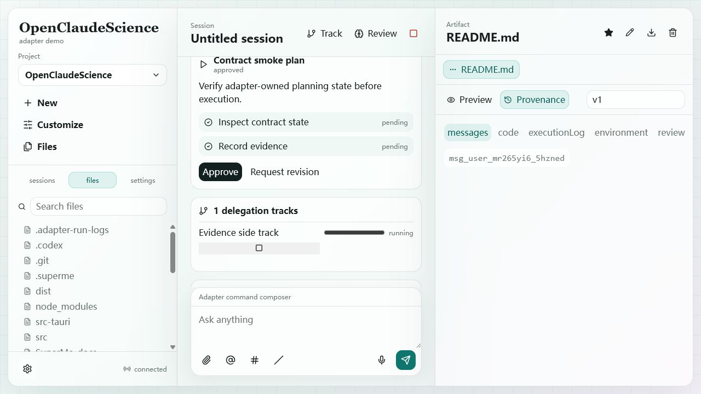

# Frontend Contract Browser Test - Combined Report

Date: 2026-07-01

Target:

- Frontend: `http://127.0.0.1:5173`
- Adapter: `http://127.0.0.1:5178`
- Runtime: managed OpenCode `1.17.12`

## Overall Verdict

9 passed, 1 failed, 1 blocked.

- Failed: Loop 09 Reviewer Flow. Backend/provenance receives manual finding, but frontend does not render the findings card.
- Blocked: Loop 11 Permission Cards. Current managed OpenCode run did not provide a deterministic permission prompt for browser testing.

## Loop 01 - App Shell And Runtime Connection

Verdict: Pass.

Operation: opened the frontend, waited for initial adapter snapshots and WebSocket connection, then queried `/v1/health`.

Expected: App Shell and runtime connection visible.

Observed: UI showed product shell, project selector, workspace actions, session filters, and `connected`. Backend health returned `healthy: true`, OpenCode `1.17.12`, managed mode, connected.

## Loop 02 - No-Session Chat Send

Verdict: Pass.

Operation: from no selected session, sent `Reply exactly TEST_OK and nothing else.`

Expected: frontend creates a session, sends through OpenCode, keeps user message, and shows assistant reply.

Observed: adapter created session `ses_Rmst77P99Hgz`; backend messages contained `user` and `assistant`; UI showed user prompt and assistant `TEST_OK`; no `NaN`.

## Loop 03 - Refresh Snapshot And Session Replay

Verdict: Pass with caveat.

Operation: reloaded page, then selected `all` session filter.

Expected: session state can be recovered from HTTP snapshots.

Observed: reload landed on Active filter with `No session selected`; selecting `all` restored the latest idle session and messages.

## Loop 04 - Files And Settings Catalogs

Verdict: Pass with caveat.

Operation: clicked `Files`, then `Customize`, and checked adapter catalog endpoints.

Expected: project tree and Settings catalog sections render.

Observed: Files showed project tree. Settings showed General, Permissions, Connectors, Skills, Specialists, and Network allowlist. Skills endpoint returned 29 skills.

Caveat: Files UI displays ignored/sensitive entries such as `.env`, `.git`, `dist`, and `node_modules`.

## Loop 05 - Artifact Registration, Preview, Version, Provenance

Verdict: Pass with caveat.

Operation: registered `README.md` as a markdown artifact owned by the tested session, then reopened the session.

Expected: artifact/version IDs are adapter-owned, public version metadata hides local paths, and frontend can open preview/provenance.

Observed: created `art_GNM6FfLmnpF9` and `ver_9pfQ0dlTsxEQ`; provenance returned messages, code, executionLog, environment, and review tabs; frontend showed artifact controls.

Caveat: `artifact.created` did not activate the artifact while the right pane was in Settings mode. Reopening the session made the artifact active.

## Loop 06 - Artifact Provenance Panel And Star Operation

Verdict: Pass.

Operation: opened Provenance and clicked Star.

Expected: five provenance tabs render and star state syncs.

Observed: UI rendered `messages`, `code`, `executionLog`, `environment`, and `review`; backend artifact `starred` became `true`.

## Loop 07 - Plan Proposal And Approval

Verdict: Pass with caveat.

Operation: sent `plan.propose` over WebSocket, then clicked Approve.

Expected: plan visible in conversation, status becomes `approved`, steps remain pending until execution evidence exists.

Observed: UI displayed `Contract smoke plan`; backend status became `approved`; steps stayed `pending`.

Caveat: UI still renders Approve/Request revision after the plan is already approved.

## Loop 08 - Annotation Staging And Commit

Verdict: Pass with caveat.

Operation: staged a markdown annotation, then sent the next composer message.

Expected: composer chip appears, next message commits annotation, chip clears.

Observed: annotation `ann_D7RaumuVucnF` was staged then committed; `1 comments staged` appeared before send and disappeared after commit.

Caveat: for the annotation send turn, backend and UI showed assistant reply timestamped before the user message.

## Loop 09 - Reviewer Failure And Manual Findings

Verdict: Fail.

Operation: clicked Review with no findings payload, then sent manual `reviewer.run` with one linked finding.

Expected: no-finding review fails explicitly; manual finding appears as `Reviewer · 1 findings` card and in artifact provenance.

Observed: UI showed explicit error toast. Backend created completed review `rev_7LSj4zBzEqHe` and finding `finding_UuNsFoDhG2CR`; provenance review tab included the finding. Frontend did not render the findings card, only started/completed toasts.

Likely cause: backend finding payload uses `id` and lacks `sessionId`; frontend expects `findingId` and filters by `sessionId`.

## Loop 10 - Delegation Track And Remote Job Lifecycle

Verdict: Pass with caveat.

Operation: clicked Track, then submitted/updated a remote job and appended a log.

Expected: track and remote job status/log render; backend records lifecycle and same-session artifact linkage.

Observed: UI showed `1 delegation tracks`, `Evidence side track`, `Remote jobs`, final status `completed`, and log line. Backend status was `succeeded` and linked the README artifact.

Caveat: backend `succeeded` is normalized to frontend `completed`.

## Loop 11 - Permission Cards And Settings Snapshot

Verdict: Blocked / not covered as pass.

Operation: queried `/v1/permissions` and checked Settings.

Expected: permission card can be rendered and approved/denied when runtime emits a permission prompt.

Observed: `/v1/permissions` returned empty permissions/grants. Settings includes Permissions section. No deterministic real OpenCode permission prompt was available in this managed runtime run, and the contract has no dev-only command to synthesize `permission.requested`.

Follow-up: add a deterministic permission-test hook in adapter dev mode, or configure OpenCode permission policy to reliably ask for a safe shell/network/file operation.

