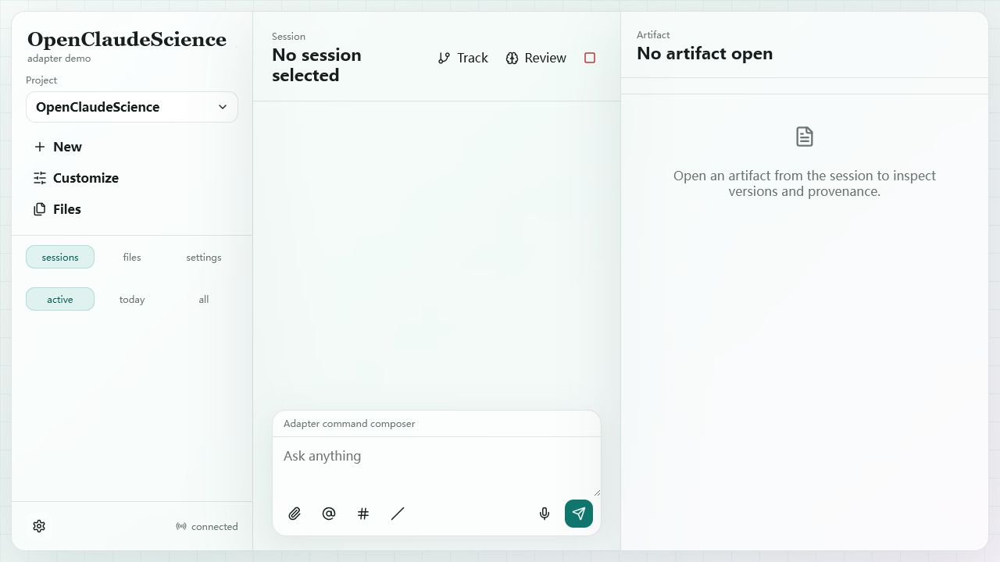

# Loop 03 - Refresh Snapshot And Session Replay

## Test Task

Verify that refresh and session filter navigation can recover chat state from HTTP snapshots.

## Acceptance Criteria

- Reload does not corrupt adapter state.
- Latest session messages can be reopened from session list.
- No duplicated, missing, or `NaN` messages after replay.

## Operations

1. Reloaded the frontend page after Loop 02.
2. Observed initial post-refresh UI.
3. Clicked `all` session filter.
4. Reopened latest session and compared UI messages to `/messages` snapshot.

## Screenshots

## Observed Result

- After reload, UI landed on `active` filter and showed `No session selected` because the latest session was idle.
- Selecting `all` restored the latest session.
- UI showed the original user prompt and assistant `TEST_OK`.
- Backend had exactly two messages for the tested session.

## Verdict

Pass with caveat: reload does not auto-select idle sessions while Active filter is selected.

