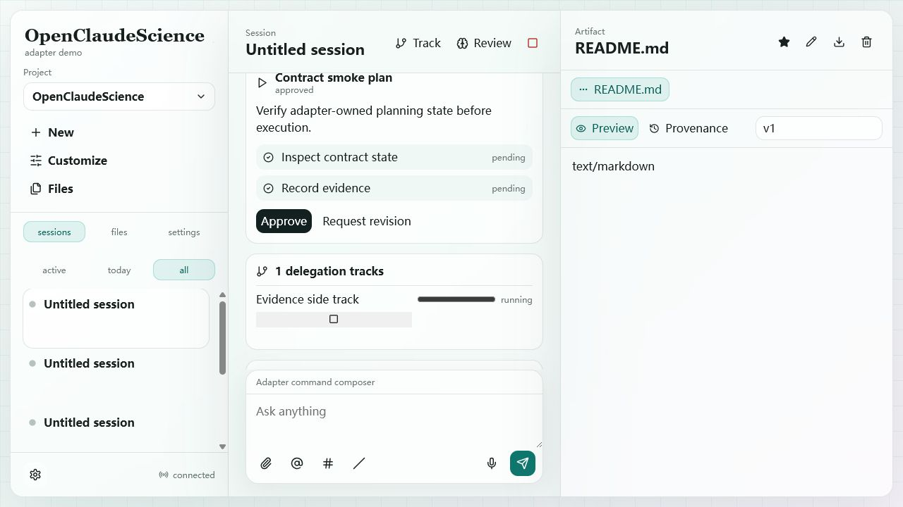

# Loop 07 - Plan Proposal And Approval

## Test Task

Verify adapter-owned plan proposal and approval flow.

## Acceptance Criteria

- `plan.propose` creates a plan visible in the conversation.
- Plan starts awaiting approval and steps do not execute automatically.
- Clicking Approve updates plan status to `approved`.
- Steps remain `pending` until execution evidence is recorded.

## Operations

1. Sent WebSocket command `plan.propose` with two steps.
2. Captured proposed plan card.
3. Clicked `Approve`.
4. Queried `/v1/sessions/:sessionId/plans`.

## Screenshots

## Observed Result

- UI displayed `Contract smoke plan`.
- After approval, backend plan status was `approved`.
- Both steps remained `pending`.

## Caveat

The UI still renders `Approve` and `Request revision` buttons after the plan is already approved. Backend state is correct, but the action surface should probably be disabled or hidden for approved plans.

## Verdict

Pass with caveat.

