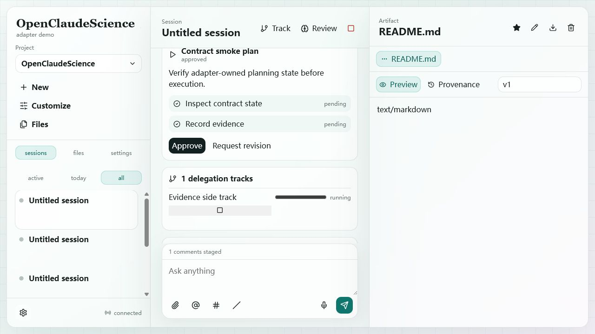

# Loop 08 - Annotation Staging And Commit

## Test Task

Verify annotation staged state, composer chip, and commit with next message.

## Acceptance Criteria

- `annotation.stage` creates staged annotation state.
- Composer shows an `N comments staged` chip.
- Sending the next message commits the annotation.
- Staged chip disappears after commit and annotation history is preserved.

## Operations

1. Sent WebSocket command `annotation.stage` against the README artifact.
2. Verified composer showed `1 comments staged`.
3. Typed `Reply exactly ANNOTATION_OK and nothing else.`
4. Sent the composer message.
5. Queried `/v1/sessions/:sessionId/annotations` and `/messages`.

## Screenshots

## Observed Result

- Annotation `ann_D7RaumuVucnF` was staged, then committed.
- Composer chip appeared before send and disappeared after commit.
- Assistant returned `ANNOTATION_OK`.

## Caveat

For the annotation send turn, backend `/messages` and the UI showed the assistant reply timestamped before the user message. This suggests message ordering should be reviewed when adapter-created user messages and runtime assistant messages are merged.

## Verdict

Pass with caveat.

