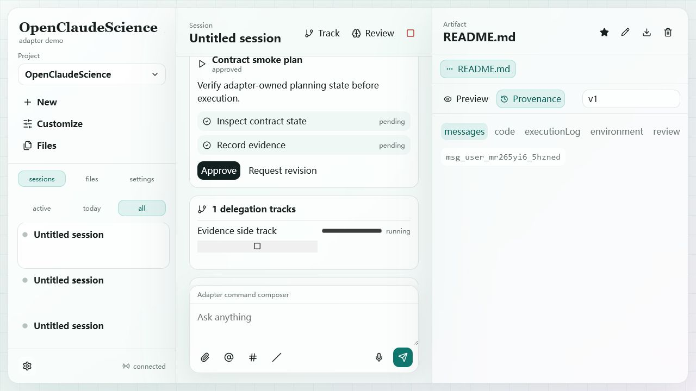

# Loop 10 - Delegation Track And Remote Job Lifecycle

## Test Task

Verify delegation track UI and remote job lifecycle rendering.

## Acceptance Criteria

- Clicking Track creates a visible running delegation track.
- `remoteJob.submit`, `remoteJob.appendLog`, and `remoteJob.update` update backend state.
- Frontend shows remote job title, final status, and log line.
- Same-session artifact collection is accepted.

## Operations

1. Clicked frontend `Track` button.
2. Queried `/v1/sessions/:sessionId/tracks`.
3. Sent WebSocket `remoteJob.submit` tied to the created track.
4. Sent `remoteJob.appendLog` with stdout text.
5. Sent `remoteJob.update` to `succeeded` and linked the README artifact.
6. Queried `/v1/sessions/:sessionId/remote-jobs`.

## Screenshots

## Observed Result

- UI showed `1 delegation tracks`, `Evidence side track`, and `running`.
- UI showed `Remote jobs`, `Contract remote job smoke`, final status `completed`, and the log line.
- Backend remote job status was `succeeded`.
- Backend job logs included `contract remote job log line`.
- Backend job linked the same-session artifact.

## Caveat

Backend status `succeeded` is normalized to frontend status text `completed`.

## Verdict

Pass with caveat.

