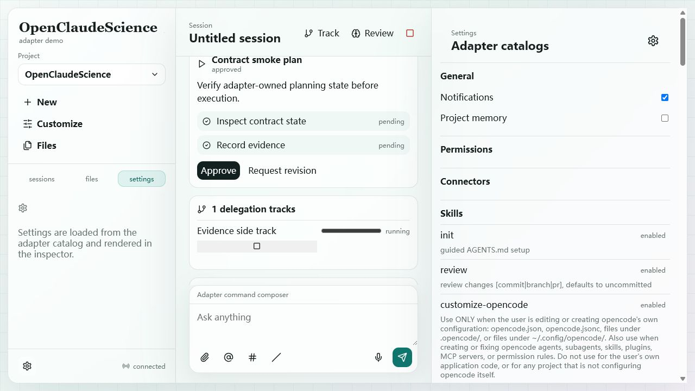

# Loop 11 - Permission Cards And Settings Snapshot

## Test Task

Verify Permission Cards and Settings > Permissions coverage.

## Acceptance Criteria

- Settings exposes permissions snapshot.
- If a runtime permission prompt occurs, frontend renders a permission card and can approve/deny with scope.
- Revocation is visible through Settings.

## Operations

1. Queried `/v1/permissions`.
2. Reused Settings screenshots from Loop 04 to confirm Permissions section is present.
3. Checked current `opencode.json` and runtime mode for a deterministic way to trigger a permission prompt.

## Screenshots

## Observed Result

- `/v1/permissions` returned `{ "permissions": [], "grants": [] }`.
- Settings contains a Permissions section.
- No contract command exists to synthesize `permission.requested`.
- The current managed OpenCode run did not expose a deterministic permission prompt that could be approved/denied through the frontend.

## Verdict

Blocked / not covered in real browser test. Do not count as pass.

## Follow-Up

Add a deterministic permission-test hook in adapter dev mode, or configure a managed OpenCode permission policy that reliably asks for a safe shell/network/file operation during browser contract tests.

