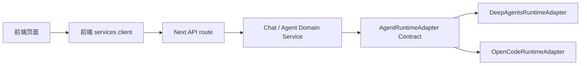

# Adapter Contracts

本文档定义后续架构改造中的 adapter 契约。

它面向三类人：

- 需求同事：看清楚底层能力替换时，上层需要什么输入、期待什么输出。
- 后续开发者：知道新 adapter 应该实现什么能力。
- 架构评审者：判断 DeepAgents、OpenCode、LangGraph、SSH、本地文件系统等底层实现是否被正确隔离。

## 1. 为什么需要 Adapter Contract

当前第二阶段正在从：

```text
route.ts
  -> old _lib
```

改成：

```text
route.ts
  -> domain service
    -> adapter
      -> old _lib
```

这是第一步，目的是让 route 变薄。

后续要继续升级为：

```text
route.ts
  -> domain service
    -> adapter contract
      -> concrete adapter
        -> 底层协议 / 进程 / 文件 / SSH / LangGraph / DeepAgents / OpenCode
```

关键点：

```text
Service 不关心底层是什么。
Service 只依赖稳定的 adapter contract。
Concrete adapter 负责把统一契约转换到底层协议。
```

如果以后要把 DeepAgents 换成 OpenCode，理想目标是：

```text
不改前端页面
不改前端 services client
不改 HTTP API URL
尽量少改 domain service
主要新增或替换 concrete adapter
```

## 2. 三种协议边界

adapter 会涉及协议，但要分清楚是哪一层协议。

### 2.1 HTTP API 协议

位置：

```text
ui/src/app/api/**/route.ts
ui/src/app/services/*Client.ts
```

例子：

```text
GET /api/config
POST /api/workspace/attachments
GET /api/runtime/backend/status
```

这层协议面向前端，第二阶段原则上不改变。

### 2.2 Adapter Contract

位置：

```text
ui/src/server/domains/*/*.types.ts
ui/src/server/domains/*/adapters/*.adapter.ts
```

例子：

```ts
interface WorkspaceFileAdapter {
  listEntries(input: ListWorkspaceEntriesInput): Promise<ListWorkspaceEntriesResult>;
}
```

这层是内部稳定契约。domain service 依赖它，而不是依赖具体底层实现。

### 2.3 底层协议

位置：

```text
concrete adapter 内部
```

例子：

- LangGraph SDK / RemoteGraph event stream
- DeepAgents runtime event
- OpenCode CLI / JSONL / session
- SSH command
- 本地文件系统路径
- MCP tool schema
- GitHub API

底层协议只能被 concrete adapter 直接处理，不应该泄漏到 route 或 service。

## 3. 通用 Adapter 规则

所有 adapter 都应遵守这些规则。

### 3.1 输入

输入必须是结构化对象，不使用位置参数堆叠。

推荐：

```ts
adapter.readFile({
  resourceId,
  workspaceId,
  path,
});
```

不推荐：

```ts
adapter.readFile(resourceId, workspaceId, path);
```

原因：

- 字段可读
- 后续容易扩展
- 方便写文档和测试
- 适合跨实现替换

### 3.2 输出

输出必须是结构化对象，不直接返回底层原始响应。

推荐：

```ts
{
  path: "src/app/page.tsx",
  content: "...",
  size: 1024,
  modifiedAt: "2026-07-08T10:00:00.000Z"
}
```

不推荐：

```ts
LangGraphRawEvent
OpenCodeRawJsonLine
ssh stdout string
```

底层原始响应可以在 adapter 内部解析，但不能直接泄漏给 service。

### 3.3 错误

adapter 错误要尽量归一化。

建议错误结构：

```ts
interface AdapterError extends Error {
  code?: string;
  statusCode?: number;
  retryable?: boolean;
  details?: unknown;
}
```

常见错误码建议：

```text
NOT_FOUND
PERMISSION_DENIED
INVALID_INPUT
TIMEOUT
UNAVAILABLE
CANCELLED
REMOTE_ERROR
PARSE_ERROR
UNSUPPORTED
```

HTTP 状态码不应由 adapter 直接决定，除非 service 明确把 adapter error 映射到 route。

### 3.4 副作用

adapter 文档必须说明允许产生哪些副作用。

例子：

```text
WorkspaceAdapter.writeFile
允许：
- 写 workspace 内文件
- 创建父目录

不允许：
- 写 workspace 外文件
- 修改 resources config
- 启动 runtime
```

### 3.5 超时和取消

涉及远程、进程、流式输出的 adapter 应支持：

```ts
signal?: AbortSignal;
timeoutMs?: number;
```

尤其是：

- AgentRuntimeAdapter
- RemoteAdapter
- RuntimeAdapter
- ComputeAdapter

### 3.6 日志和敏感信息

adapter 不应把敏感信息写入普通日志。

敏感信息包括：

- API Key
- SSH private key
- access token
- remote password
- `.env` 原文
- DeepAgents/OpenCode 认证令牌

返回给前端时也不应包含明文 secret。

## 4. Workspace Adapter Contract

用途：

- 列目录
- 搜索文件
- 读文件预览
- 读 raw 文件
- 写 raw 文件
- 打开本地文件夹/文件

当前实现状态：

```text
workspace.service.ts
workspaceAttachment.service.ts
  -> legacyWorkspace.adapter.ts
  -> localDesktop.adapter.ts
  -> attachmentExtraction.adapter.ts
```

未来建议拆分：

```text
WorkspaceFileAdapter
LocalWorkspaceAdapter
RemoteWorkspaceAdapter
WorkspaceDesktopAdapter
AttachmentExtractionAdapter
```

### 4.1 WorkspaceFileAdapter

输入：

```ts
interface WorkspaceScope {
  resourceId?: string | null;
  workspaceId?: string | null;
}

interface WorkspacePathInput extends WorkspaceScope {
  path: string;
}
```

方法：

```ts
interface WorkspaceFileAdapter {
  listEntries(input: WorkspacePathInput): Promise<WorkspaceListResult>;
  searchFiles(input: SearchWorkspaceFilesInput): Promise<WorkspaceSearchResult>;
  readFile(input: WorkspacePathInput): Promise<WorkspaceFileResult>;
  readRawFile(input: ReadRawWorkspaceFileInput): Promise<WorkspaceRawFileResult>;
  writeRawFile(input: WriteRawWorkspaceFileInput): Promise<WorkspaceFileWriteResult>;
}
```

输出：

```ts
interface WorkspaceListResult {
  path: string;
  entries: WorkspaceEntry[];
}

interface WorkspaceFileResult {
  path: string;
  name: string;
  size: number;
  modifiedAt: string;
  isFile: boolean;
  content?: string;
  tooLarge?: boolean;
}
```

副作用：

- `read*` 不应写文件。
- `writeRawFile` 只能写 workspace 范围内文件。
- remote workspace 的 SSH 细节不能泄漏到 service。

可替换实现：

```text
LocalWorkspaceAdapter
SshWorkspaceAdapter
CloudWorkspaceAdapter
```

## 5. Resources Adapter Contract

用途：

- 列出可用机器/运行资源
- 返回默认 resource

当前实现状态：

```text
resources.service.ts
  -> resources.adapter.ts
    -> remote-connections/_lib
    -> workspace/_lib
```

方法：

```ts
interface ResourcesAdapter {
  getDefaultResourceId(): string;
  listResources(): ResourceConfig[];
}
```

输出：

```ts
interface ResourcesResponse {
  defaultResourceId: string;
  resources: ResourceConfig[];
}
```

副作用：

- 不应修改 resources config。
- 不应发起 SSH 连接。
- 只负责读取和转换 UI 所需资源列表。

可替换实现：

```text
LocalResourcesAdapter
RemoteResourcesAdapter
ConfigFileResourcesAdapter
```

## 6. Workspaces Adapter Contract

用途：

- 列出项目
- 切换默认项目
- 更新项目名称/路径
- 删除项目
- 打开本地文件夹选择器

当前实现状态：

```text
workspaces.service.ts
  -> workspaces.adapter.ts
  -> folderPicker.adapter.ts
```

方法：

```ts
interface WorkspacesAdapter {
  list(): Promise<WorkspacesResponse>;
  setDefault(input: SetDefaultWorkspaceInput): Promise<WorkspacesResponse>;
  update(input: UpdateWorkspaceInput): Promise<WorkspacesResponse>;
  remove(input: RemoveWorkspaceInput): Promise<WorkspacesResponse>;
}

interface FolderPickerAdapter {
  chooseWorkspaceFolder(input: ChooseFolderInput): Promise<ChooseFolderResult>;
  isUserCancelled(error: unknown): boolean;
}
```

副作用：

- 可以修改 local workspace 配置。
- 可以打开本地文件夹选择器。
- 不应该启动 runtime。
- 不应该同步 remote backend。

可替换实现：

```text
LocalWorkspacesAdapter
DesktopFolderPickerAdapter
WebFolderPickerAdapter
```

## 7. Config Adapter Contract

用途：

- 读取/写入 `deepagent.config.json`
- 读取/写入 `.env`
- 读取 workspace/resources 配置路径
- 归一化模型配置、语言、权限模式

当前实现状态：

```text
config.service.ts
  -> configFile.adapter.ts
  -> envFile.adapter.ts
  -> workspaceConfig.adapter.ts
```

方法：

```ts
interface ConfigFileAdapter {
  getAgentConfigPath(): string;
  readAgentConfig(): Promise<AgentConfig>;
  writeAgentConfig(config: AgentConfig): Promise<void>;
}

interface EnvFileAdapter {
  getAgentEnvPath(): string;
  readEnvValues(): Promise<Record<string, string>>;
  writeEnvValues(updates: Record<string, string | null>): Promise<void>;
}
```

副作用：

- 可以写 `deepagent.config.json`。
- 可以写 `.env`。
- 不应泄漏 API key 明文到前端。
- 不应直接重启 runtime。

可替换实现：

```text
LocalConfigFileAdapter
EncryptedConfigAdapter
RemoteConfigAdapter
```

## 8. Runtime Adapter Contract

用途：

- 查询 backend 是否 ready
- 查询 backend 状态
- 重启 backend
- 读取 desktop runtime config
- 管理 pid/log/runtime 文件

当前状态：

尚未拆。当前仍在：

```text
ui/src/app/api/runtime/**
ui/src/app/api/runtime/_lib/backend.ts
```

目标方法：

```ts
interface RuntimeAdapter {
  isReady(input: RuntimeReadyInput): Promise<RuntimeReadyResult>;
  getStatus(input?: RuntimeStatusInput): Promise<RuntimeStatusResult>;
  restart(input?: RuntimeRestartInput): Promise<RuntimeRestartResult>;
  getDesktopConfig(): Promise<DesktopRuntimeConfig>;
}
```

底层协议可能包括：

- 本地 HTTP `/ok`
- LangGraph backend HTTP
- pid 文件
- 日志文件
- child_process

副作用：

- `isReady`、`getStatus` 不应重启进程。
- `restart` 可以停止/启动 backend。
- adapter 必须明确超时策略。

可替换实现：

```text
LocalLangGraphRuntimeAdapter
RemoteLangGraphRuntimeAdapter
OpenCodeRuntimeAdapter
ManagedProcessRuntimeAdapter
```

## 9. Remote Adapter Contract

用途：

- SSH host 列表
- 测试远端连接
- ensure remote backend
- setup remote backend
- push backend cli
- 远端文件同步

当前状态：

尚未拆。当前主要在：

```text
ui/src/app/api/remote-connections/**
ui/src/app/api/remote-connections/_lib/remote-connections.ts
```

目标方法：

```ts
interface RemoteAdapter {
  listSshHosts(): Promise<SshHost[]>;
  testConnection(input: RemoteConnectionInput): Promise<RemoteConnectionResult>;
  ensureBackend(input: EnsureRemoteBackendInput): AsyncIterable<RemoteBackendEvent>;
  setupBackend(input: SetupRemoteBackendInput): AsyncIterable<RemoteBackendEvent>;
  pushBackendCli(input: PushBackendCliInput): AsyncIterable<RemoteBackendEvent>;
}
```

底层协议可能包括：

- SSH command
- SCP/SFTP
- remote shell scripts
- remote Python/Node runtime
- NDJSON stream

副作用：

- 可以连接远端机器。
- 可以写远端文件。
- 可以启动远端 backend。
- 必须显式处理超时、取消、认证失败。

可替换实现：

```text
SshRemoteAdapter
CloudRemoteAdapter
KubernetesRemoteAdapter
```

## 10. Skills Adapter Contract

用途：

- 读取 skill 列表
- 导入 skill
- 启用/停用 skill
- 管理 skill connections
- 本地选择 skill 文件夹

当前状态：

尚未拆。当前主要在：

```text
ui/src/app/api/skills/**
ui/src/app/api/skills/_lib/skills.ts
```

目标方法：

```ts
interface SkillsAdapter {
  listSkills(): Promise<SkillsConfigResponse>;
  importSkills(input: ImportSkillsInput): Promise<ImportSkillsResponse>;
  updateSkills(input: UpdateSkillsInput): Promise<SkillsConfigResponse>;
  listConnections(): Promise<SkillConnectionsResponse>;
}
```

副作用：

- 可以读写 skill 配置。
- 可以复制/导入本地 skill 文件。
- 不应直接启动 Agent run。
- 不应直接修改 runtime 进程。

可替换实现：

```text
LocalSkillsAdapter
RemoteSkillsAdapter
MarketplaceSkillsAdapter
```

## 11. Compute Adapter Contract

用途：

- 读取 compute SSH hosts
- 提交远程任务
- 查询任务状态
- 取消任务
- 获取任务输出

当前状态：

尚未拆。当前主要在：

```text
ui/src/app/api/compute/**
ui/src/app/api/compute/_lib/ssh-remote-jobs.ts
```

目标方法：

```ts
interface ComputeAdapter {
  listHosts(): Promise<ComputeHost[]>;
  submitJob(input: SubmitComputeJobInput): Promise<ComputeJob>;
  getJob(input: GetComputeJobInput): Promise<ComputeJob>;
  cancelJob(input: CancelComputeJobInput): Promise<ComputeJob>;
  listJobs(input?: ListComputeJobsInput): Promise<ComputeJob[]>;
}
```

底层协议可能包括：

- SSH
- scheduler command
- remote shell
- job id mapping

副作用：

- 可以在远端启动计算任务。
- 可以取消远端任务。
- 不应修改 chat/thread 状态。

可替换实现：

```text
SshComputeAdapter
SlurmComputeAdapter
CloudBatchComputeAdapter
```

## 12. Agent Runtime Adapter Contract

用途：

- 发起 Agent run
- 接收流式事件
- 取消 run
- 查询 thread/run 状态
- 隔离 DeepAgents、LangGraph、RemoteGraph、OpenCode 等底层实现

这是后续替换 DeepAgents/OpenCode 最关键的 contract。

当前状态：

尚未拆。当前主链路仍不建议立即改。

目标方法：

```ts
interface AgentRuntimeAdapter {
  healthCheck(input?: AgentRuntimeHealthInput): Promise<AgentRuntimeHealth>;
  createThread(input: CreateThreadInput): Promise<CreateThreadResult>;
  run(input: AgentRunInput): AsyncIterable<AgentRunEvent>;
  cancelRun(input: CancelRunInput): Promise<CancelRunResult>;
  getThreadState(input: GetThreadStateInput): Promise<ThreadState>;
}
```

输入建议：

```ts
interface AgentRunInput {
  threadId: string;
  assistantId: string;
  resourceId?: string;
  workspaceId?: string;
  messages: AgentMessage[];
  model?: {
    provider: string;
    model: string;
    baseUrl?: string;
  };
  skills?: EnabledSkill[];
  attachments?: AgentAttachment[];
  signal?: AbortSignal;
}
```

标准输出事件建议：

```ts
type AgentRunEvent =
  | { type: "message_delta"; messageId: string; text: string }
  | { type: "message_done"; messageId: string }
  | { type: "tool_call"; toolCallId: string; name: string; args: unknown }
  | { type: "tool_result"; toolCallId: string; result: unknown }
  | { type: "state"; state: unknown }
  | { type: "error"; error: AdapterErrorShape }
  | { type: "done" };
```

底层协议可能包括：

- LangGraph SDK stream
- RemoteGraph stream
- DeepAgents event stream
- OpenCode CLI / JSONL stream
- 本地 Python/Node Agent runtime

副作用：

- 可以创建 thread/run。
- 可以调用工具。
- 可以读写 workspace，前提是通过工具或 workspace adapter。
- 不应直接改前端 UI 状态。
- 不应直接写前端 localStorage。

可替换实现：

```text
DeepAgentsRuntimeAdapter
LangGraphRemoteRuntimeAdapter
OpenCodeRuntimeAdapter
LocalAgentRuntimeAdapter
```

## 13. 替换 DeepAgents 为 OpenCode 时的目标边界

理想替换点：



替换时尽量不动：

- 前端页面
- `services/*Client.ts`
- API URL
- 大部分 domain service

主要新增/替换：

```text
OpenCodeRuntimeAdapter
OpenCode event -> AgentRunEvent 的转换器
OpenCode session/thread 映射
OpenCode tool event 映射
```

需要提前确认的问题：

- OpenCode 是否有稳定 CLI/HTTP/JSONL 协议。
- OpenCode 是否支持持续会话/thread。
- OpenCode tool call 和 tool result 如何表达。
- OpenCode 如何绑定 workspace。
- OpenCode 如何配置模型和 API key。
- OpenCode 如何取消运行。
- OpenCode 错误是否可结构化。

## 14. 当前落地顺序

近期：

```text
1. runtime adapter contract
2. runtime route/service/adapter 拆分
3. remote adapter contract
4. remote route/service/adapter 拆分
```

中期：

```text
skills adapter contract
compute adapter contract
update adapter contract
agent runtime model 文档
```

后期：

```text
AgentRuntimeAdapter interface
DeepAgentsRuntimeAdapter
OpenCodeRuntimeAdapter 设计验证
```

当前不要做：

```text
不急着替换 DeepAgents
不急着拆 agent_graph.py
不急着做 OpenCodeAdapter
不让 service 直接依赖 OpenCode/DeepAgents 底层事件
```

