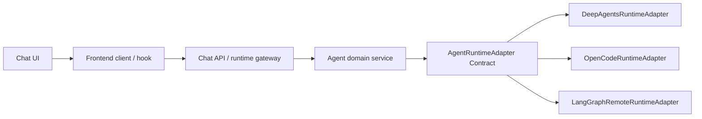

# Agent Runtime Adapter Contract

本文档定义 Agent Runtime Adapter 的目标契约。

它要解决的问题是：以后如果底层从 DeepAgents 换成 OpenCode、LangGraph RemoteGraph 或其他 Agent runtime，上层代码应该尽量不用重写。

对应的代码级 contract types：

```text
ui/src/server/shared/contracts/agentRuntime.contract.ts
ui/src/server/shared/contracts/adapterError.contract.ts
```

统一导出入口：

```text
ui/src/server/shared/contracts/index.ts
```

## 1. 背景

当前系统里，Agent 主链路大致涉及：

```text
前端聊天界面
  -> 前端 chat/client/hook
    -> Next API / LangGraph SDK / runtime
      -> LangGraph backend
        -> DeepAgents / agent_graph.py
          -> skills / tools / MCP / workspace
```

这条链路还没有进入第二阶段重构范围。原因是它是主业务链路，风险高，不能像普通 API route 一样直接拆。

正确顺序应该是：

```text
1. 先定义 Agent Runtime Adapter Contract
2. 再梳理当前 DeepAgents/LangGraph 事件模型
3. 再实现 DeepAgentsRuntimeAdapter
4. 最后才考虑 OpenCodeRuntimeAdapter 或其他替换实现
```

## 2. 目标边界

目标结构：



核心原则：

```text
Service 只依赖 AgentRuntimeAdapter Contract。
Service 不直接依赖 DeepAgents、OpenCode、LangGraph 原始事件。
具体底层协议只能存在于 concrete adapter 内部。
```

## 3. 非目标

本 contract 不负责：

```text
不定义前端 UI 状态
不定义 React hook 内部实现
不直接规定 DeepAgents 内部代码结构
不直接规定 OpenCode 具体接入方式
不替代 LangGraph/DeepAgents 自身协议
不在当前阶段重写 agent_graph.py
```

## 4. 核心模型

Agent Runtime Adapter 应该把不同底层 runtime 统一成四类能力：

```text
Thread 管理
Run 执行
Event 流
Run 控制
```

### 4.1 Thread

Thread 表示一段连续对话或任务上下文。

```ts
interface AgentThread {
  threadId: string;
  resourceId?: string;
  workspaceId?: string;
  createdAt?: string;
  updatedAt?: string;
  metadata?: Record<string, unknown>;
}
```

不同底层的映射：

| 底层 | Thread 映射 |
| --- | --- |
| LangGraph | thread id |
| DeepAgents | LangGraph thread + agent state |
| OpenCode | session / conversation / worktree context |
| Local runtime | 本地状态文件或内存 session |

### 4.2 Run

Run 表示一次用户请求触发的 Agent 执行。

```ts
interface AgentRun {
  runId: string;
  threadId: string;
  status: "queued" | "running" | "interrupted" | "succeeded" | "failed" | "cancelled";
  startedAt?: string;
  finishedAt?: string;
  metadata?: Record<string, unknown>;
}
```

### 4.3 Message

```ts
type AgentRole = "system" | "user" | "assistant" | "tool";

interface AgentMessage {
  id?: string;
  role: AgentRole;
  content: string;
  name?: string;
  toolCallId?: string;
  metadata?: Record<string, unknown>;
}
```

### 4.4 Workspace

Agent run 必须知道自己工作在哪个 workspace。

```ts
interface AgentWorkspaceContext {
  resourceId?: string;
  workspaceId?: string;
  rootLabel?: string;
  allowedPaths?: string[];
}
```

规则：

- adapter 不能直接随意写 workspace。
- 写文件应通过工具、workspace adapter 或 runtime 明确授权能力。
- remote workspace 细节不应泄漏给 Agent service。

### 4.5 Skills

```ts
interface EnabledSkill {
  key: string;
  name: string;
  sourcePath?: string;
  metadata?: Record<string, unknown>;
}
```

Skill 在不同 runtime 的映射：

| 底层 | Skill 映射 |
| --- | --- |
| DeepAgents | system prompt / tool / configured skill |
| LangGraph | assistant config / graph state |
| OpenCode | prompt instruction / tool profile / plugin |
| MCP | tool server capability |

## 5. Adapter Interface

建议目标接口：

```ts
interface AgentRuntimeAdapter {
  healthCheck(input?: AgentRuntimeHealthInput): Promise<AgentRuntimeHealth>;
  createThread(input: CreateAgentThreadInput): Promise<CreateAgentThreadResult>;
  getThreadState(input: GetAgentThreadStateInput): Promise<AgentThreadState>;
  run(input: AgentRunInput): AsyncIterable<AgentRunEvent>;
  cancelRun(input: CancelAgentRunInput): Promise<CancelAgentRunResult>;
}
```

### 5.1 healthCheck

用途：

```text
确认 runtime 是否可用
确认 assistant 是否存在
确认模型配置是否可用
确认必要工具是否可用
```

```ts
interface AgentRuntimeHealthInput {
  resourceId?: string;
  assistantId?: string;
  timeoutMs?: number;
  signal?: AbortSignal;
}

interface AgentRuntimeHealth {
  ok: boolean;
  status: "ready" | "unavailable" | "degraded";
  message?: string;
  details?: unknown;
}
```

### 5.2 createThread

```ts
interface CreateAgentThreadInput {
  resourceId?: string;
  workspaceId?: string;
  metadata?: Record<string, unknown>;
}

interface CreateAgentThreadResult {
  threadId: string;
  metadata?: Record<string, unknown>;
}
```

### 5.3 run

```ts
interface AgentRunInput {
  threadId: string;
  assistantId: string;
  resourceId?: string;
  workspaceId?: string;
  messages: AgentMessage[];
  model?: AgentModelConfig;
  workspace?: AgentWorkspaceContext;
  skills?: EnabledSkill[];
  attachments?: AgentAttachment[];
  runtimeOptions?: Record<string, unknown>;
  timeoutMs?: number;
  signal?: AbortSignal;
}

interface AgentModelConfig {
  provider: string;
  model: string;
  baseUrl?: string;
  temperature?: number;
}

interface AgentAttachment {
  name: string;
  mimeType?: string;
  size?: number;
  workspacePath?: string;
  text?: string;
  metadata?: Record<string, unknown>;
}
```

## 6. 标准事件流

不同底层 runtime 的原始事件必须转换成统一事件：

```ts
type AgentRunEvent =
  | AgentRunStartedEvent
  | AgentMessageDeltaEvent
  | AgentMessageCompletedEvent
  | AgentToolCallEvent
  | AgentToolResultEvent
  | AgentInterruptEvent
  | AgentStateEvent
  | AgentArtifactEvent
  | AgentErrorEvent
  | AgentRunCompletedEvent;
```

### 6.1 run_started

```ts
interface AgentRunStartedEvent {
  type: "run_started";
  runId: string;
  threadId: string;
  at: string;
}
```

### 6.2 message_delta

```ts
interface AgentMessageDeltaEvent {
  type: "message_delta";
  messageId: string;
  role: "assistant";
  text: string;
}
```

规则：

- 不应把底层 raw chunk 直接传给前端。
- adapter 应负责把 raw chunk 转为纯文本 delta。
- 思考标签、隐藏内容等策略应在明确层级处理，不能混在底层事件里。

### 6.3 message_completed

```ts
interface AgentMessageCompletedEvent {
  type: "message_completed";
  messageId: string;
  text?: string;
  metadata?: Record<string, unknown>;
}
```

### 6.4 tool_call

```ts
interface AgentToolCallEvent {
  type: "tool_call";
  toolCallId: string;
  name: string;
  args: unknown;
  displayName?: string;
  metadata?: Record<string, unknown>;
}
```

### 6.5 tool_result

```ts
interface AgentToolResultEvent {
  type: "tool_result";
  toolCallId: string;
  name?: string;
  result: unknown;
  isError?: boolean;
  metadata?: Record<string, unknown>;
}
```

### 6.6 interrupt

用于人工确认、权限批准、工具审批等。

```ts
interface AgentInterruptEvent {
  type: "interrupt";
  interruptId: string;
  reason: "approval_required" | "input_required" | "policy_blocked" | "other";
  message: string;
  payload?: unknown;
}
```

### 6.7 state

```ts
interface AgentStateEvent {
  type: "state";
  state: unknown;
  metadata?: Record<string, unknown>;
}
```

### 6.8 artifact

```ts
interface AgentArtifactEvent {
  type: "artifact";
  artifact: {
    name: string;
    mimeType?: string;
    workspacePath?: string;
    url?: string;
    metadata?: Record<string, unknown>;
  };
}
```

### 6.9 error

```ts
interface AgentErrorEvent {
  type: "error";
  error: AgentRuntimeErrorShape;
}

interface AgentRuntimeErrorShape {
  code:
    | "INVALID_INPUT"
    | "AUTH_FAILED"
    | "MODEL_UNAVAILABLE"
    | "RUNTIME_UNAVAILABLE"
    | "TOOL_FAILED"
    | "TIMEOUT"
    | "CANCELLED"
    | "UNKNOWN";
  message: string;
  retryable?: boolean;
  details?: unknown;
}
```

### 6.10 done

```ts
interface AgentRunCompletedEvent {
  type: "done";
  runId: string;
  status: "succeeded" | "failed" | "cancelled";
  usage?: {
    inputTokens?: number;
    outputTokens?: number;
    totalTokens?: number;
  };
  metadata?: Record<string, unknown>;
}
```

## 7. DeepAgents Adapter 映射

`DeepAgentsRuntimeAdapter` 应负责：

```text
LangGraph/DeepAgents raw event
  -> AgentRunEvent
```

它可以知道：

- LangGraph deployment URL
- assistant id
- thread id
- DeepAgents event name
- tool call raw shape
- interrupt raw shape

它不应该泄漏：

- DeepAgents raw event 给 service
- LangGraph SDK response 给 service
- Python 内部 state 结构给前端

## 8. OpenCode Adapter 映射

如果后续接 OpenCode，应新增：

```text
OpenCodeRuntimeAdapter
```

它应负责：

```text
OpenCode CLI / HTTP / JSONL event
  -> AgentRunEvent
```

接入前必须确认：

- OpenCode 是否支持稳定的 machine-readable event stream。
- 是否支持 session/thread 语义。
- tool call/tool result 是否结构化。
- 是否支持取消 run。
- 如何绑定 workspace。
- 如何注入 skills / tools / MCP。
- 如何配置模型和 API key。

如果 OpenCode 只有终端文本输出，没有稳定结构化事件，则不建议直接替换主 Agent runtime，只适合作为工具型 adapter。

## 9. 安全和权限

Agent Runtime Adapter 必须遵守：

- 不向前端返回 API key。
- 不把 `.env` 明文写入事件。
- 不在 message_delta 中混入 secret。
- 工具执行权限必须可审计。
- 需要用户确认的操作必须发出 `interrupt`。
- workspace 写入必须有边界。

## 10. 落地顺序

建议后续执行：

```text
1. 梳理当前 useChat.ts / LangGraph event stream / DeepAgents event shape
2. 写 AgentRunEvent 转换表
3. 新增 DeepAgentsRuntimeAdapter，但先不切主链路
4. 用测试或旁路验证事件转换
5. 再决定是否让主链路走 AgentRuntimeAdapter
6. 最后评估 OpenCodeRuntimeAdapter
```

当前不建议：

```text
不直接改 agent_graph.py
不直接替换 DeepAgents
不直接把 OpenCode 接进主聊天链路
不把底层 raw event 暴露给 service 或前端
```
