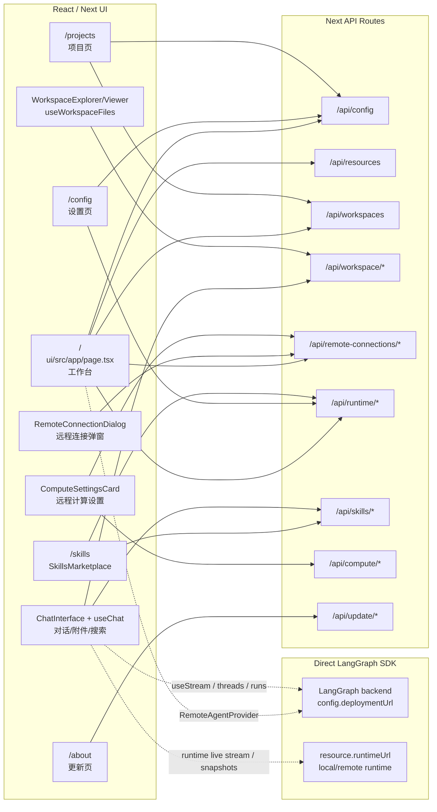
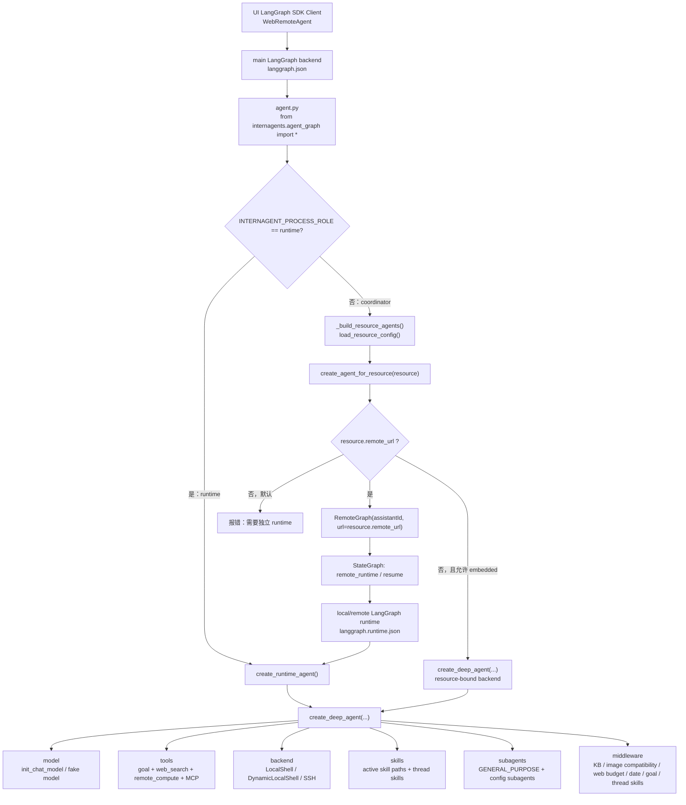

# InternAgentS 当前前后端调用地图

> 范围：本文只盘点当前代码结构和调用关系，不包含改造实现。代码基线为 `E:\OpenClaudeScience` 当前工作区。
 
## 1. 总体现状

当前项目不是传统的“轻前端 + 单一后端服务”结构，而是四层混合架构：

1. **前端 UI 层**：`ui/src/app`，Next.js App Router + React。页面中既有 UI 状态，也直接发起大量 `/api/*` 请求，并通过 LangGraph SDK 直连 LangGraph 服务。
2. **Next API 层**：`ui/src/app/api`，承担了本地服务端/Middleware 的角色。它直接读写配置文件、工作区文件、启动/重启 LangGraph 进程、执行 OS 命令、管理 SSH 和远程 runtime。
3. **LangGraph Runtime 层**：由 `python -m langgraph_cli dev` 启动。主 backend 使用 `langgraph.json`，本机 runtime 使用 `langgraph.runtime.json`。
4. **DeepAgents/工具层**：`agent.py` 只是入口 shim，真正构建逻辑在 `internagents/agent_graph.py`。这里创建 DeepAgents、接入 Skills/MCP/RemoteGraph/远程计算工具/中间件。

核心结论：

- 前端并不只是展示层，`page.tsx`、`useChat.ts`、`ChatInterface.tsx` 等文件承担了资源切换、runtime 选择、线程恢复、附件上传、Skills 查询等大量业务逻辑。
- Next API 层目前是事实上的 middleware，但没有明确的接口层/领域层边界，API route 和 `_lib` 文件直接耦合本地文件系统、进程管理、SSH、网络下载。
- LangGraph 有两类进程：**主 backend/coordinator** 和 **local runtime**。主 backend 通常通过 `RemoteGraph` 把本机 `local` 资源代理到 local runtime。
- DeepAgents 的创建、模型配置、工具列表、技能同步、MCP 加载、RemoteGraph 分流都集中在 `internagents/agent_graph.py`，这是 Python 侧最重的耦合点。

## 2. 运行角色与关键入口

| 角色 | 入口文件 | 职责 |
| --- | --- | --- |
| UI 页面 | `ui/src/app/page.tsx` | 工作台、资源/项目切换、LangGraph Provider、远程 runtime 同步入口 |
| Chat 状态/流 | `ui/src/app/hooks/useChat.ts` | `useStream`、thread snapshot、runtime live stream、goal/skill state、消息提交 |
| LangGraph SDK 包装 | `ui/src/lib/remote-agent.ts`、`ui/src/providers/ClientProvider.tsx` | 创建 `@langchain/langgraph-sdk` `Client`，包装 stream/joinStream 事件 |
| Next API | `ui/src/app/api/**/route.ts` | 本地配置、工作区、Skills、SSH、runtime、更新、远程计算 |
| 主 LangGraph backend | `langgraph.json` -> `agent.py:agent` | 对外暴露 `agent`/`agent_local`/`agent_remote*` 图 |
| 本机 runtime | `langgraph.runtime.json` -> `agent.py:agent` | 在 `INTERNAGENT_PROCESS_ROLE=runtime` 下创建真实 DeepAgent runtime |
| DeepAgents 构建 | `internagents/agent_graph.py` | 读取配置，创建 DeepAgent 或 RemoteGraph 代理 |
| 资源配置 | `internagent.resources.json`、`internagent.resources.local.json` | local/remote 资源、workspace、runtime URL、SSH 参数 |
| 模型/技能配置 | `deepagent.config.json`、`.env`、`.mcp.json` | 模型、API key、authorization、skills、MCP server |

## 3. 图 1：UI -> API 调用图



### 页面/API 清单

| UI 入口 | 调用的 Next API | 直接 LangGraph 调用 | 说明 |
| --- | --- | --- | --- |
| `ui/src/app/page.tsx` | `/api/config`、`/api/resources`、`/api/workspaces`、`/api/runtime/backend/ready`、`/api/remote-connections/ensure`、`/api/remote-connections/push-backend-cli` | 通过 `RemoteAgentProvider` 创建主 `Client` | 工作台主入口，同时处理本地 backend readiness、资源列表、项目列表、远程 runtime 同步 |
| `ui/src/app/hooks/useChat.ts` | 无直接 `/api`，但依赖 ChatInterface 的附件 API | `useStream`、`threads.getState/get/getHistory`、`runs.list/joinStream` | 对话提交、流式响应、线程快照恢复、本机 runtime 事件汇聚 |
| `ui/src/app/hooks/useThreads.ts` | 无直接 `/api` | `threads.search/getState/get/getHistory` | 会话列表，同时读取主 backend 和 runtime 状态 |
| `ui/src/app/components/ChatInterface.tsx` | `/api/workspace/attachments`、`/api/workspace/file/raw`、`/api/workspace/search`、`/api/skills` | 通过 `useChat` 间接使用 | 附件上传/工作区文件引用/Skills 选择 |
| `ui/src/app/hooks/useWorkspaceFiles.ts` | `/api/workspace/files` | 无 | 文件树目录加载 |
| `ui/src/app/components/WorkspaceViewer.tsx` | `/api/workspace/file`、`/api/workspace/open-file` | 无 | 文件预览、打开本地文件 |
| `ui/src/app/components/WorkspaceExplorer.tsx` | `/api/workspace/open-folder` | 无 | 打开工作区目录 |
| `ui/src/app/config/page.tsx` | `/api/config`、`/api/runtime/backend/status`、`/api/runtime/backend/restart` | 仅 readiness 检查外部 URL | 模型/API key/语言/授权配置，触发 backend restart |
| `ui/src/app/config/components/RemoteProjectsSettingsCard.tsx` | `/api/resources`、`/api/remote-connections/ensure` | 无 | 远程项目资源同步 |
| `ui/src/app/config/components/ComputeSettingsCard.tsx` | `/api/remote-connections/ssh-hosts`、`/api/compute/ssh-hosts` | 无 | SSH 计算主机注册 |
| `ui/src/app/components/RemoteConnectionDialog.tsx` | `/api/remote-connections/ssh-hosts`、`/api/remote-connections/test`、`/api/remote-connections/setup` | 无 | 新增远程 runtime 资源 |
| `ui/src/app/skills/components/SkillsMarketplace.tsx` | `/api/skills`、`/api/skills/connections`、`/api/skills/import`、`/api/skills/local-picker`、`/api/runtime/backend/status`、`/api/runtime/backend/restart` | 无 | 技能启停、导入、MCP/SCP 连接、重启提示 |
| `ui/src/app/projects/page.tsx` | `/api/config`、`/api/workspaces` | 无 | 本地项目列表、切换、增删改 |
| `ui/src/app/about/page.tsx` | `/api/update/status`、`/api/update/check`、`/api/update/apply`、`/api/update/rollback` | 无 | 桌面更新检查、应用、回滚 |

## 4. 图 2：API -> 本地系统/配置/SSH 调用图

```mermaid
flowchart TB
  subgraph API[Next API Layer]
    ConfigAPI["/api/config"]
    ResourcesAPI["/api/resources\n/api/workspaces"]
    WorkspaceAPI["/api/workspace/*"]
    RemoteAPI["/api/remote-connections/*"]
    RuntimeAPI["/api/runtime/backend/*"]
    SkillsAPI["/api/skills/*"]
    ComputeAPI["/api/compute/*"]
    UpdateAPI["/api/update/*"]
  end

  subgraph Files[Local Files]
    Env[".env"]
    AgentConfig["deepagent.config.json"]
    Resources["internagent.resources.json\ninternagent.resources.local.json"]
    Mcp[".mcp.json"]
    ActiveSkills[".internagents/active-skills"]
    ComputeStore[".internagents/compute/*.json\napi-token"]
    Logs[".internagents/logs/*.log\n.internagents/pids/*.pid"]
    WorkspaceFs["workspace 文件系统"]
  end

  subgraph Processes[Processes / OS]
    LangGraphProc["python -m langgraph_cli dev"]
    OpenCmd["open / xdg-open / explorer / cmd start"]
    FolderPicker["osascript / zenity / kdialog / PowerShell FolderBrowserDialog"]
  end

  subgraph SSHNet[SSH / Network]
    SshConfig["~/.ssh/config"]
    SshCmd["ssh bash/python"]
    Tunnel["local port tunnel -> remote runtime"]
    GitHub["GitHub release / archive / raw SKILL.md"]
  end

  ConfigAPI --> Env
  ConfigAPI --> AgentConfig
  ConfigAPI --> Resources

  ResourcesAPI --> Resources
  ResourcesAPI --> FolderPicker

  WorkspaceAPI --> WorkspaceFs
  WorkspaceAPI --> OpenCmd
  WorkspaceAPI --> SshCmd

  RemoteAPI --> SshConfig
  RemoteAPI --> SshCmd
  RemoteAPI --> Tunnel
  RemoteAPI --> GitHub
  RemoteAPI --> Resources
  RemoteAPI --> Env

  RuntimeAPI --> LangGraphProc
  RuntimeAPI --> Logs
  RuntimeAPI --> Resources
  RuntimeAPI --> Env

  SkillsAPI --> AgentConfig
  SkillsAPI --> ActiveSkills
  SkillsAPI --> Mcp
  SkillsAPI --> Env
  SkillsAPI --> GitHub
  SkillsAPI --> FolderPicker

  ComputeAPI --> ComputeStore
  ComputeAPI --> SshConfig
  ComputeAPI --> SshCmd

  UpdateAPI --> GitHub
  UpdateAPI --> Logs
```



### API 分组与副作用

| API 分组 | 主要文件 | 主要进程/SSH/网络 | 当前职责 |
| --- | --- | --- | --- |
| `/api/config` | `deepagent.config.json`、`.env`、资源配置 | 无直接进程，但返回 “需要重启” 语义 | 读写模型、OpenAI-compatible Base URL/API key、authorization、语言、workspace |
| `/api/resources` | `internagent.resources*.json` | 无 | 读取可用资源并转换为 UI 所需 `assistantId/runtimeUrl` |
| `/api/workspaces` | `internagent.resources*.json`、`.env` 中 `INTERNAGENT_RESOURCES_FILE` | 本地目录选择器 | 管理本地 workspace 列表、默认 workspace、资源 workspace 指向 |
| `/api/workspace/files|file|raw|search|attachments` | workspace 文件、`.internagents/uploads/*` | 对 `ssh_shell` 资源执行 `ssh ... python3 -c ...` | 文件树、文件预览、raw stream、搜索、附件上传和 Office/PDF 摘要生成 |
| `/api/workspace/open-folder|open-file` | workspace 文件 | `open` / `xdg-open` / Windows `explorer`/`cmd start`/PowerShell | 调用操作系统打开本地目录或文件 |
| `/api/remote-connections/*` | `internagent.resources*.json`、`.env`、远程 runtime 状态 | 读 `~/.ssh/config`、执行 SSH、下载 GitHub release、安装远程 backend CLI、建隧道 | 新增/测试/同步远程 runtime 资源 |
| `/api/runtime/backend/status|restart|ready` | `.internagents/logs`、`.internagents/pids`、`internagent.resources*.json` | 查端口、查/杀进程、启动 `python -m langgraph_cli dev` | 检查主 backend 状态、重启主 backend 和 local runtime |
| `/api/runtime/desktop-config` | 无写入 | 扫描本机 runtime 健康状态 | 输出 `window.__INTERNAGENTS_RUNTIME_CONFIG__` JS 给浏览器运行时配置 |
| `/api/skills/*` | `deepagent.config.json`、`.mcp.json`、`.env`、`.internagents/active-skills`、`.internagents/imported-skills` | `git clone/fetch`、HTTP 下载 GitHub archive/raw、目录选择器 | Skills 列表、启停、导入、本地选择、MCP/SCP 连接配置 |
| `/api/compute/*` | `.internagents/compute/ssh-hosts.json`、`remote-jobs.json`、`api-token` | SSH 到 Linux 主机提交/查询 job | 远程计算 host 注册、job 提交、结果收集 |
| `/api/update/*` | 桌面应用更新状态/备份相关路径 | GitHub release/asset 下载，应用/回滚 | 桌面更新检查、应用和回滚 |

## 5. LangGraph Runtime 怎么启动

### 5.1 开发模式：`scripts/dev.sh`

`/scripts/dev.sh` 会启动三类服务：

1. **local runtime**
   - 工作目录：`.internagents/langgraph-state/local-runtime`
   - 命令：`python -m langgraph_cli dev --config langgraph.runtime.json`
   - 环境变量：`INTERNAGENT_PROCESS_ROLE=runtime`、`INTERNAGENT_RUNTIME_ID=local`、`INTERNAGENTS_LOCAL_RUNTIME_PORT=<port>`
   - 作用：真正创建本机 DeepAgent runtime。

2. **main backend**
   - 工作目录：`.internagents/langgraph-state/backend`
   - 命令：`python -m langgraph_cli dev --config langgraph.json`
   - 环境变量：`INTERNAGENTS_LOCAL_RUNTIME_PORT=<local runtime port>`
   - 作用：对 UI 暴露主 LangGraph 服务，并通过 `RemoteGraph` 代理到 local/remote runtime。

3. **frontend**
   - 工作目录：`ui`
   - 命令：`npm run dev -- --hostname <host> --port <uiPort>`
   - 环境变量：`INTERNAGENTS_APP_ROOT`、`NEXT_PUBLIC_LANGGRAPH_DEPLOYMENT_URL`、`NEXT_PUBLIC_LANGGRAPH_ASSISTANT_ID`
   - 作用：启动 Next UI 和 API routes。

### 5.2 桌面模式：`desktop/electron/main.cjs`

桌面应用启动流程：

1. 复制 `internagents-template` 到用户数据目录下的 `runtimeRoot`。
2. 选择 UI/backend/runtime 三个本地端口。
3. 调整 `internagent.resources*.json`，确保 `local.remote_url = http://127.0.0.1:<runtimePort>`。
4. 启动 Next standalone server。
5. 调用 `http://127.0.0.1:<uiPort>/api/runtime/backend/restart`，由 Next API 再启动 local runtime 和 main backend。
6. 打开 Electron BrowserWindow 到 `/?assistantId=agent_local`。

### 5.3 设置页触发重启：`/api/runtime/backend/restart`

`ui/src/app/api/runtime/_lib/backend.ts` 的 `restartBackend()` 会：

1. 根据 `NEXT_PUBLIC_LANGGRAPH_DEPLOYMENT_URL` 和 `INTERNAGENTS_LOCAL_RUNTIME_PORT` 推导主 backend 与 local runtime 端口。
2. 查找旧的 `langgraph_cli` 进程：pid 文件 + 监听端口 + 父进程链。
3. 终止旧 main backend 和 local runtime。
4. 先启动 local runtime：`langgraph.runtime.json` + `INTERNAGENT_PROCESS_ROLE=runtime`。
5. 等待 local runtime `/ok` 健康检查。
6. 写回 local resource 的 `remote_url`。
7. 再启动 main backend：`langgraph.json`。
8. 等待 main backend `/ok` 健康检查。

## 6. 图 3：LangGraph -> DeepAgents 调用图



### DeepAgents 在哪里被创建

DeepAgents 创建点集中在 `internagents/agent_graph.py`：

| 函数 | 场景 | 行为 |
| --- | --- | --- |
| `create_runtime_agent()` | `INTERNAGENT_PROCESS_ROLE=runtime` | 创建真实 runtime DeepAgent，供 local/remote runtime 执行工具和模型调用 |
| `create_agent_for_resource(resource)` | coordinator 模式下每个资源 | 如果 `resource.remote_url` 存在，则创建 `RemoteGraph` 代理；否则在允许 embedded 时创建 DeepAgent |
| `_build_resource_agents()` | coordinator 启动时 | 读取 `internagent.resources*.json`，为每个 resource 构建 graph |
| 模块底部导出 | LangGraph 加载 graph 时 | 导出 `agent`、`agent_local`、`agent_remote1` ... `agent_remote8` |

当前默认路径是：

```text
UI -> main backend(agent_local) -> RemoteGraph(local.remote_url) -> local runtime(agent) -> create_runtime_agent() -> create_deep_agent()
```

也就是说，UI 看起来连的是主 backend，但本机 `local` 的真实工具执行通常在 local runtime 进程里完成。

## 7. Skills / MCP / RemoteGraph 怎么接入

### 7.1 Skills

Skills 有两条路径：

1. **全局/持久启用**
   - UI：`/skills` 调 `/api/skills`。
   - API：`ui/src/app/api/skills/_lib/skills.ts` 读写 `deepagent.config.json.skills`。
   - API 同步 `.internagents/active-skills`，优先 symlink，失败则 copy。
   - Agent 启动时 `_resolve_skills()` 再根据 `deepagent.config.json` 同步 active skills，并把路径传给 `create_deep_agent(skills=...)`。

2. **线程级 Skills**
   - 前端 `useChat.ts` 把 `threadSkills` 放入 LangGraph state。
   - `ThreadSkillMiddleware` 在 `before_model` 阶段读取 state 中的 `threadSkills`，从配置的 catalog 中加载 `SKILL.md`。
   - PDF/DOCX/XLSX/PPTX 附件会自动推断对应 skill。
   - 线程级 skill 主要通过 prompt/middleware 注入，不等同于手动注册新的独立进程 Agent。

### 7.2 MCP

MCP 接入路径：

1. UI：`/skills` 的连接设置调用 `/api/skills/connections`。
2. API：读写 `.mcp.json` 和 `.env` 中的 `SCP_HUB_API_KEY`。
3. Agent 启动：`internagents/mcp_tools.py` 调 `load_configured_mcp_tools()`。
4. 配置来源由 `internagents/mcp_config.py` 统一发现：
   - `~/.deepagents/.mcp.json`
   - `<root>/.deepagents/.mcp.json`
   - `<root>/.mcp.json`
   - `deepagent.config.json:mcp`
   - `INTERNAGENT_MCP_CONFIG_FILE`
5. MCP 工具通过 `langchain_mcp_adapters.client.MultiServerMCPClient` 转成 LangChain tools，然后追加到 DeepAgent tools。

### 7.3 RemoteGraph

RemoteGraph 接入路径：

1. `internagent.resources*.json` 中每个 resource 可以配置：
   - `remote_url`
   - `remote_assistant_id`
   - `remote_runtime_port`
   - `ssh_command`
   - `workspace`
2. coordinator 启动时 `load_resource_config()` 读取资源。
3. `create_agent_for_resource()` 如果发现 `resource.remote_url`，就创建：

```python
RemoteGraph(resource.remote_assistant_id or "agent", url=resource.remote_url, name=resource.graph_name)
```

4. coordinator 的 StateGraph 节点 `remote_runtime` / `remote_runtime_resume` 把当前 state 转发给远程 runtime，并处理 interrupt/resume、goal continuation。
5. 远程 runtime 本身也是一个 `langgraph_cli dev --config langgraph.runtime.json` 进程，内部再走 `create_runtime_agent()`。

## 8. 图 4：配置文件流向图

```mermaid
flowchart TB
  subgraph Browser[Browser]
    RuntimeJs["/api/runtime/desktop-config\nwindow.__INTERNAGENTS_RUNTIME_CONFIG__"]
    UiConfigLib["ui/src/lib/config.ts\ngetConfig/getResource"]
    LocalStorage["localStorage\ninternagents.connection"]
  end

  subgraph StaticConfig[Static UI Config]
    DeepagentUi["ui/deepagent-ui.config.json"]
    NextEnv["NEXT_PUBLIC_LANGGRAPH_*\nNEXT_PUBLIC_INTERNAGENT_*"]
  end

  subgraph ApiConfig[Next API writes]
    ConfigRoute["/api/config"]
    WorkspacesRoute["/api/workspaces\n/api/resources"]
    SkillsRoute["/api/skills/*"]
    RemoteRoute["/api/remote-connections/*"]
    RuntimeRoute["/api/runtime/backend/restart"]
  end

  subgraph Files[Runtime Files]
    Env[".env"]
    AgentConfig["deepagent.config.json"]
    Resources["internagent.resources.json"]
    LocalResources["internagent.resources.local.json"]
    Mcp[".mcp.json"]
    ActiveSkills[".internagents/active-skills"]
  end

  subgraph Agent[Python Agent Startup]
    Dotenv["load_dotenv(.env)"]
    AgentGraph["internagents/agent_graph.py"]
    ResourceLoader["internagents/internagent_resources.py"]
    McpLoader["internagents/mcp_config.py\ninternagents/mcp_tools.py"]
  end

  DeepagentUi --> UiConfigLib
  NextEnv --> UiConfigLib
  RuntimeJs --> UiConfigLib
  LocalStorage --> UiConfigLib

  ConfigRoute --> Env
  ConfigRoute --> AgentConfig
  ConfigRoute --> Resources
  WorkspacesRoute --> Resources
  WorkspacesRoute --> LocalResources
  WorkspacesRoute --> Env
  RemoteRoute --> Resources
  RemoteRoute --> LocalResources
  RemoteRoute --> Env
  RuntimeRoute --> Resources
  SkillsRoute --> AgentConfig
  SkillsRoute --> Mcp
  SkillsRoute --> Env
  SkillsRoute --> ActiveSkills

  Env --> Dotenv
  AgentConfig --> AgentGraph
  Resources --> ResourceLoader
  LocalResources --> ResourceLoader
  Mcp --> McpLoader
  ActiveSkills --> AgentGraph
  Dotenv --> AgentGraph
  ResourceLoader --> AgentGraph
  McpLoader --> AgentGraph
```



### 关键配置文件职责

| 文件 | 读写方 | 作用 |
| --- | --- | --- |
| `ui/deepagent-ui.config.json` | `ui/src/lib/config.ts` 读取 | UI 默认 deploymentUrl、assistantId、resources、stream modes |
| `.env` | `/api/config`、`/api/skills/connections`、runtime/backend 启动、Python `load_dotenv` | 模型 API key/Base URL、资源配置文件路径、运行时环境变量 |
| `deepagent.config.json` | `/api/config`、`/api/skills`、`internagents/agent_graph.py` | 模型、authorization、skills、system prompt、web search、MCP inline 配置 |
| `internagent.resources.json` | workspace/resource API、`internagents/internagent_resources.py` | 默认资源、local/remote resource、workspace、remote_url |
| `internagent.resources.local.json` | workspace/remote API 可能写入，`.env` 指向 | 本地用户覆盖资源配置，避免直接改默认资源文件 |
| `.mcp.json` | `/api/skills/connections` 写，`internagents/mcp_config.py` 读 | MCP server 配置 |
| `.internagents/active-skills` | `/api/skills` 和 agent 启动同步 | 当前启用 skills 的 symlink/copy 目录 |
| `.internagents/logs/*.log`、`.internagents/pids/*.pid` | runtime backend API、dev/desktop 启动脚本 | LangGraph 进程日志和 pid 管理 |
| `.internagents/compute/*` | compute API、remote compute tool | 远程计算 host/job 状态和 API token |

## 9. 当前耦合最重的地方

| 优先级 | 文件/模块 | 耦合表现 | 风险 |
| --- | --- | --- | --- |
| P0 | `ui/src/app/page.tsx` | 工作台 UI、资源选择、项目切换、本地 backend readiness、远程 runtime ensure、workspace state 混在一起 | 页面越来越难改，任何资源/项目/启动逻辑变化都容易影响主工作台 |
| P0 | `ui/src/app/hooks/useChat.ts` | LangGraph stream、runtime stream、thread snapshot、goal、thread skills、metadata、恢复逻辑集中在一个 hook | 对话主链路复杂，排查 “为什么没显示/为什么卡住/为什么线程状态错” 成本高 |
| P0 | `internagents/agent_graph.py` | 模型配置、DeepAgent 创建、RemoteGraph、Skills、MCP、tools、middleware、backend 都在一个文件 | Python 侧扩展专业 Agent/工具时容易互相影响 |
| P1 | `ui/src/app/api/workspace/_lib/workspace.ts` | 配置读取、本地文件、远程 SSH 文件、MIME/preview、搜索、缓存、上传写入都在一个模块 | 工作区相关功能扩展时边界不清，容易引入性能和安全问题 |
| P1 | `ui/src/app/api/remote-connections/_lib/remote-connections.ts` | SSH 解析、远程安装、GitHub release 下载、runtime 启动、隧道、资源配置写回都在一个模块 | 远程连接问题难以分层定位，测试粒度太大 |
| P1 | `ui/src/app/api/config/route.ts`、`ui/src/app/api/skills/connections/route.ts`、`workspace/_lib/workspace.ts` | 多处重复 `.env` 读写逻辑 | 配置写入规则不统一，容易出现一个页面覆盖另一个页面配置的问题 |
| P2 | 多个 UI 文件直接 `fetch('/api/...')` | 没有前端 domain client/interface 层 | API 参数、错误处理、流式 NDJSON 解析在页面里重复实现 |
| P2 | `ui/src/app/api/compute/_lib/ssh-remote-jobs.ts` | SSH host 管理、job store、remote submit/status/harvest 放一起 | 远程计算能力继续扩展时需要拆 host/job/executor/store |

## 10. 建议的第一阶段边界

这份盘点之后，第一阶段建议只做“看得见边界、行为不变”的改造：

1. **先保留所有 API route，不改协议。** 领导和团队可以先根据本文确认当前责任边界。
2. **新增前端接口层**，例如 `ui/src/app/services/*Client.ts`，逐步把页面里的 `fetch('/api/...')` 收口，但不改后端行为。
3. **优先迁移高频、低风险调用**：`config`、`resources`、`workspaces`、`workspace files`、`remote ensure NDJSON`。
4. **暂不拆 Python agent_graph 和 Next API _lib。** 先等调用地图和前端接口层稳定，再进入第二阶段拆 server domain service。
5. **每次只迁移一个页面或一个 API group。** 避免一次性改动 `page.tsx`、`useChat.ts`、`workspace/_lib` 造成主链路不可控。

建议阶段验收标准：

- 文档能解释 UI、API、LangGraph、DeepAgents、配置文件流向。
- 不改变现有接口协议和运行行为。
- 新增前端 client 后，页面不再散落同类 `fetch`、NDJSON 解析和错误处理。
- `git diff` 可以清楚区分“文档盘点”和“接口层重构”。
