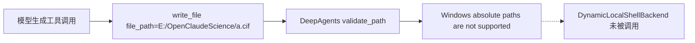
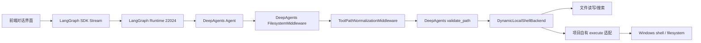
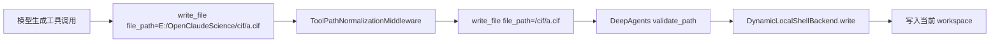
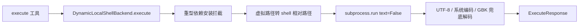
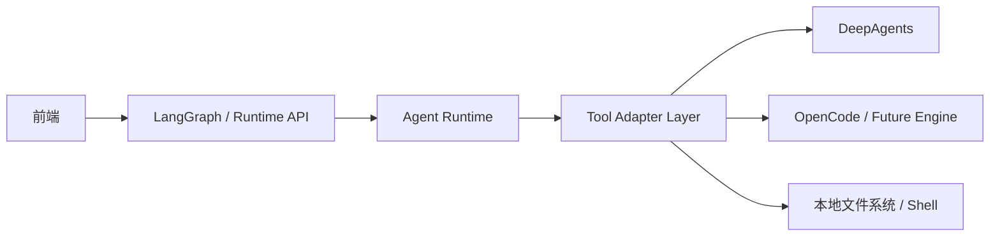

# Runtime 本地工具 Adapter 加固说明

本文说明本次 `fix(runtime): harden local tool execution` 的架构变化。重点不是新增业务功能，而是把 LangGraph Runtime 到 DeepAgents 本地工具之间的适配边界补清楚，避免后续替换 DeepAgents、OpenCode 或其它底层执行器时继续把兼容逻辑散落在主流程里。

## 背景问题

手动测试专业任务时暴露了两个平台层问题：

- 模型在 `write_file` 等文件工具里使用了 Windows 真实路径，例如 `E:/OpenClaudeScience/cif_structures/PbTiO3.cif`。DeepAgents 的文件工具会先执行 `validate_path()`，该校验只接受虚拟路径 `/xxx`，所以请求还没有到我们的 backend 就被拒绝。
- Windows 命令输出可能是 GBK/CP936 编码。原链路委托 DeepAgents `LocalShellBackend.execute()`，内部使用 `subprocess.run(..., text=True)`，在某些命令输出非 UTF-8 字节时会触发 `UnicodeDecodeError`，导致会话卡在“正在思考/工具正在运行”。

这两个问题都属于“底层工具协议和本地系统之间的适配问题”，不应该让页面、业务 route 或 Agent prompt 分散处理。

## 改造前

改造前，本地会话的大致调用链如下：

```mermaid
flowchart LR
  UI[前端对话界面] --> SDK[LangGraph SDK Stream]
  SDK --> Runtime[LangGraph Runtime 22024]
  Runtime --> Agent[DeepAgents Agent]
  Agent --> FSMiddleware[DeepAgents FilesystemMiddleware]
  FSMiddleware --> Validate[validate_path]
  Validate --> Backend[DynamicLocalShellBackend]
  Backend --> LocalShell[DeepAgents LocalShellBackend]
  LocalShell --> OS[Windows shell / filesystem]
```



这个结构的问题是：

- `validate_path` 发生在 `DynamicLocalShellBackend.write()` 之前。
- 因此 backend 里的 `_normalize_path()` 没机会处理 `E:/...`。
- `execute()` 最后委托给 `LocalShellBackend.execute()`，命令输出解码策略由 DeepAgents 控制。

失败链路如下：



命令执行失败链路如下：


## 改造后

改造后，在 DeepAgents 文件工具真正执行前，新增一层 `ToolPathNormalizationMiddleware`。同时，`DynamicLocalShellBackend.execute()` 不再委托 DeepAgents 的 `LocalShellBackend.execute()`，而是由项目自己的 adapter 执行命令和解码输出。



路径修复后的调用链：



命令执行修复后的调用链：



## Adapter 描述

### 1. ToolPathNormalizationMiddleware

位置：

- `internagents/tool_path_middleware.py`
- 在 `create_agent_for_resource()` 和 `create_runtime_agent()` 中注入。

类型：

- Tool call protocol adapter。
- 它适配的是“模型生成的工具参数”和“DeepAgents 文件工具校验协议”之间的差异。

输入：

- `ToolCallRequest`
- `tool_call.name`
- `tool_call.args.file_path` 或 `tool_call.args.path`
- runtime/config/context 中的 `internagents_workspace_path`
- 当前 resource 配置和 fallback root

输出：

- 如果路径是当前 workspace 内的 Windows 绝对路径，则返回新的 `ToolCallRequest`。
- 例如：

```text
E:/OpenClaudeScience/cif_structures/PbTiO3.cif
```

转换为：

```text
/cif_structures/PbTiO3.cif
```

不负责：

- 不放宽 DeepAgents 的安全校验。
- 不允许 workspace 外部路径绕过校验。
- 不处理普通命令字符串里的任意 Windows 路径。
- 不决定审批策略。

### 2. DynamicLocalShellBackend

位置：

- `internagents/dynamic_local_backend.py`

类型：

- Local runtime adapter。
- 它适配的是“DeepAgents backend protocol”和“本机 Windows/Linux shell + workspace 文件系统”之间的差异。

输入：

- `read/write/edit/ls/glob/grep` 等文件操作。
- `execute(command, timeout)` 命令操作。
- resource workspace 配置。
- run metadata 中的 workspace override。

输出：

- `ReadResult`
- `WriteResult`
- `EditResult`
- `ExecuteResponse`
- 文件上传/下载结果

本次新增职责：

- `execute()` 捕获 bytes 输出，再按 UTF-8、系统编码、GBK/CP936 兜底解码。
- 设置 `PYTHONUTF8=1` 和 `PYTHONIOENCODING=utf-8`，降低 Python 子进程输出乱码概率。
- 拦截普通交互里安装重型科学包的命令，例如 PySCF、Psi4、xTB、OpenBabel、FEniCS、OpenFOAM、Gmsh。

不负责：

- 不做真正 sandbox 隔离。
- 不替代远程计算资源。
- 不判断专业任务是否科学准确。
- 不自动安装大型求解器。

### 3. Runtime resource fallback

位置：

- `internagents/agent_graph.py`

作用：

- runtime 模式下，如果 `INTERNAGENT_RUNTIME_ID` 没有直接命中 resource 配置，则回退到默认 local resource。
- 这样 runtime agent 仍然能拿到本地 workspace、路径提示、KB 配置和本地 tool adapter。

不负责：

- 不改变前端协议。
- 不改变 LangGraph assistant id。
- 不改变远程 resource 的选择策略。

## 对后续替换 DeepAgents / OpenCode 的意义

这次改造把兼容逻辑收到了 adapter 层，后续如果把 DeepAgents 换成 OpenCode 或其它执行器，不应该让页面和 API route 感知这些细节。

推荐保持下面这个稳定边界：



需求同事如果要看 adapter 输入输出，可以重点看：

- 输入：工具调用名、工具参数、workspace/resource/runtime metadata。
- 输出：标准化后的工具调用参数、文件操作结果、命令执行结果。
- 副作用：只发生在 adapter 最底层，例如写文件、执行命令、读取目录。

也就是说，后续替换底层工具时，应该优先替换 `ToolAdapter Layer` 及其下游实现，而不是改页面、改业务 route、改模型 prompt。

## 验证

本次提交前执行：

```bash
python -m unittest tests.test_dynamic_local_backend tests.test_tool_path_middleware
```

结果：

```text
Ran 9 tests
OK
```

覆盖点：

- Windows workspace 绝对路径可以转换成 DeepAgents 虚拟路径。
- `write_file` 在转换后可以正常通过 DeepAgents 文件工具校验。
- GBK/非 UTF-8 子进程输出不会导致 runtime 解码异常。

## 当前边界

这次修的是平台稳定性，不是专业能力质量本身。

- PbTiO3、咖啡因这类任务能否输出高质量科学报告，还要继续补专业 Skill、工具链和报告模板。
- 如果真实计算需要 PySCF、Psi4、xTB 等大型依赖，应走单独的环境准备/远程计算流程，而不是普通对话里临时安装。
- 右侧文件预览、CAE/3D 预览、远程 runtime 等仍然是独立链路，不属于本文的本地工具 adapter 范围。
