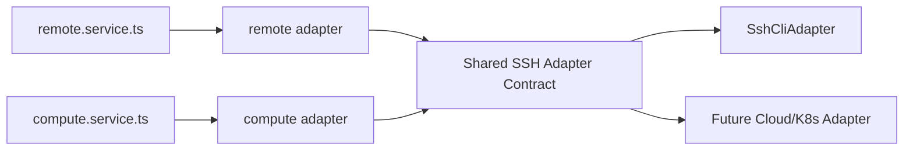

# Shared SSH Adapter Contract

本文档定义 remote 和 compute 共同使用的 SSH adapter 契约。

它要解决的问题是：当前 remote 和 compute 都在处理 SSH，但它们各自维护 SSH host、命令校验、远端探测、远端命令执行，后续容易重复发散。

对应的代码级 contract types：

```text
ui/src/server/shared/contracts/sharedSsh.contract.ts
ui/src/server/shared/contracts/adapterError.contract.ts
```

统一导出入口：

```text
ui/src/server/shared/contracts/index.ts
```

当前 concrete adapter 落点：

```text
ui/src/server/shared/adapters/sshCli.adapter.ts
ui/src/server/shared/adapters/index.ts
```

## 1. 当前问题

当前 SSH 相关逻辑主要分布在：

```text
remote:
  ui/src/app/api/remote-connections/_lib/remote-connections.ts
  ui/src/server/domains/remote/adapters/remoteConnections.adapter.ts

compute:
  ui/src/app/api/compute/_lib/ssh-remote-jobs.ts
  ui/src/server/domains/compute/adapters/sshRemoteJobs.adapter.ts
```

两边都涉及：

```text
读取 ~/.ssh/config
校验 Host alias
拼接 ssh 命令
执行远端 shell
探测远端环境
处理 stdout/stderr
处理超时
屏蔽敏感信息
```

第一轮改造先把它们分别包进 remote/compute adapter，是合理的。

第二轮建议沉淀共享 SSH contract，避免两边继续各写一套。

## 2. 目标结构

目标结构：



remote 和 compute 不直接依赖具体 SSH CLI 细节，而是依赖共享 contract。

## 3. 非目标

Shared SSH Adapter 不负责：

```text
不决定 remote backend 如何安装
不决定 compute job 如何提交
不决定 workspace 文件如何解析
不保存业务资源配置
不直接返回 HTTP response
```

它只负责 SSH 连接和远端命令能力。

## 4. 核心概念

### 4.1 SSH Host

```ts
interface SshHost {
  alias: string;
  source: string;
}
```

说明：

- `alias` 来自 `~/.ssh/config` 的 Host。
- `source` 是配置文件来源路径。
- 不应该把 private key 内容读入或返回。

### 4.2 SSH Connection

```ts
interface SshConnection {
  mode: "sshConfig" | "sshCommand";
  hostAlias?: string;
  sshCommand?: string;
  displayName: string;
}
```

建议策略：

- 默认优先使用 `sshConfig`。
- `sshCommand` 只允许单行 `ssh ...` 连接命令。
- 不允许附加远端命令。
- 不允许管道、重定向、命令串联。

### 4.3 Remote Command

```ts
interface RemoteCommandInput {
  connection: SshConnection;
  script: string;
  timeoutMs?: number;
  maxBufferBytes?: number;
  signal?: AbortSignal;
}

interface RemoteCommandResult {
  stdout: string;
  stderr: string;
  exitCode: number;
  timedOut?: boolean;
}
```

规则：

- `script` 是远端执行脚本，由 adapter 负责安全包装。
- stdout/stderr 应限制最大长度。
- 超时必须可控。
- 失败时应返回结构化错误。

## 5. Adapter Interface

建议目标接口：

```ts
interface SharedSshAdapter {
  listHosts(input?: ListSshHostsInput): Promise<SshHost[]>;
  resolveConnection(input: ResolveSshConnectionInput): Promise<SshConnection>;
  testConnection(input: TestSshConnectionInput): Promise<SshProbeResult>;
  runCommand(input: RemoteCommandInput): Promise<RemoteCommandResult>;
  runCommandWithInput(input: RemoteStdinCommandInput): Promise<RemoteCommandResult>;
  runJsonCommand<T>(input: RemoteJsonCommandInput): Promise<T>;
  openTunnel(input: OpenSshTunnelInput): Promise<SshTunnelHandle>;
}
```

### 5.1 listHosts

```ts
interface ListSshHostsInput {
  includePatterns?: boolean;
}
```

要求：

- 默认过滤 `Host *`、`Host ?` 这类 pattern。
- 支持读取 `Include`。
- 去重。
- 不返回敏感配置。

### 5.2 resolveConnection

```ts
interface ResolveSshConnectionInput {
  connectionMode?: "sshConfig" | "sshCommand";
  host?: unknown;
  sshCommand?: unknown;
}
```

输出：

```ts
interface SshConnection {
  mode: "sshConfig" | "sshCommand";
  hostAlias?: string;
  sshCommand: string;
  displayName: string;
}
```

规则：

- `sshConfig` 模式必须确认 Host 存在于 `~/.ssh/config`。
- `sshCommand` 模式必须经过命令安全校验。
- 输出的 `sshCommand` 可以被底层 CLI adapter 使用，但不能暴露给无关 UI。

### 5.3 testConnection

```ts
interface TestSshConnectionInput {
  connection: SshConnection;
  timeoutMs?: number;
}

interface SshProbeResult {
  ok: boolean;
  checkedAt: string;
  user?: string;
  host?: string;
  os?: string;
  kernel?: string;
  arch?: string;
  python?: string;
  bash?: string;
  workdir?: string;
  error?: string;
}
```

remote 和 compute 可以在此基础上做自己的业务判断：

- remote backend 可能需要 Python/Node。
- compute job 可能需要 Linux、python3、bash、timeout。

### 5.4 runCommand

```ts
interface RemoteCommandInput {
  connection: SshConnection;
  script: string;
  timeoutMs?: number;
  maxBufferBytes?: number;
  signal?: AbortSignal;
}
```

错误结构：

```ts
interface SshAdapterError extends Error {
  code:
    | "SSH_CONFIG_NOT_FOUND"
    | "INVALID_SSH_COMMAND"
    | "AUTH_FAILED"
    | "CONNECT_TIMEOUT"
    | "COMMAND_TIMEOUT"
    | "REMOTE_COMMAND_FAILED"
    | "OUTPUT_TOO_LARGE"
    | "CANCELLED"
    | "UNKNOWN";
  stdout?: string;
  stderr?: string;
  retryable?: boolean;
}
```

### 5.5 runJsonCommand

用于 compute 这类远端 Python JSON 协议：

```ts
interface RemoteJsonCommandInput extends RemoteCommandInput {
  input?: unknown;
}
```

规则：

- adapter 负责解析 JSON。
- JSON 解析失败返回 `PARSE_ERROR` 或 `REMOTE_COMMAND_FAILED`。
- service 不直接解析远端 stdout。

### 5.6 runCommandWithInput

用于 remote backend CLI 上传、runtime config 上传这类 stdin streaming 场景：

```ts
type RemoteCommandStdin = string | Uint8Array | Readable;

interface RemoteStdinCommandInput extends RemoteCommandInput {
  stdin: RemoteCommandStdin;
}
```

规则：

- adapter 负责把 `stdin` pipe 到远端 bash 脚本。
- adapter 负责限制 stdout/stderr buffer。
- adapter 负责 timeout 后终止 ssh 进程。
- 调用方仍负责决定上传内容、远端路径和业务日志。

### 5.7 openTunnel

用于 remote runtime 本地访问 tunnel：

```ts
interface OpenSshTunnelInput {
  connection: SshConnection;
  localPort: number;
  remotePort: number;
  remoteHost?: string;
  logFile?: string;
  pidFile?: string;
  replaceExistingPid?: boolean;
}
```

规则：

- adapter 负责启动 `ssh -N -L localPort:remoteHost:remotePort`。
- adapter 可以写 `logFile` 和 `pidFile`。
- adapter 可以根据 `pidFile` 停掉旧 tunnel。
- 调用方负责健康检查，比如等待 `http://127.0.0.1:<localPort>/ok`。
- 调用方负责决定 resourceId、日志路径和用户提示。

## 6. 安全规则

SSH adapter 必须遵守：

```text
不读取 private key 明文
不返回 private key 路径以外的敏感内容
不允许 sshCommand 附加远端命令
不允许 shell 管道、重定向、串联命令进入 sshCommand
不把完整 .ssh/config 原文返回给前端
不把 token、password、API key 写入日志
```

允许：

```text
读取 ~/.ssh/config 的 Host alias
执行经过包装的远端脚本
返回受限 stdout/stderr
返回远端环境探测摘要
```

## 7. remote 域如何使用

remote 域需要 SSH 能力做：

```text
测试远端连接
选择远端 runtime 端口
上传 backend CLI
上传 runtime config
启动远端 backend
建立本地 tunnel
```

remote service 不应自己解析 SSH 命令。

目标：

```text
remote.service.ts
  -> remoteBackend.adapter.ts
    -> sharedSsh.adapter.ts
```

remote 特有逻辑留在 remote adapter：

```text
backend CLI 打包/上传
远端 runtime 目录
远端 backend 版本
resources config 更新
```

## 8. compute 域如何使用

compute 域需要 SSH 能力做：

```text
保存 compute host
探测 Linux 环境
提交远程 job
查询 job 状态
收集输出文件
```

目标：

```text
compute.service.ts
  -> computeJob.adapter.ts
    -> sharedSsh.adapter.ts
```

compute 特有逻辑留在 compute adapter：

```text
job store
scratchRoot
remote job id
input/output 文件限制
timeoutSeconds
outputGlobs
```

## 9. 可替换实现

初期实现：

```text
SshCliAdapter
  -> local ssh binary
```

未来可替换：

```text
ParamikoAdapter
CloudShellAdapter
KubernetesExecAdapter
SlurmLoginNodeAdapter
```

替换要求：

- 仍实现 SharedSshAdapter contract。
- remote/compute service 不感知底层变化。
- 错误码保持稳定。
- stdout/stderr/timeout 语义保持稳定。

## 10. 第二轮落地顺序

建议执行：

```text
1. 新增 shared ssh contract 文档
2. 新增 shared ssh adapter types
3. 从 remoteConnections.adapter.ts 抽出 SSH host list / command validate / run command
4. 从 sshRemoteJobs.adapter.ts 复用 shared ssh adapter
5. 保持 remote/compute API 行为不变
6. 给 SSH command 校验和 Host config 解析补单元测试
```

当前落地状态：

```text
已完成：
1. shared ssh contract 文档
2. shared ssh adapter TypeScript types
3. shared ssh concrete adapter：sshCliAdapter
4. remoteConnections.adapter.ts 的 ssh-hosts/test 接入
5. compute ssh host alias 校验接入
6. compute Linux 环境 probe 接入
7. remote ensure/setup/push 内部普通 SSH command helper 接入
8. SSH command 与 Host config 解析测试
9. stdin streaming 与 local tunnel contract/adapter 能力
10. remote streaming upload / tunnel 旧调用迁移到 shared SSH adapter

未完成：
1. compute job 提交/状态采集协议迁移
2. shared SSH adapter 错误码结构化
```

当前不建议：

```text
不同时重写 remote backend 安装逻辑
不同时重写 compute job 协议
不直接引入新的 SSH 库
不改变前端 remote/compute 页面协议
```
