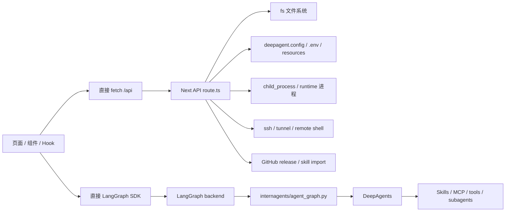
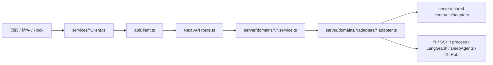
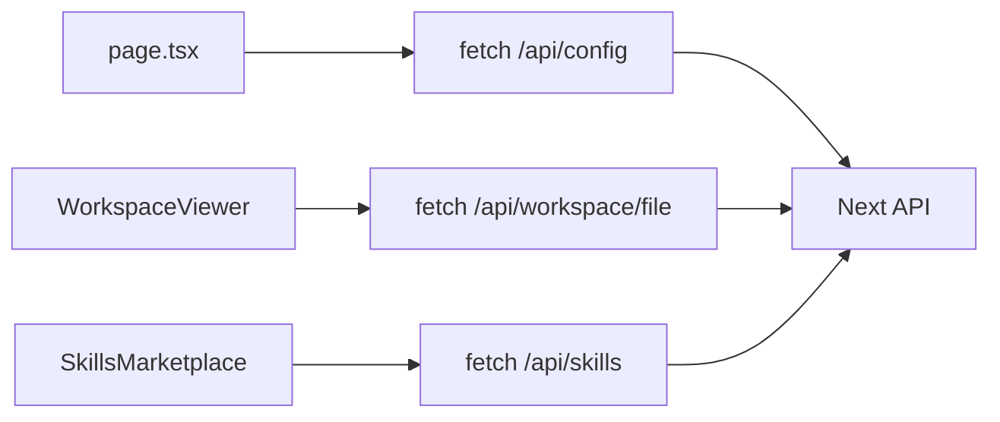
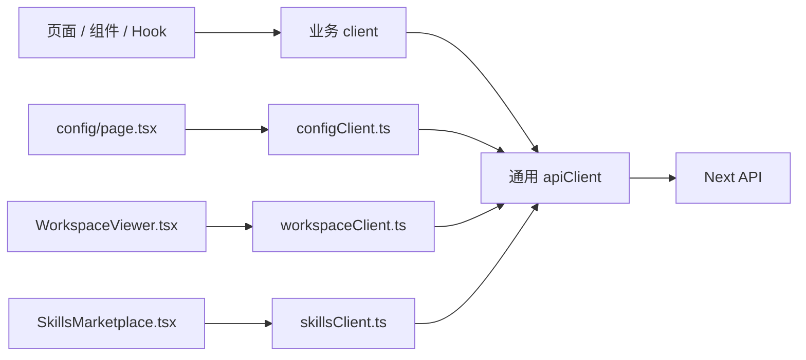
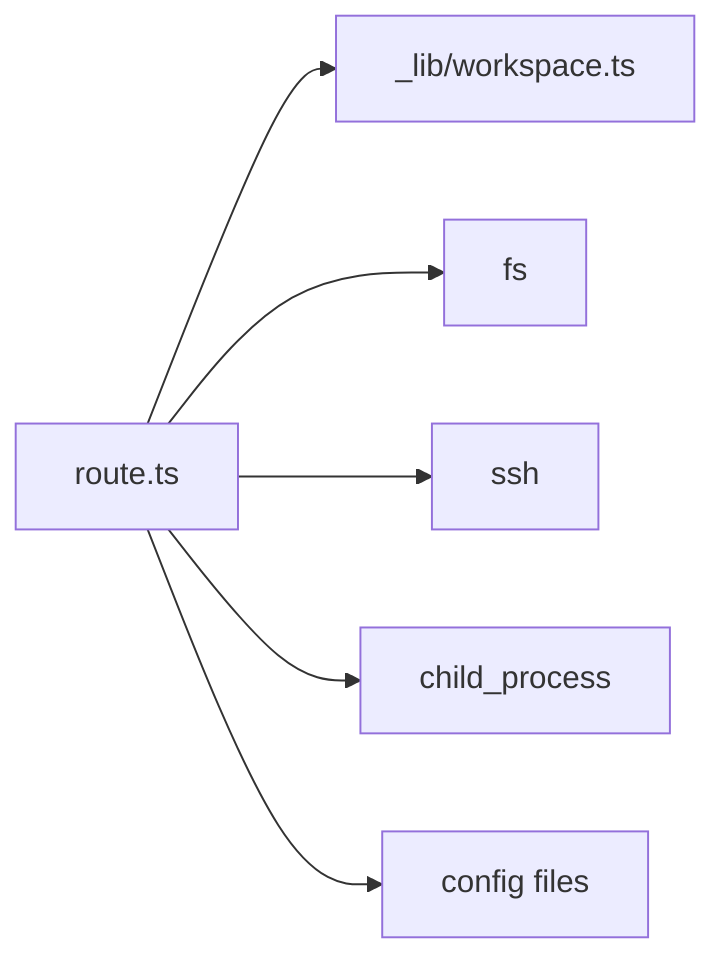
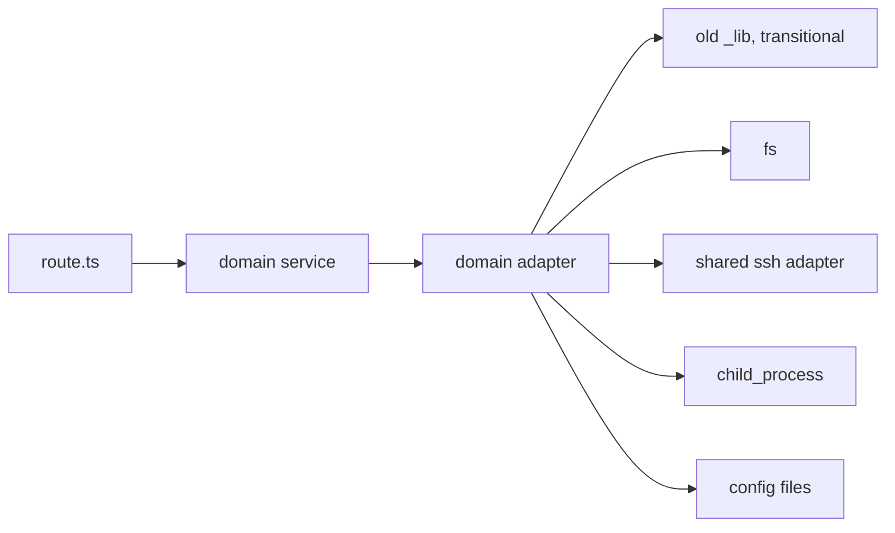
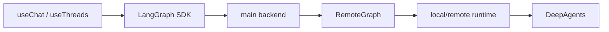
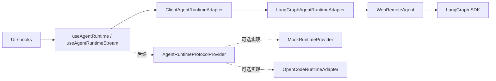
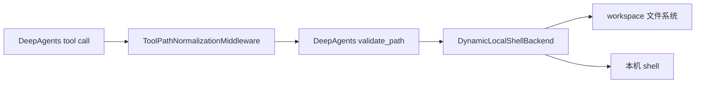
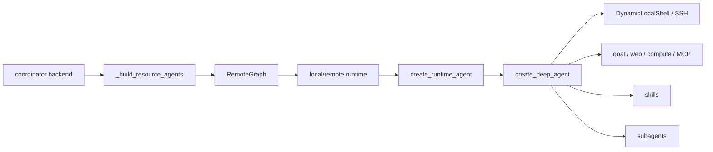

# 全量架构与 Adapter 说明

> 范围：本文基于当前 `E:\OpenClaudeScience` 代码结构，说明架构改造前后差异，并给出当前全部 Adapter / Client / Runtime Protocol 的职责、输入、输出、副作用和可替换边界。
>
> 读者：领导、需求同事、后续开发同事。本文尽量用业务语言解释，再给出代码位置。

## 0. 结论先行

当前项目已经从“页面、API route、底层系统调用混在一起”的结构，改造成了较清晰的分层结构：

```text
前端页面 / Hook / 组件
  -> 前端 services client
    -> Next API route
      -> server domain service
        -> adapter / shared contract
          -> 文件系统 / SSH / 进程 / LangGraph / DeepAgents / MCP / GitHub
```

这次改造的核心价值不是“链路变短”，而是“责任边界变清楚”：

- 页面不再到处直接 `fetch("/api/...")`。
- API route 基本只负责 HTTP 入参、出参和状态码。
- 业务流程下沉到 `ui/src/server/domains/*/*.service.ts`。
- 底层副作用下沉到 `ui/src/server/domains/*/adapters/*.adapter.ts`。
- SSH、Agent runtime、错误格式等横向能力开始有 shared contract。
- Agent Runtime 已开始从 LangGraph / DeepAgents 具体实现中抽出协议和 provider 边界。

但也要客观说明：当前不是“所有底层都彻底抽干净”的最终形态。部分 adapter 仍然是过渡包装，内部还调用旧的 `ui/src/app/api/**/_lib`。这不是失败，而是有意保守的中间态：先稳住 HTTP 协议和用户行为，再逐步拆掉旧实现。

## 1. 改造前架构

改造前，项目能跑，但边界不清：



主要问题：

| 问题 | 表现 | 后果 |
| --- | --- | --- |
| 前端接口分散 | 页面、组件、Hook 中散落 `fetch("/api/...")` | API 参数、错误处理、NDJSON 解析重复 |
| API route 太厚 | route 同时处理 HTTP、业务规则、文件、SSH、进程 | 修改风险大，难测试 |
| 底层副作用无边界 | 文件系统、SSH、GitHub、runtime 启停直接散落 | 后续替换底层能力很痛 |
| Agent runtime 依赖具体实现 | UI 知道 LangGraph SDK、thread、run、stream 细节 | 换 OpenCode / 其他 runtime 会牵动主链路 |
| Python agent 构建集中 | `agent_graph.py` 同时管模型、Skills、MCP、RemoteGraph、DeepAgents | 专业能力扩展容易互相影响 |

## 2. 改造后当前架构

当前架构变成：



每层职责：

| 层 | 代码位置 | 只负责什么 | 不负责什么 |
| --- | --- | --- | --- |
| UI 层 | `ui/src/app/**` | 展示、交互、React 状态 | 拼底层协议、直接读写文件、直接 SSH |
| 前端 Client 层 | `ui/src/app/services/*Client.ts` | 封装浏览器到 Next API 的请求 | 业务副作用、文件系统、LangGraph 内部协议 |
| API route 层 | `ui/src/app/api/**/route.ts` | HTTP query/body/formData/header、状态码、JSON/stream response | 复杂业务、系统调用、SSH、进程 |
| Domain service 层 | `ui/src/server/domains/*/*.service.ts` | 业务流程、规则、组合多个 adapter | 直接 `fs`、直接 `ssh`、直接启动进程 |
| Adapter 层 | `ui/src/server/domains/*/adapters/*.adapter.ts` | 文件/SSH/进程/GitHub/LangGraph 等副作用 | React 状态、HTTP response、页面展示 |
| Shared contract 层 | `ui/src/server/shared/contracts/*` | 横向协议、错误、SSH、Agent runtime 形状 | 具体实现 |
| Python runtime 层 | `internagents/*.py` | DeepAgents、工具、Skills、MCP、RemoteGraph、shell backend | 前端 UI、Next API 入参出参 |

## 3. 前后架构对比

### 3.1 UI 到 API

改造前：



改造后：



变化：

- URL、请求体、返回字段基本不变。
- 页面从“知道 API 细节”变成“调用业务动作”。
- 例如页面调用 `listWorkspaceFiles()`，而不是自己拼 `/api/workspace/files?...`。

### 3.2 API 到后端服务

改造前：



改造后：



变化：

- route 变薄。
- service 代表业务域。
- adapter 集中底层副作用。
- 有些 adapter 仍然调用旧 `_lib`，这是过渡状态，后续可以继续替换。

### 3.3 Agent Runtime

改造前：



改造后：



变化：

- UI 不应该长期直接依赖 LangGraph SDK 的细节。
- 当前 concrete runtime 仍是 LangGraph / DeepAgents。
- 已经有 `mock` 和 `opencode` provider kind 的协议位置，但 OpenCode 尚未接入。

### 3.4 Python Runtime / 本地工具

改造后新增了本地工具适配边界：



意义：

- Windows 绝对路径先转成 DeepAgents 允许的虚拟路径。
- 命令输出解码由项目自己控制，避免 GBK/UTF-8 问题卡住 runtime。
- 这些都属于 tool/runtime adapter，不应该散落到 UI 或 prompt。

## 4. Adapter 设计原则

后续所有 adapter 都应该遵守下面规则。

### 4.1 输入

输入应尽量是结构化对象：

```ts
adapter.readFile({
  resourceId,
  workspaceId,
  path,
  signal,
  timeoutMs,
});
```

不要使用一堆位置参数：

```ts
adapter.readFile(resourceId, workspaceId, path);
```

原因：结构化对象更容易扩展、更容易写文档，也更容易替换底层实现。

### 4.2 输出

输出也应该是结构化对象，不直接把底层原始协议泄漏给 service：

```ts
{
  path: "src/app/page.tsx",
  content: "...",
  size: 1024,
  modifiedAt: "2026-07-09T10:00:00.000Z"
}
```

不要让 service 直接处理：

```text
ssh stdout string
LangGraph raw event
OpenCode raw JSONL
child_process raw error
```

### 4.3 错误

横向错误 contract 已存在：

```text
ui/src/server/shared/contracts/adapterError.contract.ts
```

标准错误形状：

```ts
{
  code: "INVALID_INPUT" | "NOT_FOUND" | "AUTH_FAILED" | "TIMEOUT" | "...",
  message: string,
  retryable?: boolean,
  details?: unknown
}
```

adapter 不应该直接决定最终 HTTP 状态码。HTTP 状态码由 service / route 映射。

### 4.4 副作用

每个 adapter 文档必须说明允许的副作用：

- 是否能写文件？
- 是否能启动进程？
- 是否能连 SSH？
- 是否能下载网络资源？
- 是否能修改配置？
- 是否能调用模型或 Agent runtime？

这是需求同事评估“底层能不能替换”的关键。

## 5. 前端 Client 总清单

这些不是底层 adapter，但它们是前端接口层。它们把页面从 API URL 细节中解耦出来。

| 文件 | 面向业务域 | 输入 | 输出 | 副作用 | 后端 API |
| --- | --- | --- | --- | --- | --- |
| `apiClient.ts` | 通用 HTTP | URL、query、body、signal | JSON、NDJSON event | 浏览器 HTTP 请求 | 所有 `/api/*` |
| `configClient.ts` | config | 配置保存请求 | 配置响应、onboarding 判断 | HTTP | `/api/config` |
| `runtimeClient.ts` | runtime | backend URL、restart 请求 | ready/status/restart 结果 | HTTP | `/api/runtime/*` |
| `resourcesClient.ts` | resources | 无或 signal | resource 列表 | HTTP | `/api/resources` |
| `workspacesClient.ts` | workspaces | workspace id/path/name | workspace 列表 | HTTP | `/api/workspaces` |
| `workspaceClient.ts` | workspace 文件 | resourceId、workspaceId、path、FormData | 文件树、预览、raw blob、搜索、附件 | HTTP | `/api/workspace/*` |
| `remoteClient.ts` | remote runtime | SSH host/command、setup 参数 | SSH host、测试结果、NDJSON 日志 | HTTP stream | `/api/remote-connections/*` |
| `skillsClient.ts` | skills | skill 配置、导入请求、connection 配置 | skill 列表、导入结果、连接配置 | HTTP | `/api/skills/*` |
| `computeClient.ts` | compute | compute host 配置 | compute host / probe 结果 | HTTP | `/api/compute/*` |
| `updateClient.ts` | update | check/apply/rollback 操作 | update status | HTTP | `/api/update/*` |

前端 Client 的边界：

- 只做请求封装和基础解析。
- 不直接操作文件系统。
- 不直接启动 runtime。
- 不直接 SSH。
- 不理解 DeepAgents / OpenCode 的底层协议。

## 6. Server Domain Adapter 总清单

### 6.1 Config

代码位置：

```text
ui/src/server/domains/config/
```

| Adapter | 职责 | 输入 | 输出 | 副作用 | 当前成熟度 |
| --- | --- | --- | --- | --- | --- |
| `configFile.adapter.ts` | 读写 `deepagent.config.json` | `AgentConfig` 或无 | `AgentConfig` | 读写配置文件 | 已拆实 |
| `envFile.adapter.ts` | 读写 `.env` | env updates | env key/value | 读写 `.env` | 已拆实 |
| `workspaceConfig.adapter.ts` | 解析/更新当前 workspace 配置 | workspace path | workspace root/path | 读写 resources/workspace 配置 | 过渡，仍复用旧 workspace `_lib` |

服务入口：

```text
config.service.ts
  getConfig()
  updateConfig()
```

可替换方向：

- 本地 JSON 配置可以换成加密配置、数据库配置、远程配置中心。
- 只要 service 拿到同样的 `ConfigResponse`，前端不用改。

### 6.2 Resources

代码位置：

```text
ui/src/server/domains/resources/
```

| Adapter | 职责 | 输入 | 输出 | 副作用 | 当前成熟度 |
| --- | --- | --- | --- | --- | --- |
| `resources.adapter.ts` | 读取资源注册表，转换成 UI resource | 无 | `defaultResourceId`、`resources[]` | 读 resources 配置 | 过渡，仍复用旧 workspace `_lib` |

服务入口：

```text
resources.service.ts
  getResources()
```

resource 是跨域对象，会影响：

- chat 用哪个 assistant/runtime。
- workspace 根目录在哪。
- remote runtime URL/SSH 配置。

### 6.3 Workspaces

代码位置：

```text
ui/src/server/domains/workspaces/
```

| Adapter | 职责 | 输入 | 输出 | 副作用 | 当前成熟度 |
| --- | --- | --- | --- | --- | --- |
| `workspaces.adapter.ts` | workspace 列表、默认 workspace、更新、删除 | workspace id/path/name | workspace response | 读写 workspace/resource 配置 | 过渡，仍复用旧 workspace `_lib` |
| `folderPicker.adapter.ts` | 打开本地文件夹选择器 | 无 | 选中的路径或取消 | 调用系统文件夹选择器 | 过渡，复用 `local-folder-picker` |

服务入口：

```text
workspaces.service.ts
  getWorkspaces()
  setDefaultWorkspace()
  updateWorkspace()
  deleteWorkspace()
  pickWorkspace()
```

### 6.4 Workspace

代码位置：

```text
ui/src/server/domains/workspace/
```

| Adapter | 职责 | 输入 | 输出 | 副作用 | 当前成熟度 |
| --- | --- | --- | --- | --- | --- |
| `workspacePath.adapter.ts` | 解析 resource/workspace/path 到真实路径 | resourceId、workspaceId、path | resolved path/resource | 读 workspace/resource 配置 | 过渡，仍用旧 `_lib` 类型/函数 |
| `workspaceMetadata.adapter.ts` | 文件可读性、元数据、路径约束 | relative path | metadata / 校验结果 | 读文件 metadata | 过渡 |
| `workspaceDirectory.adapter.ts` | 列目录、搜索文件 | path、resourceId、workspaceId | entries/search results | 读本地或远程 workspace | 过渡 |
| `workspaceFile.adapter.ts` | 读预览、raw 文件、写 raw 文件 | path、range、content | preview/raw stream/buffer | 读写 workspace 文件 | 过渡 |
| `localDesktop.adapter.ts` | 本地打开文件/文件夹 | 本地路径 | void | 调 OS 打开文件/目录 | 基本已拆实 |
| `attachmentExtraction.adapter.ts` | PDF/Office 附件文本提取 | 文件路径/内容 | 提取文本、摘要路径 | 读文件，可能调用解析库 | 过渡，仍复用 office-preview |

服务入口：

```text
workspace.service.ts
  listWorkspaceDirectory()
  searchWorkspaceDirectoryFiles()
  readWorkspaceFile()
  readWorkspaceRawFileContent()
  openWorkspaceRoot()
  openWorkspaceFile()

workspaceAttachment.service.ts
  uploadWorkspaceAttachment()
```

可替换方向：

- 本地 workspace adapter。
- SSH workspace adapter。
- 云对象存储 workspace adapter。
- 专业 CAE/CAD preview adapter。

注意：workspace 是后续航空 CAE 能力最容易变重的地方，但专业解析能力不应该塞回 `workspace.service.ts`，应该成为独立专业 adapter 或 skill/tool。

### 6.5 Runtime

代码位置：

```text
ui/src/server/domains/runtime/
```

| Adapter | 职责 | 输入 | 输出 | 副作用 | 当前成熟度 |
| --- | --- | --- | --- | --- | --- |
| `backendHealth.adapter.ts` | 判断本地 backend URL 是否 ready | backend URL | `{ ready }` | HTTP `/ok` 探测 | 已拆实 |
| `backendStatus.adapter.ts` | 查询 backend idle/busy/interrupted | 无 | backend status | 读 runtime 状态 | 过渡，包装旧 runtime `_lib` |
| `backendRestart.adapter.ts` | 重启 main backend 和 local runtime | 无 | restart result | 杀进程、启动进程、写 pid/log/resources | 过渡，包装旧 runtime `_lib` |
| `desktopRuntime.adapter.ts` | 生成桌面运行时配置 | 无 | desktop runtime config | 读取 runtime/resource 配置 | 过渡 |

服务入口：

```text
runtime.service.ts
  checkRuntimeBackendReady()
  getRuntimeStatus()
  restartRuntime()
  getDesktopRuntimeConfigScript()
```

可替换方向：

- `LocalLangGraphRuntimeAdapter`
- `ManagedProcessRuntimeAdapter`
- `RemoteRuntimeAdapter`
- `OpenCodeRuntimeAdapter`

这里的 runtime 是“Agent 运行服务”，不是 Next.js 的运行模式。

### 6.6 Remote

代码位置：

```text
ui/src/server/domains/remote/
```

| Adapter | 职责 | 输入 | 输出 | 副作用 | 当前成熟度 |
| --- | --- | --- | --- | --- | --- |
| `remoteSsh.adapter.ts` | 列 SSH host、测试 SSH 连接 | SSH host/command | host list / probe result | 读 `~/.ssh/config`、执行 SSH | 已复用 shared SSH |
| `remoteRuntime.adapter.ts` | ensure/setup 远程 runtime | setup/ensure 请求 | NDJSON stream events | SSH、远程安装、启动 runtime、写资源配置 | 过渡，包装旧 remote `_lib` |
| `remoteBackendCli.adapter.ts` | 推送 backend CLI 到远程 | push 请求 | NDJSON stream events | SSH/SCP/远程文件写入 | 过渡，包装旧 remote `_lib` |

服务入口：

```text
remote.service.ts
  createEnsureRemoteRuntimeStream()
  createSetupRemoteRuntimeStream()
  createPushRemoteBackendCliStream()
  testRemoteConnection()
  getRemoteSshHosts()
```

remote 和 compute 的区别：

```text
remote = 让远程机器跑一个 Agent runtime
compute = 在远程机器提交一次计算 job
```

### 6.7 Skills

代码位置：

```text
ui/src/server/domains/skills/
```

| Adapter | 职责 | 输入 | 输出 | 副作用 | 当前成熟度 |
| --- | --- | --- | --- | --- | --- |
| `skillsConfigFile.adapter.ts` | 读写 skill 启用状态、active skills 同步 | skill settings | skills config response | 读写 `deepagent.config.json`、`.internagents/active-skills` | 过渡，包装旧 skills `_lib` |
| `skillsImport.adapter.ts` | 从本地/GitHub 导入 skill | import request | import result | git/HTTP 下载、复制文件 | 过渡 |
| `skillFolderPicker.adapter.ts` | 选择本地 skill 文件夹 | 无 | folder path | 调系统选择器 | 过渡 |
| `skillConnections.adapter.ts` | MCP/SCP connection 配置 | connection config | connection response | 读写 `.mcp.json`、`.env` | 部分已拆实 |

服务入口：

```text
skills.service.ts
  getSkillsConfig()
  updateSkills()
  importSkillsFromSource()
  pickLocalSkillFolder()
  getSkillConnections()
  updateSkillConnections()
```

重要边界：

- Skill 是能力包，不等于独立 Agent。
- Skill 如何进入 DeepAgents 当前仍由 Python runtime 侧处理。
- 后续如果做 OpenCodeRuntimeAdapter，需要重新定义 skill 如何注入 OpenCode。

### 6.8 Compute

代码位置：

```text
ui/src/server/domains/compute/
```

| Adapter | 职责 | 输入 | 输出 | 副作用 | 当前成熟度 |
| --- | --- | --- | --- | --- | --- |
| `computeAuth.adapter.ts` | 校验 compute API 调用权限 | NextRequest | void/error | 读取 token/origin 配置 | 已拆实 |
| `computeHost.adapter.ts` | 探测/保存 compute host | host alias/config | host/probe result | SSH 探测、写 store | 已拆实 |
| `computeJob.adapter.ts` | 提交 job、读取 job 快照 | job request/job id | job record/snapshot | SSH 提交、读写 store | 已拆实 |
| `computeRemoteJobProtocol.adapter.ts` | 远程 job submit/status 协议 | SSH connection、job payload | remote job status/output | SSH 执行远程脚本 | 已拆实 |
| `computeStore.adapter.ts` | 本地 host/job 状态存储 | host/job record | host/job record | 读写 `.internagents/compute/*.json` | 已拆实 |
| `computeStore.helpers.ts` | store record upsert helper | record arrays | updated arrays | 无直接 IO | 已拆实 |

服务入口：

```text
compute.service.ts
  getComputeHosts()
  upsertComputeHost()
  getComputeJobs()
  submitRemoteComputeJob()
  getComputeJobSnapshot()
```

可替换方向：

- SSH compute adapter。
- Slurm/PBS adapter。
- 云 Batch adapter。
- Kubernetes Job adapter。

### 6.9 Update

代码位置：

```text
ui/src/server/domains/update/
```

| Adapter | 职责 | 输入 | 输出 | 副作用 | 当前成熟度 |
| --- | --- | --- | --- | --- | --- |
| `updateState.adapter.ts` | 读取当前更新状态 | 无 | update status | 读更新状态文件 | 过渡，包装旧 update `_lib` |
| `updateRelease.adapter.ts` | 检查远程 release | 无 | update status | GitHub/network | 过渡 |
| `updateInstall.adapter.ts` | 应用更新 | 无 | update status | 下载/替换本地应用文件 | 过渡 |
| `updateRollback.adapter.ts` | 回滚更新 | 无 | update status | 读写/替换本地应用文件 | 过渡 |

服务入口：

```text
update.service.ts
  getCurrentUpdateStatus()
  checkForAvailableUpdate()
  applyAvailableUpdate()
  rollbackCurrentUpdate()
```

## 7. Shared Adapter / Contract

### 7.1 Adapter Error Contract

位置：

```text
ui/src/server/shared/contracts/adapterError.contract.ts
```

职责：

- 统一 adapter 错误码。
- 提供 `AdapterError`。
- 支持 `signal`、`timeoutMs` 等操作选项。

输入/输出：

```text
输入：AdapterErrorShape
输出：AdapterError instance / error shape
```

### 7.2 Shared SSH Contract

位置：

```text
ui/src/server/shared/contracts/sharedSsh.contract.ts
ui/src/server/shared/adapters/sshCli.adapter.ts
ui/src/server/shared/adapters/sshCli.helpers.ts
```

职责：

- 统一 SSH host 列表。
- 统一 SSH command / config host 解析。
- 统一远程命令执行。
- 统一 JSON 命令、stdin 命令、SSH tunnel。

核心接口：

```ts
interface SharedSshAdapter {
  listHosts()
  resolveConnection()
  testConnection()
  runCommand()
  runCommandWithInput()
  runJsonCommand()
  openTunnel()
}
```

允许副作用：

- 读取 `~/.ssh/config`。
- 执行本机 `ssh` 命令。
- 建立 tunnel。

不负责：

- 不理解 remote runtime 的业务流程。
- 不理解 compute job 的业务流程。
- 不直接修改 resources 配置。

### 7.3 Agent Runtime Server Contract

位置：

```text
ui/src/server/shared/contracts/agentRuntime.contract.ts
```

职责：

- 描述服务端 Agent runtime 的健康检查、thread state、run、cancel、事件流。
- 给未来 `DeepAgentsRuntimeAdapter` / `OpenCodeRuntimeAdapter` 预留稳定输入输出。

核心输入：

```text
threadId
assistantId
resourceId
workspaceId
messages
model
workspace
skills
attachments
signal / timeoutMs
```

核心输出事件：

```text
run_started
message_delta
message_completed
tool_call
tool_result
interrupt
state
artifact
error
done
```

当前状态：

- contract 已定义。
- 还没有完全替代主聊天链路。
- 后续接 OpenCode 时应该优先实现这个 contract 或客户端 runtime protocol。

## 8. Client Agent Runtime / Protocol Adapter

### 8.1 ClientAgentRuntimeAdapter

位置：

```text
ui/src/lib/agent-runtime.ts
```

职责：

- 前端运行时 facade。
- 屏蔽 `WebRemoteAgent` 和 LangGraph SDK 直接调用。
- 提供 thread、state、history、submit、stop、事件订阅等入口。

当前 concrete 实现：

```text
LangGraphAgentRuntimeAdapter
```

输入：

- deploymentUrl
- assistantId
- apiKey/header
- threadId
- run input/options

输出：

- LangGraph thread/state/history。
- stream submit/stop 结果。
- 中立 protocol events 的旁路订阅。

当前边界：

- 仍保留 `getStreamClient()` 给 `useStream()` 过渡。
- 当前 provider 只有 `"langgraph"`。

### 8.2 AgentRuntimeProtocolProvider

位置：

```text
ui/src/lib/agent-runtime-provider.ts
ui/src/lib/agent-runtime-protocol.ts
```

职责：

- 定义跨 runtime 的标准 provider 接口。
- 不依赖 React、LangGraph、DeepAgents。

核心接口：

```ts
interface AgentRuntimeProtocolProvider {
  provider: "langgraph" | "mock" | "opencode";
  healthCheck?(): Promise<Health>;
  run(input, options): AsyncIterable<AgentRuntimeRunEvent>;
  cancelRun?(input): Promise<void>;
}
```

### 8.3 MockRuntimeProvider

位置：

```text
ui/src/lib/mock-agent-runtime.ts
```

职责：

- 用纯 TypeScript 生成标准 runtime events。
- 验证 UI/协议是否可以脱离真实 LangGraph。

支持场景：

```text
success
tool_call
interrupt
error
```

副作用：

- 无真实外部副作用。
- 不调用模型。
- 不读写文件。

### 8.4 LangGraphProtocolRuntimeProvider

位置：

```text
ui/src/lib/langgraph-protocol-runtime-provider.ts
ui/src/lib/langgraph-runtime-event-mapper.ts
ui/src/lib/agent-runtime-lifecycle.ts
```

职责：

- 把 LangGraph stream event 转成中立 `AgentRuntimeRunEvent`。
- 把 run submit/stream/cancel 生命周期标准化。

当前状态：

- 是旁路验证实现。
- 还没有完全替换 `useChat.ts` 主链路。

## 9. Python Runtime Adapter

Python 侧是当前 DeepAgents 真正运行的位置。

### 9.1 agent_graph.py

位置：

```text
internagents/agent_graph.py
```

职责：

- 读取 resource/config。
- 判断 coordinator/runtime 模式。
- 创建 `RemoteGraph` 或真实 DeepAgent。
- 组装 tools、Skills、MCP、subagents、middleware、backend。

当前调用关系：



### 9.2 DynamicLocalShellBackend

位置：

```text
internagents/dynamic_local_backend.py
```

类型：

```text
DeepAgents backend protocol -> 本地 shell / workspace adapter
```

输入：

- 文件工具调用：read/write/edit/ls/glob/grep。
- 命令工具调用：execute(command, timeout)。
- workspace/resource metadata。

输出：

- DeepAgents backend 期望的文件/命令结果。

副作用：

- 读写 workspace 文件。
- 执行本机 shell 命令。
- 设置 Python 子进程 UTF-8 环境。

新增加固：

- 命令输出按 UTF-8、系统编码、GBK/CP936 兜底解码。
- 拦截普通对话中安装大型科学包的命令。

### 9.3 ToolPathNormalizationMiddleware

位置：

```text
internagents/tool_path_middleware.py
```

类型：

```text
模型工具参数 -> DeepAgents 文件工具路径协议 adapter
```

输入：

- DeepAgents tool call request。
- `file_path` / `path`。
- 当前 workspace root。

输出：

- 如果路径是 workspace 内 Windows 绝对路径，则转换成 `/relative/path`。

副作用：

- 无文件系统写入。
- 只改工具调用参数。

不负责：

- 不放宽 workspace 安全边界。
- 不允许 workspace 外路径绕过校验。

### 9.4 SshShellBackend

位置：

```text
internagents/ssh_backend.py
```

类型：

```text
DeepAgents backend protocol -> SSH remote shell adapter
```

职责：

- 让 Agent 工具在远程 workspace 上执行。
- 对 DeepAgents 暴露类似本地 shell backend 的能力。

副作用：

- SSH 到远程机器。
- 读写远程 workspace。
- 执行远程 shell。

### 9.5 ThreadSkillMiddleware

位置：

```text
internagents/thread_skill_middleware.py
```

类型：

```text
thread state -> prompt/skill injection adapter
```

职责：

- 从 thread state 中读取线程级 Skills。
- 将 `SKILL.md` 内容注入模型上下文。

注意：

- 线程级 Skill 不等于动态创建一个新 Agent。
- 它是能力注入，不是独立进程编排。

### 9.6 MCP Tools

位置：

```text
internagents/mcp_config.py
internagents/mcp_tools.py
```

类型：

```text
MCP server config -> LangChain tools adapter
```

职责：

- 查找 `.mcp.json` / `deepagent.config.json:mcp`。
- 使用 MCP client 加载工具。
- 转成 DeepAgents 可用 tools。

副作用：

- 启动/连接 MCP server。
- 读取 MCP 配置。

### 9.7 Remote Compute Tools

位置：

```text
internagents/remote_compute_tools.py
```

类型：

```text
Agent tool -> Next compute API adapter
```

职责：

- Agent 在对话中需要远程计算时，调用 UI/Next 提供的 compute API。
- 不直接承担 compute host/job store 的全部逻辑。

副作用：

- HTTP 调用本地 compute API。
- 间接触发 SSH job。

## 10. 如果以后替换 DeepAgents / 接 OpenCode，应该怎么替

需求同事提到“以后可能把 DeepAgents 换成 OpenCode”。这句话需要拆成两种可能。

### 10.1 OpenCode 作为新的 Agent Runtime

如果 OpenCode 能完整承担：

- 会话 session/thread。
- 流式输出。
- 工具调用。
- 文件修改。
- 取消/中断。
- 模型配置。

那么它应该接在：

```text
AgentRuntimeProtocolProvider
  -> OpenCodeRuntimeAdapter
    -> OpenCode CLI / HTTP / JSONL protocol
```

目标是：

```text
UI 不变
前端 services 不变
HTTP API 尽量不变
主要新增 OpenCodeRuntimeAdapter 和 event mapper
```

需要提前确认的 OpenCode 协议问题：

| 问题 | 为什么重要 |
| --- | --- |
| 是否有稳定 CLI/HTTP/JSONL 输出 | 决定能否映射 `message_delta/tool_call/done` |
| 是否有 session/thread 概念 | 决定如何映射 LangGraph thread |
| 是否支持取消 run | 决定 `cancelRun()` 能否实现 |
| 工具调用事件怎么表达 | 决定 UI 能否展示工具调用 |
| 文件写入权限怎么控制 | 决定 workspace adapter 如何配合 |
| 模型/API key 如何配置 | 决定是否复用 config domain |

### 10.2 OpenCode 只是底层工具执行器

如果 OpenCode 只是一个代码修改/执行工具，而不是完整 Agent runtime，那么它更适合接在：

```text
DeepAgents tool
  -> OpenCodeToolAdapter
    -> OpenCode CLI
```

这种方式下，DeepAgents 仍是主 Agent，OpenCode 只是工具之一。

区别：

| 方案 | 替换范围 | 风险 |
| --- | --- | --- |
| OpenCodeRuntimeAdapter | 替换主 Agent runtime | 大，需要完整协议 |
| OpenCodeToolAdapter | 作为 DeepAgents 工具 | 小，但不是真正替换 DeepAgents |

当前建议：

```text
先不要直接接 OpenCode。
先把 AgentRuntimeProtocolProvider 的输入、输出、事件、取消、中断语义跑通。
再根据 OpenCode 实际协议决定是 RuntimeAdapter 还是 ToolAdapter。
```

## 11. 当前遗留点

| 遗留点 | 当前状态 | 建议 |
| --- | --- | --- |
| 部分 adapter 仍包装旧 `_lib` | 存在于 workspace、remote、runtime、skills、update 等 | 后续逐个把旧 `_lib` 内部继续拆实 |
| `useChat.ts` 主链路仍重 | 已有 adapter facade，但没有完全 protocol provider 化 | 先保持稳定，等 runtime protocol 成熟再迁移 |
| `agent_graph.py` 仍是 Python 侧最重文件 | 仍负责 DeepAgents 全量组装 | 暂不急拆，先把输入输出协议稳定 |
| OpenCode 未接入 | 只有 provider kind 和协议预留 | 等 OpenCode 协议调研后做 spike |
| 专业航空能力不属于原项目主线 | AeroWing 应独立推进 | 原项目只保留平台架构能力 |
| domain adapter contract 还不够形式化 | shared SSH/AgentRuntime 有 contract，其他域主要靠 types/service | 后续补 `workspace/config/skills/runtime/compute` contract 文档 |

## 12. 后续建议顺序

建议继续按“稳定协议优先，替换底层最后”的顺序走：

1. 补齐各 domain adapter 的正式 contract 文档。
2. 把仍调用旧 `_lib` 的过渡 adapter 逐个拆实。
3. 给关键 adapter 加单元测试，尤其是 workspace、runtime、remote、compute。
4. 梳理 `useChat.ts` 主链路，将更多 run/thread 操作迁到 runtime protocol facade。
5. 做 OpenCode 协议调研，判断它是 RuntimeAdapter 还是 ToolAdapter。
6. 如果接 OpenCode，先做旁路 mock/spike，不直接切主链路。

一句话总结：

```text
现在的方向是对的：先把边界划清楚，再逐步把底层替换点抽出来。
不要为了“看起来完成替换”而提前把 DeepAgents/OpenCode 混进主链路。
```
