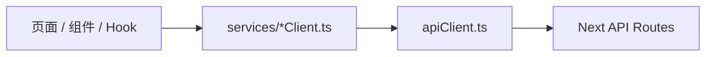
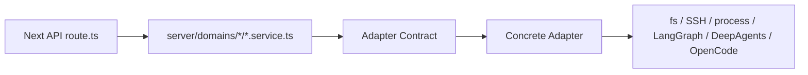

# 后续改造基准

本文档作为后续架构改造的基准路线。

核心原则：

- 不为了重构而重构，所有改造都服务于边界清晰、后续可维护、底层可替换。
- 不改变现有 API URL、请求字段、返回字段。
- 不改前端交互行为，不影响原项目主流程。
- 每次只改一个小域或一个 API group。
- 每次改完必须验证，并记录到对应改动过程文档。
- 文档、代码、测试结果要能解释给领导、需求同事和后续开发者看。

整体目标：

```text
前端页面 / Hook
  -> 前端 services client
    -> Next API route
      -> domain service
        -> adapter contract
          -> concrete adapter
            -> 文件系统 / SSH / LangGraph / DeepAgents / OpenCode / 其他底层能力
```

## 第一阶段：前端接口层收口（已完成）

目标：

页面、组件、Hook 不再到处直接 `fetch("/api/...")`，统一收口到：

```text
ui/src/app/services/*Client.ts
```

已完成内容：

```text
ui/src/app/services/apiClient.ts
ui/src/app/services/configClient.ts
ui/src/app/services/runtimeClient.ts
ui/src/app/services/resourcesClient.ts
ui/src/app/services/workspacesClient.ts
ui/src/app/services/workspaceClient.ts
ui/src/app/services/remoteClient.ts
ui/src/app/services/skillsClient.ts
ui/src/app/services/computeClient.ts
ui/src/app/services/updateClient.ts
```

完成后的前端调用结构：



保留策略：

- `useChat.ts` 主流式链路暂不重构。
- 已迁移侧边功能 API，但不改变聊天主流程。
- 前端 API 协议保持不变。

详细过程见：

```text
docs/architecture/第一阶段改动过程.md
```

## 第二阶段：后端 API Service 层梳理（第一轮已完成）

目标：

```text
API route 只负责 HTTP 入参 / 出参
domain service 负责业务流程和规则
adapter 负责底层副作用
adapter contract 负责约束输入、输出、错误和可替换边界
```

目标结构：



当前过渡结构：

```text
route.ts
  -> domain service
    -> adapter
      -> old _lib
```

这是合理的中间态。第一轮目标是先让 route 变薄，第二轮再逐步把 legacy adapter 拆成真正的 local、remote、runtime、agent adapter。

第一轮验收文档：

```text
docs/architecture/第二阶段第一轮验收.md
```

横向 contract 文档：

```text
docs/architecture/agent-runtime-adapter-contract.md
docs/architecture/shared-ssh-adapter-contract.md
```

横向 contract types：

```text
ui/src/server/shared/contracts/agentRuntime.contract.ts
ui/src/server/shared/contracts/sharedSsh.contract.ts
ui/src/server/shared/contracts/adapterError.contract.ts
ui/src/server/shared/contracts/index.ts
```

### 2.1 workspace（已完成第一轮）

已完成 route 瘦身：

```text
/api/workspace/files
/api/workspace/search
/api/workspace/file
/api/workspace/file/raw
/api/workspace/open-folder
/api/workspace/open-file
/api/workspace/attachments
```

已新增：

```text
ui/src/server/domains/workspace/workspace.service.ts
ui/src/server/domains/workspace/workspaceAttachment.service.ts
ui/src/server/domains/workspace/workspace.types.ts
ui/src/server/domains/workspace/adapters/localDesktop.adapter.ts
ui/src/server/domains/workspace/adapters/attachmentExtraction.adapter.ts
ui/src/server/domains/workspace/adapters/workspaceMetadata.adapter.ts
ui/src/server/domains/workspace/adapters/workspacePath.adapter.ts
ui/src/server/domains/workspace/adapters/workspaceDirectory.adapter.ts
ui/src/server/domains/workspace/adapters/workspaceFile.adapter.ts
```

第二轮已完成：

- 删除 `legacyWorkspace.adapter.ts` 聚合入口。
- workspace 元信息、路径解析、目录搜索、文件读写已拆到独立 adapter。
- API URL、预览行为、附件上传行为保持不变。

### 2.2 config（已完成第一轮）

已完成 route 瘦身：

```text
/api/config
```

已新增：

```text
ui/src/server/domains/config/config.service.ts
ui/src/server/domains/config/config.types.ts
ui/src/server/domains/config/adapters/configFile.adapter.ts
ui/src/server/domains/config/adapters/envFile.adapter.ts
ui/src/server/domains/config/adapters/workspaceConfig.adapter.ts
```

后续还需要：

- 检查 config 和 resources/workspaces 的边界是否重复。
- 如果 workspace 配置读写被多个域使用，考虑抽到 `server/shared` 或统一的资源配置 adapter。

### 2.3 resources + workspaces（已完成第一轮）

已完成 route 瘦身：

```text
ui/src/app/api/resources/route.ts
ui/src/app/api/workspaces/route.ts
```

已新增：

```text
ui/src/server/domains/resources/resources.service.ts
ui/src/server/domains/resources/resources.types.ts
ui/src/server/domains/resources/adapters/resources.adapter.ts

ui/src/server/domains/workspaces/workspaces.service.ts
ui/src/server/domains/workspaces/workspaces.types.ts
ui/src/server/domains/workspaces/adapters/workspaces.adapter.ts
ui/src/server/domains/workspaces/adapters/folderPicker.adapter.ts
```

已完成目标：

- `resources` 和 `workspaces` 连接了 config 与 workspace。
- route 不再直接 import workspace `_lib`、remote-connections `_lib`、local-folder-picker。
- `GET /api/resources` 返回结构保持不变。
- `GET/PUT/PATCH/DELETE/POST /api/workspaces` 行为保持不变。

### 2.4 runtime（已完成第一轮）

目标 API：

```text
/api/runtime/backend/ready
/api/runtime/backend/status
/api/runtime/backend/restart
/api/runtime/desktop-config
```

已完成结构：

```text
ui/src/server/domains/runtime/runtime.service.ts
ui/src/server/domains/runtime/runtime.types.ts
ui/src/server/domains/runtime/adapters/backendHealth.adapter.ts
ui/src/server/domains/runtime/adapters/backendStatus.adapter.ts
ui/src/server/domains/runtime/adapters/backendRestart.adapter.ts
ui/src/server/domains/runtime/adapters/desktopRuntime.adapter.ts
```

已完成目标：

- runtime route 不再直接 import `runtime/_lib/backend`。
- `ready/status/restart/desktop-config` 的 URL、返回字段、状态码和 header 保持不变。
- 后端状态、重启、健康检查和桌面 runtime config 逻辑已拆到独立 adapter。

后续还需要：

- 如果继续深拆 runtime，可把旧 `_lib/backend` 内部实现再拆成进程、pid、日志、LangGraph runtime adapter。
- 如果以后替换 LangGraph / DeepAgents / OpenCode，优先补完整 Runtime Adapter Contract。

### 2.5 remote（已完成第一轮）

目标 API：

```text
/api/remote-connections/ensure
/api/remote-connections/setup
/api/remote-connections/push-backend-cli
/api/remote-connections/test
/api/remote-connections/ssh-hosts
```

已完成结构：

```text
ui/src/server/domains/remote/remote.service.ts
ui/src/server/domains/remote/remote.types.ts
ui/src/server/domains/remote/adapters/remoteSsh.adapter.ts
ui/src/server/domains/remote/adapters/remoteRuntime.adapter.ts
ui/src/server/domains/remote/adapters/remoteBackendCli.adapter.ts
```

已完成目标：

- `remote-connections` route 不再直接 import `remote-connections/_lib`。
- `ensure/setup/push-backend-cli` 的 NDJSON 流式返回协议保持不变。
- `test/ssh-hosts` 的 JSON 返回结构和状态码保持不变。
- SSH host/test 已拆到 `remoteSsh.adapter.ts`，并复用 shared SSH adapter。
- ensure/setup 远端 runtime 流程已拆到 `remoteRuntime.adapter.ts`。
- backend CLI push 已拆到 `remoteBackendCli.adapter.ts`。
- API URL、NDJSON 流式返回协议和状态码保持不变。

### 2.6 skills（已完成第一轮）

目标 API：

```text
/api/skills
/api/skills/import
/api/skills/connections
/api/skills/local-picker
```

已完成结构：

```text
ui/src/server/domains/skills/skills.service.ts
ui/src/server/domains/skills/skills.types.ts
ui/src/server/domains/skills/adapters/skillFolderPicker.adapter.ts
ui/src/server/domains/skills/adapters/skillConnections.adapter.ts
ui/src/server/domains/skills/adapters/skillsConfigFile.adapter.ts
ui/src/server/domains/skills/adapters/skillsImport.adapter.ts
```

已完成目标：

- `/api/skills`、`/api/skills/import`、`/api/skills/local-picker`、`/api/skills/connections` route 不再直接承载技能配置、导入、本地选择器、连接配置文件读写逻辑。
- 技能配置读写和 active skills 同步通过 `skillsConfigFile.adapter.ts`。
- 技能导入通过 `skillsImport.adapter.ts`。
- `.env` 中的 `SCP_HUB_API_KEY` 和 `.mcp.json` 读写、MCP JSON 校验下沉到 `skillConnections.adapter.ts`。
- 不改 subagent、MCP、Agent 编排逻辑。

后续还需要：

- 如果后续做 Agent Runtime Adapter，再定义 skills 如何进入 Agent runtime 的稳定 contract。

### 2.7 compute（已完成第一轮，第二轮已完成）

目标 API：

```text
/api/compute/ssh-hosts
/api/compute/remote-jobs
/api/compute/remote-jobs/[jobId]
```

已完成结构：

```text
ui/src/server/domains/compute/compute.service.ts
ui/src/server/domains/compute/compute.types.ts
ui/src/server/domains/compute/adapters/computeAuth.adapter.ts
ui/src/server/domains/compute/adapters/computeHost.adapter.ts
ui/src/server/domains/compute/adapters/computeJob.adapter.ts
ui/src/server/domains/compute/adapters/computeStore.adapter.ts
ui/src/server/domains/compute/adapters/computeStore.helpers.ts
ui/src/server/domains/compute/adapters/computeRemoteJobProtocol.adapter.ts
```

已完成目标：

- `/api/compute/ssh-hosts`、`/api/compute/remote-jobs`、`/api/compute/remote-jobs/[jobId]` route 不再直接 import `compute/_lib`。
- POST 授权检查已在 `computeAuth.adapter.ts` 中独立实现。
- SSH compute host 保存/探测、远程任务提交、任务快照读取已经拆到 `computeHost.adapter.ts`、`computeJob.adapter.ts`、`computeStore.adapter.ts`。
- compute 本地 store 已从旧 `_lib/ssh-remote-jobs.ts` 下沉到 `computeStore.adapter.ts`。
- compute 远端 job submit/status 协议已拆到 `computeRemoteJobProtocol.adapter.ts`，并复用 shared SSH adapter。
- compute domain types 已从旧 `app/api/compute/_lib` 独立出来。
- API URL、返回结构和错误状态码保持不变。

### 2.8 update（已完成第一轮）

目标 API：

```text
/api/update/check
/api/update/status
/api/update/apply
/api/update/rollback
```

已完成结构：

```text
ui/src/server/domains/update/update.service.ts
ui/src/server/domains/update/update.types.ts
ui/src/server/domains/update/adapters/updateState.adapter.ts
ui/src/server/domains/update/adapters/updateRelease.adapter.ts
ui/src/server/domains/update/adapters/updateInstall.adapter.ts
ui/src/server/domains/update/adapters/updateRollback.adapter.ts
```

已完成目标：

- `/api/update/status`、`/api/update/check`、`/api/update/apply`、`/api/update/rollback` route 不再直接 import `update/_lib/update.ts`。
- 状态读取、Release 检查、安装应用、回滚入口已拆到独立 adapter。
- update domain types 已从旧 `app/api/update/_lib` 独立出来。
- API URL、返回结构和失败状态码保持不变。

## Adapter Contract：贯穿第二阶段的新主线

需求同事关心的是：以后底层能力能不能替换，比如从 DeepAgents 换成 OpenCode。

所以后续不仅要有 adapter 代码，还要有 adapter contract 文档。

建议新增：

```text
docs/architecture/adapter-contracts.md
```

这个文档要描述：

- adapter 的职责
- 输入字段
- 输出字段
- 错误格式
- 允许产生的副作用
- 底层协议如何被封装
- 可替换实现有哪些

示例：

```text
AgentRuntimeAdapter
  输入：
  - threadId
  - messages
  - workspace
  - model config
  - enabled skills
  - attachments

  输出：
  - message_delta
  - tool_call
  - tool_result
  - error
  - done

  可替换实现：
  - DeepAgentsAdapter
  - OpenCodeAdapter
  - RemoteGraphAdapter
```

关键原则：

```text
Service 不关心底层是 DeepAgents、OpenCode、LangGraph、SSH 还是本地进程。
Service 只依赖稳定的 adapter contract。
底层协议只允许存在于 concrete adapter 内部。
```

## 第三阶段：Agent Runtime Adapter 化（已完成当前阶段）

目标：

把 coordinator、runtime、RemoteGraph、DeepAgents、Skills、MCP、subagents 的关系讲清楚，并为后续替换 DeepAgents / OpenCode 打基础。

当前第三阶段产出：

```text
docs/architecture/第三阶段AgentRuntimeAdapter设计.md
docs/architecture/第三阶段改动过程.md
docs/architecture/第三阶段-runtime关系图.md
docs/architecture/第三阶段验收.md
ui/src/lib/agent-runtime.ts
ui/src/lib/agent-runtime-events.ts
ui/src/lib/agent-runtime-runs.ts
ui/src/providers/AgentRuntimeContext.ts
ui/src/app/hooks/useAgentRuntimeStream.ts
```

已完成前端 runtime adapter 边界：

```text
UI / useChat
  -> useAgentRuntime()
  -> useAgentRuntimeStream()
  -> ClientAgentRuntimeAdapter
    -> LangGraphAgentRuntimeAdapter
      -> WebRemoteAgent
        -> LangGraph SDK
```

已完成 Python runtime 关系说明：

```text
coordinator
  -> RemoteGraph
    -> runtime
      -> DeepAgents create_deep_agent()
        -> tools / skills / MCP / subagents / backend
```

已完成能力：

```text
会话列表、归档、恢复、assistant resolve 走 Agent Runtime Adapter
thread state/history/pending preview 走 Agent Runtime Adapter
useChat stream 入口收口到 useAgentRuntimeStream()
run submit/stop/retry/resume/continue/resolve/singleStep 走 intent-specific helper
run intent contract 独立到 agent-runtime-runs.ts
coordinator/runtime/RemoteGraph/DeepAgents/Skills/MCP/subagents 关系已画清楚
```

第三阶段保留边界：

```text
不替换 DeepAgents
不接 OpenCode
不接 mock runtime
不重写 agent_graph.py
不改变 LangGraph run payload / checkpoint / interrupt / durability
不改变 Skills/MCP/subagents 注入方式
```

下一阶段建议：

```text
1. 定义跨 runtime 的 run/event/file/workspace 协议
2. 做 MockRuntimeProvider 验证 UI 是否真能脱离 LangGraph concrete runtime
3. 再评估 OpenCodeRuntimeAdapter
4. 最后才考虑改 agent_graph.py 或替换 DeepAgents runtime
```

## 第四阶段：Runtime Protocol 标准化 + Mock Runtime 验证（进行中）

目标：

```text
先定义跨 runtime 的 run/event/file/workspace 协议
再用 MockRuntimeProvider 验证 UI 是否真正脱离 LangGraph concrete runtime
最后再评估 OpenCodeRuntimeAdapter
```

当前产出：

```text
docs/architecture/第四阶段RuntimeProtocol设计.md
docs/architecture/第四阶段改动过程.md
ui/src/lib/agent-runtime-protocol.ts
ui/src/lib/mock-agent-runtime.ts
ui/src/lib/langgraph-runtime-event-mapper.ts
ui/src/lib/agent-runtime-lifecycle.ts
ui/src/lib/agent-runtime-provider.ts
ui/tests/mock-agent-runtime.test.mts
ui/tests/langgraph-runtime-event-mapper.test.mts
ui/tests/agent-runtime-lifecycle.test.mts
ui/tests/agent-runtime-provider.test.mts
```

第一步已启动：

```text
AgentRuntimeRunInput
AgentRuntimeRunEvent
AgentRuntimeMessage
AgentRuntimeWorkspaceContext
AgentRuntimeSkillContext
AgentRuntimeMcpToolContext
AgentRuntimeAttachment
AgentRuntimeErrorShape
```

当前不做：

```text
不切 useChat 主链路
不接 OpenCode
不接 mock runtime 到 UI
不改 agent_graph.py
不改 LangGraph payload / checkpoint / interrupt / durability
```

下一步建议：

```text
1. 设计真实 LangGraph provider 如何组合 lifecycle helper + stream mapper
2. 评估是否需要开发模式 mock runtime 开关
3. 暂不挂主链路，先做旁路转换器或测试
4. 再评估 OpenCode 是否能映射到同一协议
```

## 第五阶段：测试、文档、回归验证（贯穿所有阶段）

这个阶段不是最后才做，而是贯穿每次改造。

每次改动后至少执行：

```text
npx tsc --noEmit --pretty false
npm run lint
git diff --check
```

根据影响范围补充：

```text
npm run test:open-folder
npm run test:office-preview
npm run test:think-tags
npm run test:local-folder-picker
```

重点人工回归：

- 配置读取和保存
- 语言切换
- 项目切换
- 文件树展开状态保持
- 文件预览
- 附件上传
- 聊天流式输出
- Skill 启用/导入
- 远程连接
- runtime ready/status/restart
- compute job
- 桌面更新

每次改动过程记录到：

```text
docs/architecture/第一阶段改动过程.md
docs/architecture/第二阶段改动过程.md
docs/architecture/第三阶段改动过程.md
docs/architecture/第四阶段改动过程.md
```

## 第六阶段：平台化能力增强（暂缓）

这个阶段不是当前架构梳理主线。

只有在 route、service、adapter、adapter contract 边界稳定后，再考虑做。

可选方向：

- 通用 Agent 配置入口
- 通用 subagent 管理
- 通用 MCP 状态展示
- 通用 workflow 可视化
- 通用资源管理
- 通用 adapter 状态展示

注意：

- 这些能力可以回馈原项目。
- 但不要在第二阶段还没稳定时提前做产品化大功能。
- 航空专业能力不放在原项目主线里，应该放到 AeroWing 版本独立推进。

## 当前优先级总结

最近三步：

```text
1. 第三阶段已完成：Agent Runtime Adapter 边界收口
2. 第三阶段已补齐：coordinator/runtime/RemoteGraph/DeepAgents/Skills/MCP/subagents 关系图
3. 第四阶段已完成第一轮旁路验证：Runtime Protocol、MockRuntimeProvider、LangGraph event mapper、lifecycle helper、provider contract
```

中期路线：

```text
Agent Runtime Adapter 入口
  -> thread 查询和元数据操作
    -> thread state/history
      -> useStream 入口外壳
        -> run stream/stop/retry/interrupt protocol
        -> mock runtime provider
          -> OpenCode/其他 runtime provider
```

当前不要做：

```text
不急着拆 agent_graph.py
不急着替换 DeepAgents
不急着做 OpenCodeAdapter
不急着做多 Agent 产品配置页
不在原项目里做航空特化
```
