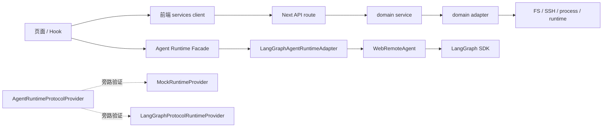

# 架构改造总验收

## 总体结论

当前架构改造范围已完成。

这里的“完成”指：

```text
前端接口层已收口
后端 API route 已下沉到 service / adapter
关键 adapter contract 已补齐
Agent Runtime Adapter 边界已建立
Runtime Protocol 与 Mock/LangGraph 旁路验证已完成
自动化回归与文档验收已补齐
```

这不等于“所有未来平台化能力都已完成”。

## 已完成阶段

### 第一阶段：前端接口层收口

完成：

- `services/apiClient.ts`
- config/runtime/resources/workspaces/workspace/remote/skills/compute/update clients
- 页面与 Hook 中的高频 API 调用逐步收口

结果：

```text
UI / Hook
  -> services/*Client.ts
  -> apiClient.ts
  -> Next API route
```

### 第二阶段：后端 service / adapter 分层

完成领域：

```text
workspace
config
resources
workspaces
runtime
remote
skills
compute
update
```

结果：

```text
API route
  -> domain service
    -> adapter
      -> filesystem / SSH / process / legacy _lib / runtime
```

已补横向 contract：

```text
adapterError.contract.ts
sharedSsh.contract.ts
agentRuntime.contract.ts
```

### 第三阶段：Agent Runtime Adapter 边界

完成：

- `useAgentRuntime()`
- `ClientAgentRuntimeAdapter`
- `LangGraphAgentRuntimeAdapter`
- `useAgentRuntimeStream()`
- run intent helper
- coordinator / runtime / RemoteGraph / DeepAgents / Skills / MCP / subagents 关系图

结果：

```text
UI / useChat
  -> useAgentRuntimeStream
  -> ClientAgentRuntimeAdapter
    -> submitStreamRun / stopStreamRun
  -> LangGraphAgentRuntimeAdapter
  -> WebRemoteAgent
  -> LangGraph SDK
```

同时主链路 runtime facade 已补充中立事件通道：

```text
WebRemoteAgent raw stream event
  -> LangGraphAgentRuntimeAdapter.subscribeProtocolEvents()
  -> AgentRuntimeRunEvent
  -> useStreamEventLayer.protocolEvents
```

### 第四阶段：Runtime Protocol + Mock/LangGraph 旁路验证

完成：

- `AgentRuntimeRunInput`
- `AgentRuntimeRunEvent`
- `AgentRuntimeProtocolProvider`
- `AgentRuntimeProviderRegistry`
- `AgentRuntimeSettings`
- `MockRuntimeProvider`
- `LangGraphRuntimeEventMapper`
- runtime lifecycle helper
- `LangGraphProtocolRuntimeProvider`

结果：

```text
AgentRuntimeRunInput
  -> AgentRuntimeProtocolProvider
  -> AsyncIterable<AgentRuntimeRunEvent>
```

这为后续替换 DeepAgents / LangGraph / OpenCode 建立了中立协议边界。

Provider registry 已补齐：

```text
AgentRuntimeProviderRegistry
  -> provider kind
  -> provider factory
  -> AgentRuntimeProtocolProvider
```

这解决后续按配置选择 `mock` / `langgraph` / `opencode` provider 的入口问题。

Provider settings 已补齐：

```text
AgentRuntimeSettings
  -> defaultProvider
  -> providers[]
  -> resolveEnabledRuntimeProvider()
```

这给后续设置页或配置文件接入 runtime provider 选择留出稳定字段。

### 第五阶段：回归验证与文档收口

完成：

- runtime protocol 聚合测试脚本
- 全量本地 Node 测试
- TypeScript
- lint
- diff check
- 第五阶段回归验证文档
- 总体验收文档

## 当前架构图



## 已达成的工程价值

### 1. 前后端耦合降低

改造前：

```text
页面 / Hook 直接 fetch
route 内直接处理业务逻辑和副作用
底层文件、SSH、runtime 操作混在 API 层
```

改造后：

```text
页面 / Hook 依赖 service client
route 只处理 HTTP 入参/出参
业务逻辑进入 domain service
副作用进入 adapter
跨域能力有 shared contract
```

### 2. 底层替换边界更清楚

现在可以向需求同事解释：

```text
如果未来要替换 DeepAgents / LangGraph / OpenCode：
  不应该从 UI 页面直接改
  不应该从 API route 里硬接
  应该先满足 AgentRuntimeProtocolProvider
```

### 3. 文档可交付

当前可交付文档包括：

```text
current-call-map.md
domains.md
后续改造.md
第一阶段改动过程.md
第二阶段拆分设计.md
第二阶段改动过程.md
第二阶段第一轮验收.md
第三阶段AgentRuntimeAdapter设计.md
第三阶段-runtime关系图.md
第三阶段改动过程.md
第三阶段验收.md
第四阶段RuntimeProtocol设计.md
第四阶段改动过程.md
第四阶段验收.md
第五阶段回归验证.md
架构改造总验收.md
```

## 不属于本轮架构改造范围的后续实现

以下不是当前架构改造未完成，而是后续产品/平台化实现：

```text
OpenCodeRuntimeAdapter 真实接入
DeepAgents 替换
agent_graph.py 重写
开发模式 mock runtime 开关
adapter 状态页
多 Agent 产品化配置页
航空专业能力接入
```

## 为什么不建议现在强切主聊天链路

当前聊天主链路依赖：

```text
LangGraph SDK useStream
thread state/history
checkpoint
interrupt
durability
join stream
resume
retry
single step
subgraph stream
```

直接把它切到新 provider contract，风险包括：

- 流式状态丢失。
- interrupt/resume 语义不一致。
- checkpoint 行为变化。
- 会话历史加载变化。
- 子图事件过滤变化。
- 正常聊天主流程回归成本很高。

因此当前更合理的完成状态是：

```text
主链路保持稳定
submit/stop 控制已收口到 ClientAgentRuntimeAdapter
protocol event 已从主链路 runtime facade 暴露
provider contract / registry / settings 已完成
后续替换 runtime 时有明确接入点
```

## 验收状态

自动化：

```text
npm run test:runtime-protocol -> passed
node --test --experimental-strip-types tests/*.test.mts -> 67 passed
npx tsc --noEmit --pretty false -> passed
npm run lint -> 0 errors, 5 existing warnings
git diff --check -> passed
```

构建：

```text
npm run build -> failed on Windows EPERM scandir C:\Users\LeoHao\Application Data
```

构建失败判断：

- 属于 Next standalone tracing / Windows 用户目录权限问题。
- 不属于当前架构代码类型错误。
- 建议后续独立处理。

## 最终判断

当前架构改造任务可以收口。

如果领导问“现在代码是否已经完全平台化”，答案是：

```text
架构边界已经平台化，具体 OpenCode/DeepAgents 替换实现还没有做。
```

如果领导问“这轮架构梳理和边界改造是否完成”，答案是：

```text
是，这轮架构梳理和边界改造已完成。
```
