# 改动过程记录

> 目的：记录第一阶段“前端接口层收口”的每次小步改造，方便团队 review、回滚和向领导解释。

## 记录规则

每次做接口收口后，记录以下内容：

1. 本次目标：只写这一步要收口的 API group。
2. 改动范围：列出新增/修改文件。
3. 改动前调用图：说明页面/组件是否直接 `fetch("/api/...")`。
4. 改动后调用图：说明是否已经经过 `services/*Client.ts` 和 `apiClient.ts`。
5. 未迁移范围：明确哪些文件/API 暂时不动。
6. 验证结果：记录 `npm run lint`、`npx tsc --noEmit --pretty false`。

## 2026-07-07 第一阶段：workspace/config/runtime 前端接口层收口

### 本次目标

按 `docs/architecture/后续改造.md` 的第一阶段要求，逐步把前端页面、组件、hook 中散落的 API 调用收口到：

```text
ui/src/app/services/*Client.ts
```

本阶段保持原则：

- 不改后端 API route。
- 不改 request body。
- 不改 response shape。
- 不碰 `useChat.ts` 主链路。
- 每次只迁移一个小块。

### 已新增 client

```text
ui/src/app/services/apiClient.ts
ui/src/app/services/configClient.ts
ui/src/app/services/remoteClient.ts
ui/src/app/services/resourcesClient.ts
ui/src/app/services/runtimeClient.ts
ui/src/app/services/workspaceClient.ts
ui/src/app/services/workspacesClient.ts
```

### 已迁移调用

```text
useWorkspaceFiles.ts
  /api/workspace/files
  -> workspaceClient.listWorkspaceFiles()

WorkspaceViewer.tsx
  /api/workspace/file
  -> workspaceClient.getWorkspaceFile()

WorkspaceViewer.tsx
  /api/workspace/open-file
  -> workspaceClient.openWorkspaceFile()

WorkspaceExplorer.tsx
  /api/workspace/open-folder
  -> workspaceClient.openWorkspaceFolder()

config/page.tsx
  /api/config GET
  -> configClient.loadConfig()

config/page.tsx
  /api/config PUT
  -> configClient.saveConfig()

config/page.tsx
  /api/runtime/backend/status
  -> runtimeClient.getBackendStatus()

config/page.tsx
  /api/runtime/backend/restart
  -> runtimeClient.restartBackend()

RemoteProjectsSettingsCard.tsx
  /api/resources
  -> resourcesClient.listResources()

projects/page.tsx
  /api/workspaces GET
  -> workspacesClient.listWorkspaces()

projects/page.tsx
  /api/workspaces POST
  -> workspacesClient.pickWorkspace()

projects/page.tsx
  /api/workspaces DELETE
  -> workspacesClient.removeWorkspace()

projects/page.tsx
  /api/workspaces PATCH
  -> workspacesClient.updateWorkspace()

RemoteProjectsSettingsCard.tsx
  /api/remote-connections/ensure
  -> remoteClient.ensureRemoteConnectionStream()
```

### 改动前调用图

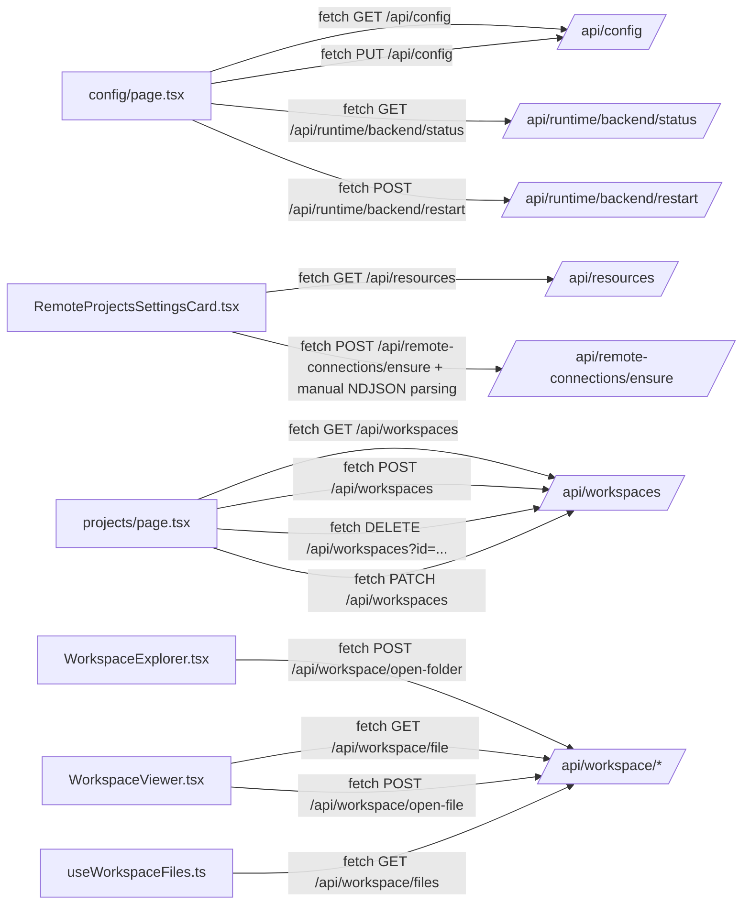

### 改动后调用图

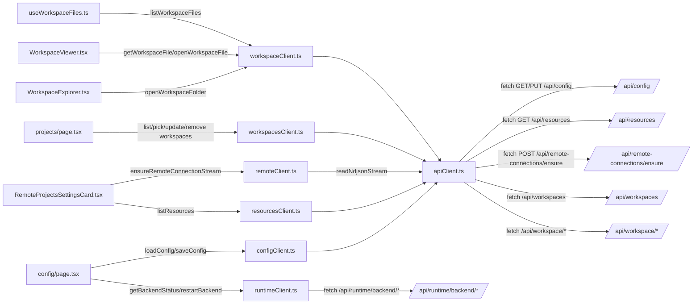

### 第一阶段目标总图

第一阶段希望逐步收口成下面这种形态：

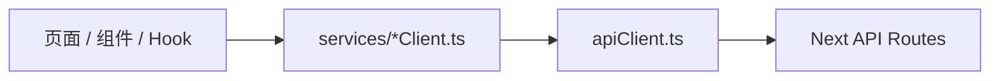

这张图表达的是“前端接口层收口”的目标结构：

```text
页面 / 组件 / Hook
  不再到处直接 fetch("/api/...")

services/*Client.ts
  负责业务含义，例如 loadConfig、listWorkspaceFiles、restartBackend

apiClient.ts
  负责通用 HTTP 能力，例如 requestJson、readJsonResponse、buildQuery、readNdjsonStream

Next API Routes
  保持现有后端接口不变
```

当前已经符合这张目标图的部分：

```text
configClient.ts
  -> apiClient.ts
  -> /api/config

workspaceClient.ts
  -> apiClient.ts
  -> /api/workspace/*

resourcesClient.ts
  -> apiClient.ts
  -> /api/resources

workspacesClient.ts
  -> apiClient.ts
  -> /api/workspaces

remoteClient.ts
  -> apiClient.readNdjsonStream()
  -> /api/remote-connections/ensure
```

当前暂时例外：

```text
runtimeClient.ts
  -> fetch /api/runtime/backend/status
  -> fetch /api/runtime/backend/restart
```

原因是 `/api/runtime/backend/status` 有特殊行为：HTTP 503 时 body 里仍然有可展示的 `unavailable` 状态。
如果直接用普通 `requestJson()`，会把这个状态当成错误抛掉。
后续可以把 `apiClient.ts` 再补一个支持“允许非 2xx 读取 body”的通用方法，然后让 `runtimeClient.ts` 也完全走 `apiClient.ts`。

### runtimeClient 这一步的重点

`/api/runtime/backend/status` 有一个特殊行为：当 backend 不可用时，后端可能返回 HTTP 503，但 body 里仍然包含可展示的 `unavailable` 状态。

所以 `runtimeClient.getBackendStatus()` 保留了旧行为：

```text
读取 body
只要 body.status 存在，就返回 BackendStatusResult
不因为 HTTP 503 直接丢掉状态信息
```

`runtimeClient.restartBackend()` 也保留旧行为：

```text
读取 body
返回 BackendRestartResult
页面继续根据 restart.status 判断是否成功
```

### resourcesClient 这一步的重点

`resourcesClient.ts` 当前只收口资源列表读取：

```text
RemoteProjectsSettingsCard.tsx
  -> resourcesClient.listResources()
  -> apiClient.requestJson()
  -> GET /api/resources
```

这一步没有迁移 `page.tsx` 里的 `/api/resources`，因为它属于主工作台资源切换/初始化链路，后续应单独处理。

`RemoteProjectsSettingsCard.tsx` 里的 `/api/remote-connections/ensure` 已经在后续小步迁移到 `remoteClient.ts`。

### workspacesClient 这一步的重点

`workspacesClient.ts` 当前收口本地项目列表管理：

```text
projects/page.tsx
  -> workspacesClient.listWorkspaces()
  -> workspacesClient.pickWorkspace()
  -> workspacesClient.updateWorkspace()
  -> workspacesClient.removeWorkspace()
  -> apiClient.requestJson()
  -> /api/workspaces
```

这一步没有迁移 `page.tsx` 里的 `/api/workspaces`，因为它属于主工作台 workspace 切换和当前工作区状态同步链路，后续应单独处理。

### remoteClient 这一步的重点

`remoteClient.ts` 当前只收口远程 runtime ensure 的 NDJSON 流：

```text
RemoteProjectsSettingsCard.tsx
  -> remoteClient.ensureRemoteConnectionStream()
  -> apiClient.readNdjsonStream()
  -> POST /api/remote-connections/ensure
```

迁移前，`RemoteProjectsSettingsCard.tsx` 同时负责：

```text
发起 POST /api/remote-connections/ensure
判断 content-type 是否是 application/x-ndjson
手写 TextDecoder 读取流
按行 JSON.parse
处理 log/done/error
处理 noLog/noResult
```

迁移后，组件只负责 UI 状态更新：

```text
onLog(message) -> 更新当前远程项目的同步状态文案
done result -> 更新 resources 和 ready 状态
error -> 显示错误
```

这一步没有迁移：

```text
page.tsx
  /api/remote-connections/ensure
  /api/remote-connections/push-backend-cli

RemoteConnectionDialog.tsx
  /api/remote-connections/setup
  /api/remote-connections/test
  /api/remote-connections/ssh-hosts
```

原因是这些调用属于主工作台远程启动链路或远程连接弹窗链路，后续应分小步迁移。

### 暂未迁移

```text
page.tsx
  /api/config
  /api/runtime/backend/ready
  /api/resources
  /api/workspaces
  /api/remote-connections/ensure
  /api/remote-connections/push-backend-cli

projects/page.tsx
  /api/config

SkillsMarketplace.tsx
  /api/skills/*
  /api/runtime/backend/status
  /api/runtime/backend/restart

ChatInterface.tsx
  暂不迁移

useChat.ts
  暂不迁移
```

### 验证结果

已执行：

```bash
npm run lint
npx tsc --noEmit --pretty false
```

结果：

```text
0 errors
7 warnings
```

这 7 个 warning 是原项目已有的 lint warning，当前接口层收口没有引入新的错误。

## 本次对比：remoteClient 收口远程 ensure 流

本次只看远程项目同步这一条链路：

```text
RemoteProjectsSettingsCard.tsx
  /api/remote-connections/ensure
  -> remoteClient.ensureRemoteConnectionStream()
```

### 改动前

组件直接负责网络请求和流式协议解析：


也就是说，组件里同时做了：

```text
发起 POST 请求
检查 content-type
用 TextDecoder 读取 response.body
按换行拆 NDJSON
JSON.parse 每一行
处理 log/done/error
再更新页面状态
```

### 改动后

组件只负责页面状态，远程 ensure 的请求和 NDJSON 读取下沉到 services：


职责变成：

```text
RemoteProjectsSettingsCard.tsx
  只管 UI 状态、toast、resources 刷新

remoteClient.ts
  只管远程连接业务接口，比如 ensureRemoteConnectionStream()

apiClient.ts
  只管通用 HTTP/NDJSON 读取能力

Next API Route
  后端协议保持不变
```

这一小步的价值是：页面文件少一大段手写流解析逻辑，以后其他远程 setup/push-backend-cli 如果也是 NDJSON 流，可以复用同一个 `readNdjsonStream()`。

## 本次对比：RemoteConnectionDialog 收口远程连接弹窗 API

本次只看远程连接弹窗这一块：

```text
RemoteConnectionDialog.tsx
  /api/remote-connections/ssh-hosts
  /api/remote-connections/test
  /api/remote-connections/setup
  -> remoteClient.ts
```

### 改动前

弹窗组件直接调用 3 个后端接口：

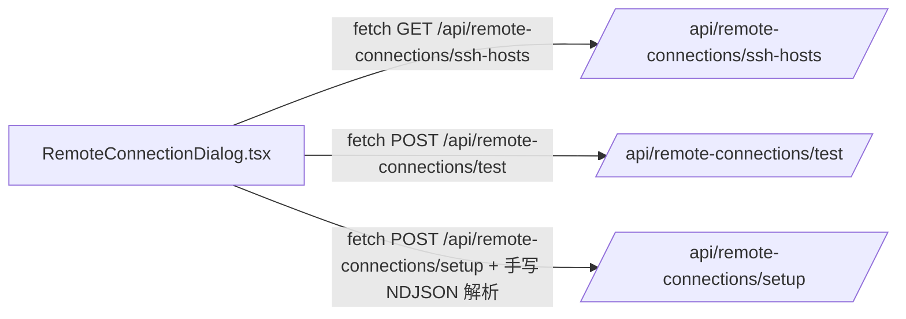

组件里同时承担：

```text
读取 SSH hosts
测试 SSH 连接
发起远程 setup
检查 setup content-type
读取 response.body
用 TextDecoder 手写 NDJSON 流解析
处理 log/done/error
更新弹窗 UI 状态
```

### 改动后

弹窗组件只保留表单状态、日志展示、toast 和回调处理，API 细节进入 `remoteClient.ts`：

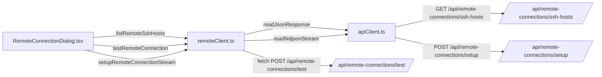

这里 `testRemoteConnection()` 暂时保留直接 `fetch`，原因是 `/api/remote-connections/test` 在 SSH 不通时可能返回 HTTP 400，但 body 里的 `stdout/stderr` 仍然要显示在弹窗里。如果直接套普通 `requestJson()`，会在 400 时抛错，导致测试输出丢失。

### 本次迁移后的职责

```text
RemoteConnectionDialog.tsx
  负责连接方式、表单输入、按钮状态、日志展示、toast

remoteClient.ts
  负责远程连接相关业务 API：
  listRemoteSshHosts()
  testRemoteConnection()
  setupRemoteConnectionStream()
  ensureRemoteConnectionStream()

apiClient.ts
  负责通用 JSON 响应读取和 NDJSON 流读取
```

### 验证结果

已执行：

```bash
npm run lint
npx tsc --noEmit --pretty false
```

结果：

```text
0 errors
7 warnings
```

这 7 个 warning 仍然是原项目已有 warning，本次 remote 弹窗收口没有新增错误。

## 本次对比：ComputeSettingsCard 收口 compute host API

本次只看设置页里的远程计算主机配置：

```text
ComputeSettingsCard.tsx
  /api/remote-connections/ssh-hosts
  /api/compute/ssh-hosts
  -> remoteClient.ts + computeClient.ts
```

### 改动前

`ComputeSettingsCard.tsx` 直接调用两个后端接口：

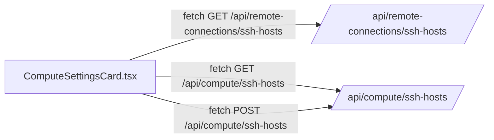

组件里同时承担：

```text
读取 ~/.ssh/config host 列表
读取 compute host 列表
注册新的 compute host
手写 JSON 错误读取
处理 SSH config 读取失败时的局部降级
更新设置页 UI 状态
```

### 改动后

`ComputeSettingsCard.tsx` 不再直接 `fetch`，改为调用业务 client：

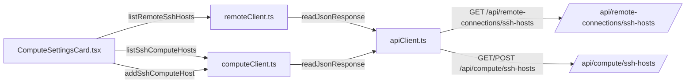

### 本次迁移后的职责

```text
ComputeSettingsCard.tsx
  负责设置页 UI、表单状态、host 选择、toast

remoteClient.ts
  负责读取 SSH config hosts

computeClient.ts
  负责 compute 域 API：
  listSshComputeHosts()
  addSshComputeHost()

apiClient.ts
  负责通用 JSON 响应读取
```

保留的旧行为：

```text
如果 /api/remote-connections/ssh-hosts 失败：
  只显示 SSH config 不可读
  compute hosts 仍继续加载

如果 /api/compute/ssh-hosts 失败：
  整个 compute host 刷新显示错误
```

### 验证结果

已执行：

```bash
npm run lint
npx tsc --noEmit --pretty false
```

结果：

```text
0 errors
7 warnings
```

这 7 个 warning 仍然是原项目已有 warning，本次 compute 设置页收口没有新增错误。

## 本次改动：projects 页面收口 onboarding config 检查

本次只清理 `projects/page.tsx` 里剩余的一条 `/api/config` 调用：

```text
projects/page.tsx
  /api/config
  -> configClient.shouldOpenOnboarding()
```

### 改动前

`projects/page.tsx` 自己定义了一个 `shouldOpenInitialConfig()`，内部直接请求 `/api/config`：

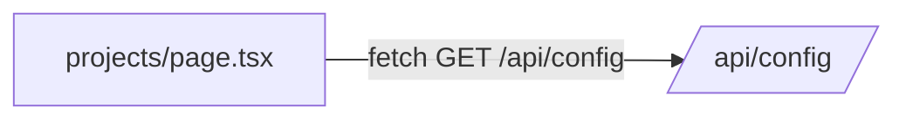

组件里重复承担：

```text
请求 /api/config
解析 desktopMode
解析 needsOnboarding
请求失败时返回 false
```

### 改动后

`projects/page.tsx` 直接复用已有的 `configClient.shouldOpenOnboarding()`：

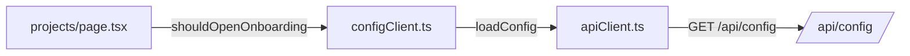

### 本次迁移后的职责

```text
projects/page.tsx
  负责页面跳转和项目列表 UI

configClient.ts
  负责读取 config 并判断是否需要打开 onboarding

apiClient.ts
  负责通用 JSON 请求
```

保留的旧行为：

```text
/api/config 读取失败时：
  shouldOpenOnboarding() 返回 false
  projects 页面继续加载 workspace 列表
```

### 验证结果

已执行：

```bash
npm run lint
npx tsc --noEmit --pretty false
```

结果：

```text
0 errors
7 warnings
```

这 7 个 warning 仍然是原项目已有 warning，本次 projects 页面 config 收口没有新增错误。

## 本次改动：about 页面收口 update API

本次只看关于/更新页面：

```text
about/page.tsx
  /api/update/status
  /api/update/check
  /api/update/apply
  /api/update/rollback
  -> updateClient.ts
```

### 改动前

`about/page.tsx` 直接调用 4 个更新接口：

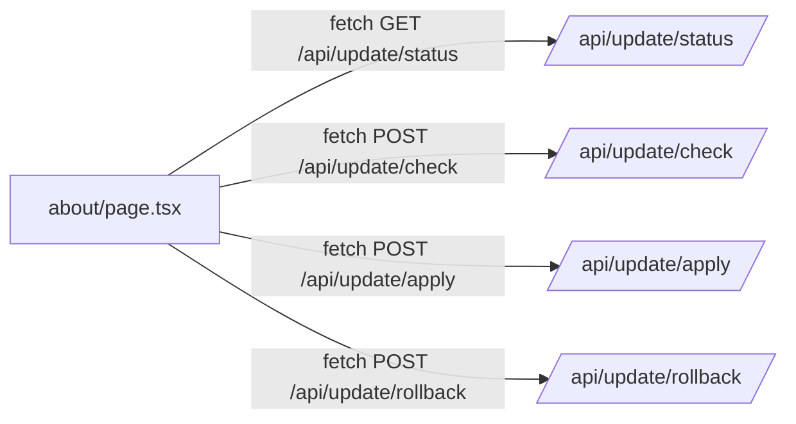

页面里同时承担：

```text
读取更新状态
检查新版本
应用更新
回滚更新
解析 JSON
处理 response.ok
维护 UpdateStatusResult 类型
```

### 改动后

`about/page.tsx` 改为通过 `updateClient.ts` 调用更新业务接口：

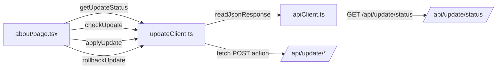

### 本次迁移后的职责

```text
about/page.tsx
  负责确认弹窗、按钮 loading、toast、状态展示、页面刷新

updateClient.ts
  负责 update 域 API：
  getUpdateStatus()
  checkUpdate()
  applyUpdate()
  rollbackUpdate()
  UpdateStatusResult 类型

apiClient.ts
  负责通用 JSON 响应读取
```

保留的旧行为：

```text
/api/update/check/apply/rollback 如果返回非 2xx：
  页面仍然先 setUpdateStatus(payload)
  然后再显示错误 toast

原因：
  后端失败时也会返回有价值的 UpdateStatusResult，
  页面需要展示 failed 状态、message、log 等信息。
```

所以 `checkUpdate()`、`applyUpdate()`、`rollbackUpdate()` 没有直接使用普通 `requestJson()` 抛错，而是返回：

```text
{
  responseOk,
  status
}
```

### 验证结果

已执行：

```bash
npm run lint
npx tsc --noEmit --pretty false
```

结果：

```text
0 errors
7 warnings
```

这 7 个 warning 仍然是原项目已有 warning，本次 about/update 收口没有新增错误。

## 第一阶段完成记录：前端接口层收口

本次收尾后，第一阶段目标已经完成：

```text
页面 / 组件 / Hook
  不再直接散落 fetch("/api/...")

统一进入：
  ui/src/app/services/*Client.ts
```

### 最终结构

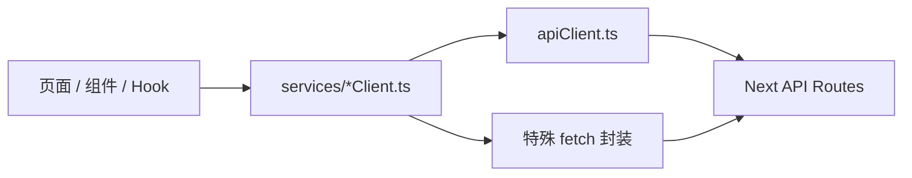

说明：

```text
apiClient.ts
  负责通用 JSON / NDJSON / query 能力

services/*Client.ts
  负责业务语义，比如 loadSkills、listWorkspaces、pushBackendCliStream

页面 / 组件 / Hook
  只负责 UI 状态、toast、跳转、表单、渲染
```

### 当前已有 client

```text
apiClient.ts
configClient.ts
runtimeClient.ts
resourcesClient.ts
workspacesClient.ts
workspaceClient.ts
remoteClient.ts
skillsClient.ts
computeClient.ts
updateClient.ts
```

### 本次收尾新增/补齐

```text
skillsClient.ts
  loadSkills()
  saveSkills()
  loadSkillConnections()
  saveSkillConnections()
  importSkills()
  pickLocalSkillFolder()

remoteClient.ts
  pushBackendCliStream()

workspaceClient.ts
  getWorkspaceRawFileBlob()
  uploadWorkspaceAttachment()

runtimeClient.ts
  isWorkbenchHomeReady()
```

### 本次收尾迁移

```text
config/page.tsx
  fetch(url)
  -> runtimeClient.isWorkbenchHomeReady()

page.tsx
  /api/runtime/backend/ready
  -> runtimeClient.isLocalBackendReady()

page.tsx
  /api/config
  -> configClient.shouldOpenOnboarding()

page.tsx
  /api/resources
  -> resourcesClient.listResources()

page.tsx
  /api/workspaces
  -> workspacesClient.listWorkspaces()
  -> workspacesClient.pickWorkspace()
  -> workspacesClient.setDefaultWorkspace()

page.tsx
  /api/remote-connections/ensure
  -> remoteClient.ensureRemoteConnectionStream()

page.tsx
  /api/remote-connections/push-backend-cli
  -> remoteClient.pushBackendCliStream()

skills/components/SkillsMarketplace.tsx
  /api/skills
  -> skillsClient.loadSkills()
  -> skillsClient.saveSkills()

skills/components/SkillsMarketplace.tsx
  /api/skills/connections
  -> skillsClient.loadSkillConnections()
  -> skillsClient.saveSkillConnections()

skills/components/SkillsMarketplace.tsx
  /api/skills/import
  -> skillsClient.importSkills()

skills/components/SkillsMarketplace.tsx
  /api/skills/local-picker
  -> skillsClient.pickLocalSkillFolder()

skills/components/SkillsMarketplace.tsx
  /api/runtime/backend/status
  -> runtimeClient.getBackendStatus()

skills/components/SkillsMarketplace.tsx
  /api/runtime/backend/restart
  -> runtimeClient.restartBackend()

components/ChatInterface.tsx
  /api/workspace/attachments
  -> workspaceClient.uploadWorkspaceAttachment()

components/ChatInterface.tsx
  /api/workspace/file/raw
  -> workspaceClient.getWorkspaceRawFileBlob()

components/ChatInterface.tsx
  /api/workspace/search
  -> workspaceClient.searchWorkspace()

components/ChatInterface.tsx
  /api/skills
  -> skillsClient.loadSkills()
```

### 收尾后页面层扫描

执行扫描：

```bash
rg -n "fetch\\(" ui/src/app/components ui/src/app/config ui/src/app/skills ui/src/app/projects ui/src/app/about ui/src/app/hooks ui/src/app/page.tsx --glob "*.tsx" --glob "*.ts"
```

结果：

```text
无输出
```

这表示页面、组件、hooks 里已经没有直接 `fetch`。

### 仍然允许存在 fetch 的地方

这些不属于第一阶段要消灭的对象：

```text
ui/src/app/services/*Client.ts
  前端接口层，允许 fetch

ui/src/app/api/**
  Next API route / 后端内部逻辑，允许 fetch 外部服务、GitHub、runtime、远程机器

internagents/**
  Python agent / compute 工具，不属于前端接口层收口范围
```

### 验证结果

已执行：

```bash
npm run lint
npx tsc --noEmit --pretty false
```

结果：

```text
0 errors
7 warnings
```

这 7 个 warning 仍然是原项目已有 warning：

```text
config/page.tsx React Hook dependency warning
layout/button/providers Fast Refresh warnings
```

第一阶段没有新增 lint error 或 TypeScript error。
