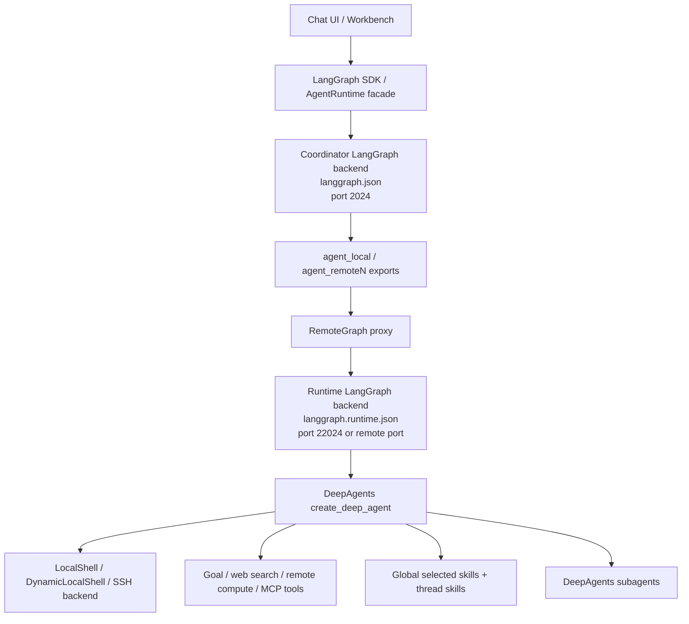
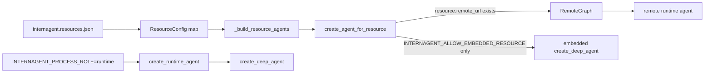
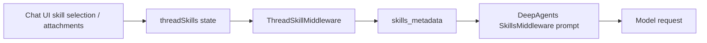
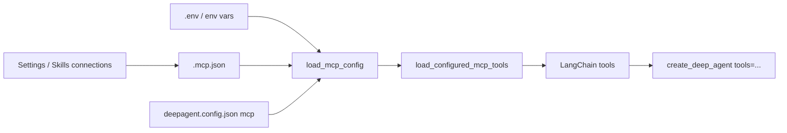
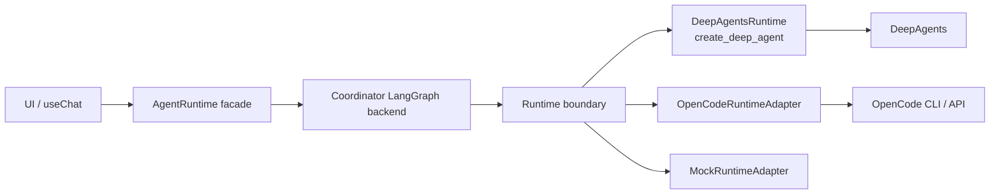

# 第三阶段补齐：Runtime / RemoteGraph / DeepAgents / Skills / MCP 关系图

## 结论

当前项目不是“前端直接访问 DeepAgents”，也不是“网页实时生成多个 Agent”。

当前实际结构是：

```text
前端 Chat UI
  -> LangGraph SDK / AgentRuntime facade
    -> coordinator LangGraph backend
      -> RemoteGraph
        -> 独立 runtime LangGraph backend
          -> DeepAgents create_deep_agent()
            -> tools / skills / MCP / subagents / backend
```

其中：

- `coordinator` 是主后台 LangGraph 进程，负责把资源会话路由到对应 runtime。
- `runtime` 是真正执行 DeepAgent 的 LangGraph 进程。
- `RemoteGraph` 是 LangGraph 的远程图调用代理，不是一个智能体网络。
- `DeepAgents` 是当前真正的 Agent runtime 实现。
- `Skills` 和 `MCP` 最终都进入 DeepAgent 的工具/上下文体系。
- `subagents` 是传给 DeepAgents 的子 agent 配置，不是平台前端动态创建的新 Agent。

## 关键代码位置

| 概念 | 代码位置 | 当前职责 |
| --- | --- | --- |
| coordinator graph | `langgraph.json` | 导出 `agent`、`agent_local`、`agent_remote1..8` |
| runtime graph | `langgraph.runtime.json` | runtime 进程只导出 `agent` |
| graph shim | `agent.py` | 把 LangGraph 入口转发到 `internagents.agent_graph` |
| graph 实现 | `internagents/agent_graph.py` | 创建 coordinator graph、runtime DeepAgent、RemoteGraph 代理 |
| DeepAgents 创建 | `create_runtime_agent()` / `create_agent_for_resource()` | 调用 `create_deep_agent()` |
| RemoteGraph 代理 | `create_agent_for_resource()` | 资源有 `remote_url` 时创建 `RemoteGraph` |
| Skills 配置 | `deepagent.config.json` / `/api/skills` | 保存 catalog、selected、active skills |
| 线程级 Skills | `ThreadSkillMiddleware` | 根据 thread state 里的 `threadSkills` 动态加载技能说明 |
| MCP 工具 | `internagents/mcp_tools.py` / `internagents/mcp_config.py` | 读取 `.mcp.json` / config，并转成 LangChain tools |
| 前端 runtime facade | `ui/src/lib/agent-runtime.ts` / `useAgentRuntimeStream()` | 收口前端对 LangGraph SDK 的访问 |

## 1. 进程拓扑



说明：

- 主后台使用 `langgraph.json`，它是 coordinator。
- 本机 runtime 使用 `langgraph.runtime.json`，并设置 `INTERNAGENT_PROCESS_ROLE=runtime`。
- 远端 runtime 也是独立 LangGraph backend，只是运行在 SSH 机器上。
- coordinator 正常情况下不直接嵌入资源 DeepAgent，而是通过 `RemoteGraph` 调 runtime。

## 2. coordinator 和 runtime 的关系



实际规则：

- `create_agent_for_resource(resource)` 如果发现 `resource.remote_url`，就创建 `RemoteGraph`。
- `RemoteGraph` 调用独立 runtime 的 `agent` graph。
- 只有显式设置 `INTERNAGENT_ALLOW_EMBEDDED_RESOURCE` 时，coordinator 才允许直接创建资源 DeepAgent。
- `create_runtime_agent()` 是 runtime 进程真正创建 DeepAgent 的入口。

这意味着：

```text
coordinator 负责路由和代理
runtime 负责真正执行 Agent
DeepAgents 运行在 runtime 内
```

## 3. RemoteGraph 是什么

在本项目里，`RemoteGraph` 是：

```text
LangGraph SDK 提供的远程 graph 调用对象
```

它不是：

```text
不是多 Agent 网络
不是 Agent 编排器
不是自动生成子 Agent 的系统
```

当前用法：

```text
RemoteGraph(resource.remote_assistant_id or "agent", url=resource.remote_url)
  -> remote.ainvoke(payload, config)
```

它的作用是让 coordinator 像调用本地图一样调用远端 runtime graph。

## 4. DeepAgents 在哪里创建

DeepAgents 的实际创建点是：

```text
internagents/agent_graph.py
  create_runtime_agent()
  create_agent_for_resource() 的 embedded fallback
```

核心调用：

```text
create_deep_agent(
  model=...
  tools=...
  backend=...
  skills=...
  subagents=...
  system_prompt=...
  interrupt_on=...
  middleware=...
)
```

正常运行路径下：

```text
coordinator
  -> RemoteGraph
    -> runtime process
      -> create_runtime_agent()
        -> create_deep_agent()
```

因此，如果以后要把 DeepAgents 换成 OpenCode，优先替换的是：

```text
runtime process 内 create_deep_agent() 对应的 concrete runtime 实现
```

而不是先改 UI，也不是先改 coordinator。

## 5. Skills 如何进入 Agent

Skills 有两条路径。

### 5.1 全局启用 Skills

```mermaid
flowchart LR
  Settings[Settings / Skills UI] --> API[/api/skills]
  API --> Config[deepagent.config.json skills.selected]
  Config --> Sync[_sync_selected_skills]
  Sync --> ActivePath[.internagents/active-skills]
  ActivePath --> Resolve[_resolve_skills]
  Resolve --> DeepAgent[create_deep_agent skills=...]
```

说明：

- 设置页保存选中的 skills 到 `deepagent.config.json`。
- `_sync_selected_skills()` 把选中 skill 同步到 `.internagents/active-skills`。
- `_resolve_skills()` 把 active path 作为 `skills=` 传给 `create_deep_agent()`。
- 这类 skills 是 runtime 启动/重启后生效的全局能力。

### 5.2 线程级 Skills



说明：

- `threadSkills` 存在线程 state 中。
- `ThreadSkillMiddleware` 在模型调用前读取对应 `SKILL.md`。
- 附件也会自动推断 `pdf/docx/xlsx/pptx` 等技能。
- `ThreadSkillMiddleware` 会阻止 task 工具把 `threadSkills` 更新泄漏回子任务。

因此：

```text
全局 selected skills 进入 create_deep_agent(skills=...)
线程级 skills 通过 ThreadSkillMiddleware 动态进入模型上下文
```

## 6. MCP 如何进入 Agent



当前 MCP 加载路径：

```text
_resolve_tools(config)
  -> goal_tools()
  -> remote_compute_tools()
  -> web_search_tools(config)
  -> load_configured_mcp_tools(config)
```

MCP 配置来源：

- `~/.deepagents/.mcp.json`
- 项目 `.deepagents/.mcp.json`
- 项目 `.mcp.json`
- `deepagent.config.json:mcp`
- `INTERNAGENT_MCP_CONFIG_FILE`

MCP server 加载失败不会阻止 graph 启动；失败会被记录为 status。

## 7. subagents 是什么

当前 subagents 来自：

```text
deepagent.config.json subagents
  + DeepAgents GENERAL_PURPOSE_SUBAGENT
  + ThreadSkillMiddleware
```

处理逻辑：

```text
_thread_skill_subagents(config, backend)
  -> 读取 config.subagents
  -> 如果没有 general-purpose，则插入 GENERAL_PURPOSE_SUBAGENT
  -> 给普通 subagent 追加 ThreadSkillMiddleware
  -> create_deep_agent(subagents=...)
```

这说明：

- 平台前端现在没有“实时新建子 Agent”的产品化入口。
- subagents 是 DeepAgents 的配置能力。
- 是否调用某个 subagent，由 DeepAgents 的 task/subagent 机制决定。
- 当前平台只是把配置和 thread skill middleware 传进去。

## 8. 当前有没有真正多 Agent 编排

有，但层级要分清：

```text
平台层：
  不是通用多 Agent 编排平台。
  没有可视化 workflow，也没有运行时动态注册 Agent 的产品入口。

LangGraph 层：
  有 coordinator graph 和 runtime graph。
  coordinator 代理不同 resource runtime。

DeepAgents 层：
  有 subagents 配置和 GENERAL_PURPOSE_SUBAGENT。
  DeepAgents 内部可以根据任务调用 subagent。
```

所以当前更准确的说法是：

```text
InternAgentS 当前是 coordinator + resource runtime + DeepAgents subagents 的组合，
不是像 Kimi 那种由平台层实时规划多个新 Agent 的通用 Agent 网络。
```

## 9. 替换 DeepAgents / 接入 OpenCode 时换哪一层



替换优先级：

1. 保留前端 `AgentRuntime facade`。
2. 保留 coordinator 对 runtime 的路由语义。
3. 定义 runtime run/event/file/workspace 协议。
4. 新增 `OpenCodeRuntimeAdapter` 或 `MockRuntimeAdapter`。
5. 再决定是否让 coordinator 继续用 LangGraph `RemoteGraph`，还是改成新的 runtime gateway。

不能直接替换的点：

- OpenCode 是否有稳定结构化事件流，需要先确认。
- OpenCode 的 session/thread 语义是否能映射 LangGraph thread，需要先确认。
- OpenCode 如何注入 skills/MCP，需要单独定义。
- OpenCode 如何执行文件写入、审批、取消 run，需要单独定义。

## 10. 第三阶段和当前代码改造的关系

已经完成的代码边界：

```text
UI
  -> useAgentRuntime()
  -> useAgentRuntimeStream()
  -> LangGraphAgentRuntimeAdapter
  -> WebRemoteAgent / LangGraph SDK
```

已经补齐的架构说明：

```text
coordinator
  -> RemoteGraph
  -> runtime
  -> DeepAgents
  -> Skills / MCP / subagents
```

第三阶段到这里才完整：

```text
代码边界收口 + Agent runtime 关系讲清楚
```

下一阶段才应该进入：

```text
Runtime protocol 标准化
MockRuntimeProvider
OpenCodeRuntimeAdapter 评估/接入
```
