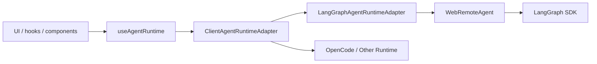
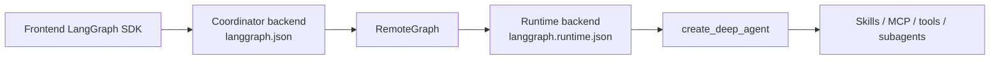

# 第三阶段：Agent Runtime Adapter 化设计

## 目标

第三阶段目标是把当前 UI 对 LangGraph / DeepAgents 的直接依赖，逐步收口到 Agent Runtime Adapter。

这样后续如果底层从 DeepAgents / LangGraph 换成 OpenCode、其他 agent runtime、远程 agent 服务，前端和业务层不需要大面积重写。

第三阶段还必须讲清楚当前 Agent runtime 关系：

```text
coordinator
  -> RemoteGraph
    -> runtime
      -> DeepAgents
        -> Skills / MCP / subagents
```

详细关系图见：

```text
docs/architecture/第三阶段-runtime关系图.md
```

## 当前问题

当前主链路里仍有多处直接依赖：

```text
@langchain/langgraph-sdk
@langchain/langgraph-sdk/react
WebRemoteAgent
client.threads
client.runs
useStream()
```

典型位置：

```text
ui/src/providers/ClientProvider.tsx
ui/src/lib/remote-agent.ts
ui/src/app/hooks/useChat.ts
ui/src/app/hooks/useThreads.ts
ui/src/app/components/ThreadList.tsx
ui/src/app/config/components/ArchivedThreadsCard.tsx
```

这说明前端现在知道太多 LangGraph 的细节：

- assistant 怎么 resolve
- thread 怎么 search / update
- run 怎么 stream / join
- thread state / history 怎么读
- interrupt / event 怎么解析

这些细节应该进入 runtime adapter。

## 目标结构



注意：上图描述的是前端 TypeScript 侧 runtime adapter 边界。Python 后端侧当前是：



## 分层职责

### UI / Hook

负责：

- 展示会话列表
- 打开会话
- 发送用户输入
- 展示运行状态
- 展示中断、工具调用、文件引用

不负责：

- 直接拼 LangGraph SDK 参数
- 直接调用 `client.threads.*`
- 直接调用 `client.runs.*`
- 直接理解 OpenCode / DeepAgents 底层协议

### ClientAgentRuntimeAdapter

位置：

```text
ui/src/lib/agent-runtime.ts
```

负责：

- 暴露统一的前端 runtime 能力
- 屏蔽 LangGraph SDK / WebRemoteAgent 的具体调用
- 为未来 OpenCode runtime 留 provider 入口

当前第一步能力：

```text
resolveAssistant()
searchThreads()
getThread()
getThreadState()
getThreadHistory()
getPendingRunInputPreview()
updateThreadMetadata()
updateState()
subscribe()
getStreamSubmitOptions()
useAgentRuntimeStream() -> LangGraph useStream() wrapper
client / legacyAgent 兼容出口
```

前端 context 入口：

```text
ui/src/providers/AgentRuntimeContext.ts
  useAgentRuntime()
  useRemoteAgent()
  useClient()

ui/src/providers/ClientProvider.tsx
  RemoteAgentProvider
```

### LangGraphAgentRuntimeAdapter

当前唯一 concrete adapter。

负责：

- 包装现有 `WebRemoteAgent`
- 复用现有 LangGraph SDK 行为
- 保持现有主流程不变

## 第三阶段已完成范围

已完成迁移和收口：

```text
useThreads()
ThreadList archive
ArchivedThreadsCard restore
HomePageInner resolveAssistant
useChat thread snapshot main-state reads
useChat updateState for files/threadSkills
useChat thread title metadata update
useChat stream hook entry via useAgentRuntimeStream()
useChat stream event subscription via agentRuntime.subscribe()
AgentRuntimeStreamEvent / AgentRuntimeStreamConfig neutral type entry
ProjectRuntimeClient for runtimeUrl synchronization branch
useAgentRuntime as the only React context runtime hook
AgentRuntimeProvider / AgentRuntimeContext naming
getStreamClient as the only temporary LangGraph stream client escape hatch
AgentRuntimeStreamMode neutral stream mode type
submitRun / stopRun transition methods with intent descriptors
AgentRuntime run intent contracts in ui/src/lib/agent-runtime-runs.ts
intent-specific run helpers in useAgentRuntimeStream()
runtime relationship map for coordinator / RemoteGraph / DeepAgents / Skills / MCP / subagents
```

第三阶段结束后仍保留的有意边界：

```text
LangGraph useStream() is isolated in useAgentRuntimeStream()
WebRemoteAgent is isolated in LangGraphAgentRuntimeAdapter
LangGraph client.threads.* is isolated in agent-runtime.ts / project-runtime-client.ts
LangGraph client.runs.* is isolated in project-runtime-client.ts / pending-run-input.ts
UI still uses LangGraph data types such as Message / Assistant / Thread
OpenCode / mock runtime provider is deferred until a concrete runtime protocol exists
```

原因：

- 当前产品仍运行在 LangGraph / DeepAgents 上，第三阶段目标是边界收口，不是替换底层 runtime。
- `useStream()` 是官方 React streaming hook，当前保留在 `useAgentRuntimeStream()` 这个唯一 facade 内。
- `ProjectRuntimeClient` 负责 `runtimeUrl` 对应的远端运行时同步，和主 `AgentRuntimeAdapter` 是两个不同边界。
- OpenCode / mock runtime 需要先定义 run/event/file/workspace 协议，不能在没有协议的情况下硬接。

## 后续顺序

### 3.1 完成前端 runtime adapter 入口

目标：

- `RemoteAgentProvider` 内部创建 `ClientAgentRuntimeAdapter`
- 新增 `useAgentRuntime()`
- 保留 `useRemoteAgent()` 兼容旧代码

验收：

- UI 行为不变
- 会话列表、归档、恢复、assistant resolve 走 adapter
- `useChat()` 暂不动

### 3.2 迁移 thread 操作

已完成：

- `archiveThread`
- `restoreThread`
- `updateState`
- `searchThreads`
- `getThread`
- `getThreadState`
- `getThreadHistory`
- `getPendingRunInputPreview`

结果：

- 会话列表、归档、恢复、主线程 state/history、pending run preview、线程标题和线程局部状态更新已走 runtime adapter。
- `useChat.ts` 的 stream event layer 已从 `WebRemoteAgent` 改为依赖 `agentRuntime.subscribe()`。
- stream event/config 类型已从 `remote-agent.ts` 抽到 `agent-runtime-events.ts`。
- `runtimeUrl` 对应的项目 runtime 同步分支已收口到 `ProjectRuntimeClient`，不再散落在页面 Hook 中直接调用 `runtimeClient.threads.*` / `runtimeClient.runs.*`。
- React context 已移除未使用的 `useRemoteAgent()` / `useClient()` 兼容出口，页面层只通过 `useAgentRuntime()` 访问运行时。
- Provider / Context 命名已从 RemoteAgent 收口为 AgentRuntime，降低对 WebRemoteAgent 实现的误导。
- Adapter 接口已删除通用 `client` 属性，仅保留 `getStreamClient()` 供当前 LangGraph `useStream()` wrapper 过渡使用。
- 通用 stream 配置已改用 `AgentRuntimeStreamMode`，不再从配置层直接引用 LangGraph `StreamMode`。
- 主 run 控制已新增 `submitRun()` / `stopRun()` 过渡入口，当前仍原样透传 LangGraph `stream.submit()` / `stream.stop()`。
- `submitRun()` / `stopRun()` 已支持 intent descriptor，用于标记发送、重试、单步、继续、恢复中断、停止等业务意图；descriptor 当前不参与 payload 拼装。
- run intent 类型已从 React hook 文件抽到 `ui/src/lib/agent-runtime-runs.ts`，后续 mock/OpenCode adapter 可以引用这份中立 contract。
- `useAgentRuntimeStream()` 已新增 intent-specific helper，把发送、重试、单步、继续、结束、恢复中断、停止这些 run 控制入口从 `useChat.ts` 的 UI 回调中收口出来；helper 当前仍原样透传既有 input/options。

### 3.3 迁移 run 操作

已完成：

- `submit`
- `stop`
- `retry`
- `resumeInterrupt`
- `continue`
- `resolve`
- `singleStep`
- `rerunSubagentStep`

当前 run 入口：

```text
useAgentRuntimeStream()
  -> LangGraph useStream()
  -> submitRun() / stopRun()
  -> submitSendMessageRun()
  -> submitRetryMessageRun()
  -> submitSingleStepRun()
  -> submitRerunSubagentStepRun()
  -> submitContinueRun()
  -> submitResolveThreadRun()
  -> submitResumeInterruptRun()
  -> stopCurrentRun()
```

当前 run intent 矩阵：

| intent | 当前 UI 动作 | 当前 input | 当前 options / control | 后续 adapter 语义 | 风险点 |
| --- | --- | --- | --- | --- | --- |
| `send_message` | 用户发送新消息 | `{ messages: [newMessage], goal?, threadSkills? }` | `metadata`、无效 implicit checkpoint、可选 `threadId`、`optimisticValues`、`config`、可选 `durability: "async"` | 启动一次新的用户消息 run | 不能丢附件 metadata、goal command、threadSkills、optimisticValues |
| `retry_message` | 重新发送某条 human 消息 | `{ messages: [newMessage] }` | 可用 checkpoint 或无效 implicit checkpoint、`metadata`、`optimisticValues`、`config` | 基于指定历史点重新跑一次消息 | checkpoint 判断不能改，否则会导致重试点错位 |
| `single_step` | 单步执行 / 从当前点继续到工具前 | 有 checkpoint 时为 `undefined`，无 checkpoint 时为 `{ messages }` | 有 checkpoint 时传 `checkpoint`，通常 `interruptBefore: ["tools"]`；无 checkpoint 时走无效 implicit checkpoint | 控制 run 在工具调用前停住 | `undefined` input 和 `{ messages }` 两条路径不能合并得太早 |
| `rerun_subagent_step` | 重新执行子 agent 单步 | `undefined` | `checkpoint`、`interruptAfter: ["tools"]`、可选 optimistic messages、`config` | 从子 agent checkpoint 重新执行并在工具后停住 | `interruptAfter` 与普通单步相反，容易误改 |
| `continue_run` | 继续当前中断/暂停的 run | `undefined` | 无效 implicit checkpoint、`config`、根据是否 task tool call 选择 `interruptAfter` 或 `interruptBefore` | 从当前线程状态继续 run | `hasTaskToolCall` 会改变中断位置 |
| `resolve_thread` | 标记当前线程结束 | `null` | 无效 implicit checkpoint、`command: { goto: "__end__", update: null }` | 让 runtime 跳到结束节点 | 这是控制命令，不是普通消息提交 |
| `resume_interrupt` | 用户提交 interrupt 的恢复值 | `null` | 无效 implicit checkpoint、`command: { resume: value }`、`config` | 恢复 LangGraph interrupt | `value` 是 interrupt 协议值，不能当 message 处理 |
| `stop_run` | 用户停止当前流 | 无 | `stream.stop()` | 取消/停止当前前端 stream | 当前只停前端 stream；后续是否取消后端 run 要单独定义 |

这张矩阵的作用：

- 后续拆 `useChat.ts` helper 时，先按 intent 拆，不按 LangGraph 参数形状硬拆。
- 后续接 OpenCode / mock runtime 时，adapter 要实现的是这些业务语义，而不是照搬 LangGraph `submit()` 参数。
- 当前所有 intent descriptor 仍是 metadata-only，不参与 payload 拼装。

这里已经完成第三阶段的入口收口；真正替换内部运行时实现前，还需要先定义跨 runtime event 标准。

### 3.4 定义跨 runtime event protocol

目标事件：

```text
run_started
message_delta
message_completed
tool_call
tool_result
interrupt
state
artifact
error
done
```

这部分已经在后端 shared contract 里有基础：

```text
ui/src/server/shared/contracts/agentRuntime.contract.ts
```

后续要判断是否抽成前后端共享 contract，避免前端和 server 各写一份。

### 3.5 接入第二 runtime provider

本阶段暂不接入第二 runtime provider，建议放到下一阶段先做 mock / noop provider，不要直接接 OpenCode。

原因：

- mock provider 可以验证 UI 是否真的不依赖 LangGraph。
- OpenCode 接入之前，需要明确输入输出、事件流、文件权限、工作区协议。

## 验收标准

- 新增 `useAgentRuntime()` 作为第三阶段入口。
- 新增 concrete `LangGraphAgentRuntimeAdapter`。
- 低风险 thread 操作不再直接依赖 `WebRemoteAgent`。
- `useChat()` 主链路保持行为不变。
- `useChat()` 的 run 控制入口走 `useAgentRuntimeStream()` 语义方法。
- 文档讲清 coordinator、runtime、RemoteGraph、DeepAgents、Skills、MCP、subagents 的真实关系。
- TypeScript / lint 通过。
- 文档能向需求同事解释：Adapter 不是前端跑仿真，而是隔离底层 agent runtime 协议。
