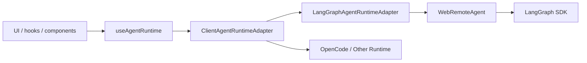

# 第三阶段：Agent Runtime Adapter 化设计

## 目标

第三阶段目标是把当前 UI 对 LangGraph / DeepAgents 的直接依赖，逐步收口到 Agent Runtime Adapter。

这样后续如果底层从 DeepAgents / LangGraph 换成 OpenCode、其他 agent runtime、远程 agent 服务，前端和业务层不需要大面积重写。

## 当前问题

当前主链路里仍有多处直接依赖：

```text
@langchain/langgraph-sdk
@langchain/langgraph-sdk/react
WebRemoteAgent
client.threads
client.runs
useStream()
```

典型位置：

```text
ui/src/providers/ClientProvider.tsx
ui/src/lib/remote-agent.ts
ui/src/app/hooks/useChat.ts
ui/src/app/hooks/useThreads.ts
ui/src/app/components/ThreadList.tsx
ui/src/app/config/components/ArchivedThreadsCard.tsx
```

这说明前端现在知道太多 LangGraph 的细节：

- assistant 怎么 resolve
- thread 怎么 search / update
- run 怎么 stream / join
- thread state / history 怎么读
- interrupt / event 怎么解析

这些细节应该进入 runtime adapter。

## 目标结构



## 分层职责

### UI / Hook

负责：

- 展示会话列表
- 打开会话
- 发送用户输入
- 展示运行状态
- 展示中断、工具调用、文件引用

不负责：

- 直接拼 LangGraph SDK 参数
- 直接调用 `client.threads.*`
- 直接调用 `client.runs.*`
- 直接理解 OpenCode / DeepAgents 底层协议

### ClientAgentRuntimeAdapter

位置：

```text
ui/src/lib/agent-runtime.ts
```

负责：

- 暴露统一的前端 runtime 能力
- 屏蔽 LangGraph SDK / WebRemoteAgent 的具体调用
- 为未来 OpenCode runtime 留 provider 入口

当前第一步能力：

```text
resolveAssistant()
searchThreads()
getThread()
getThreadState()
getThreadHistory()
getPendingRunInputPreview()
updateThreadMetadata()
updateState()
subscribe()
getStreamSubmitOptions()
useAgentRuntimeStream() -> LangGraph useStream() wrapper
client / legacyAgent 兼容出口
```

前端 context 入口：

```text
ui/src/providers/AgentRuntimeContext.ts
  useAgentRuntime()
  useRemoteAgent()
  useClient()

ui/src/providers/ClientProvider.tsx
  RemoteAgentProvider
```

### LangGraphAgentRuntimeAdapter

当前唯一 concrete adapter。

负责：

- 包装现有 `WebRemoteAgent`
- 复用现有 LangGraph SDK 行为
- 保持现有主流程不变

## 第一阶段迁移范围

已经开始迁移低风险调用：

```text
useThreads()
ThreadList archive
ArchivedThreadsCard restore
HomePageInner resolveAssistant
useChat thread snapshot main-state reads
useChat updateState for files/threadSkills
useChat thread title metadata update
useChat stream hook entry via useAgentRuntimeStream()
useChat stream event subscription via agentRuntime.subscribe()
AgentRuntimeStreamEvent / AgentRuntimeStreamConfig neutral type entry
```

暂不迁移：

```text
runtime live stream
interrupt resume
run stop/retry
runtimeClient.threads.* temporary runtime sync
runtime event normalization
OpenCode / mock runtime provider
```

原因：

- 这是聊天主链路。
- 它依赖 `@langchain/langgraph-sdk/react` 的 `useStream()`。
- 一次迁移风险太高。

## 后续顺序

### 3.1 完成前端 runtime adapter 入口

目标：

- `RemoteAgentProvider` 内部创建 `ClientAgentRuntimeAdapter`
- 新增 `useAgentRuntime()`
- 保留 `useRemoteAgent()` 兼容旧代码

验收：

- UI 行为不变
- 会话列表、归档、恢复、assistant resolve 走 adapter
- `useChat()` 暂不动

### 3.2 迁移 thread 操作

已完成：

- `archiveThread`
- `restoreThread`
- `updateState`
- `searchThreads`
- `getThread`
- `getThreadState`
- `getThreadHistory`
- `getPendingRunInputPreview`

结果：

- 会话列表、归档、恢复、主线程 state/history、pending run preview、线程标题和线程局部状态更新已走 runtime adapter。
- `useChat.ts` 的 stream event layer 已从 `WebRemoteAgent` 改为依赖 `agentRuntime.subscribe()`。
- stream event/config 类型已从 `remote-agent.ts` 抽到 `agent-runtime-events.ts`。
- `runtimeClient.threads.*` 暂时保留，因为它属于项目 runtime 状态同步，不是主 Agent Runtime 的第一轮替换点。

### 3.3 迁移 run 操作

下一步目标：

- `submit`
- `stop`
- `retry`
- `resumeInterrupt`
- `joinStream`
- `liveStream`

当前已完成入口外壳：

```text
useAgentRuntimeStream()
  -> LangGraph useStream()
```

这里还需要先定义 runtime event 标准，才能真正替换内部运行时实现。

### 3.4 定义跨 runtime event protocol

目标事件：

```text
run_started
message_delta
message_completed
tool_call
tool_result
interrupt
state
artifact
error
done
```

这部分已经在后端 shared contract 里有基础：

```text
ui/src/server/shared/contracts/agentRuntime.contract.ts
```

后续要判断是否抽成前后端共享 contract，避免前端和 server 各写一份。

### 3.5 接入第二 runtime provider

建议先做 mock / noop provider，不要直接接 OpenCode。

原因：

- mock provider 可以验证 UI 是否真的不依赖 LangGraph。
- OpenCode 接入之前，需要明确输入输出、事件流、文件权限、工作区协议。

## 验收标准

- 新增 `useAgentRuntime()` 作为第三阶段入口。
- 新增 concrete `LangGraphAgentRuntimeAdapter`。
- 低风险 thread 操作不再直接依赖 `WebRemoteAgent`。
- `useChat()` 主链路保持行为不变。
- TypeScript / lint 通过。
- 文档能向需求同事解释：Adapter 不是前端跑仿真，而是隔离底层 agent runtime 协议。
