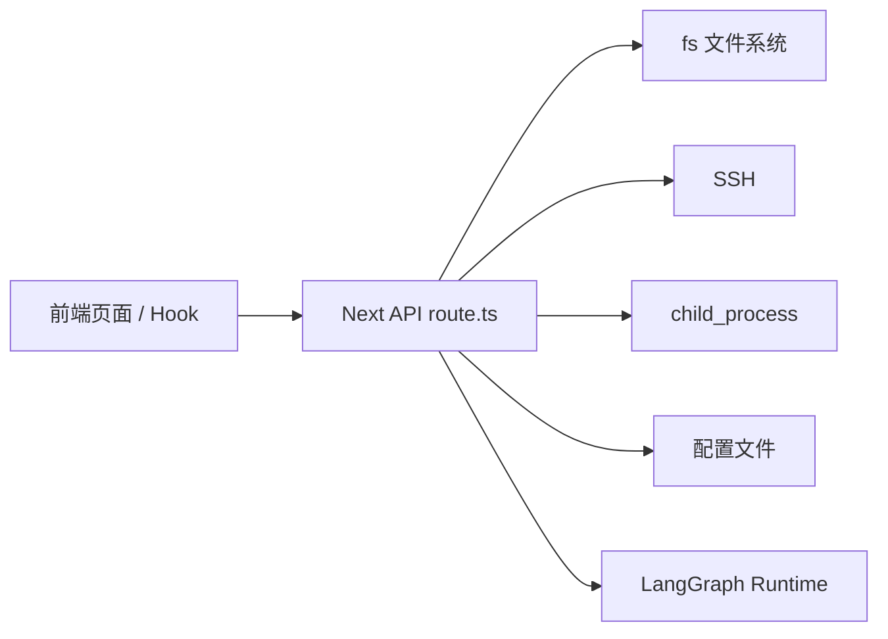
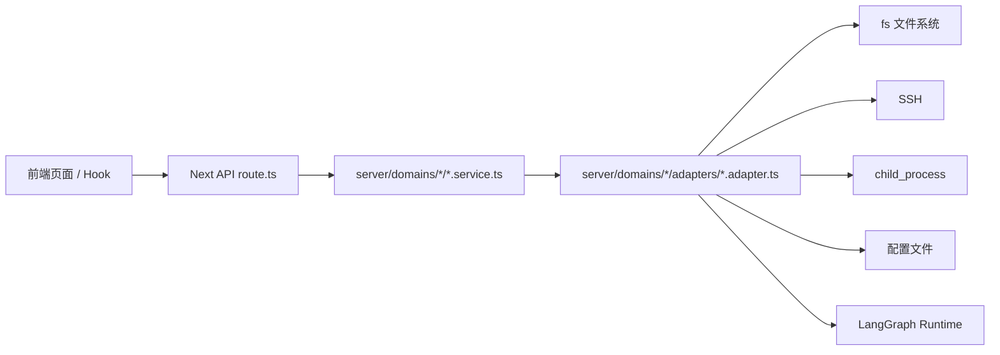

# 第二阶段：后端 API Service 层拆分设计

## 1. 阶段目标

第二阶段的目标不是改功能，而是把后端 API 的责任边界拆清楚。

当前很多 `ui/src/app/api/**/route.ts` 文件同时做了几件事：

- 读取 HTTP 参数
- 校验业务规则
- 拼装返回数据
- 读写本地文件
- 调用 SSH、进程、LangGraph runtime、系统命令
- 处理错误和状态码

这会导致 route 文件越来越厚，后续加功能时很容易改到不该改的地方。

第二阶段要改成：

```text
API route 只负责 HTTP 入参 / 出参
domain service 负责业务流程和规则
adapter 负责文件系统、SSH、进程、系统命令等副作用
```

核心原则：

- 不改前端调用协议
- 不改 API URL
- 不改 request / response 数据结构
- 不一次性重写大文件
- 每次只拆一个小 API group
- 拆完必须能 lint/typecheck/test

## 2. 目标分层

### 2.1 API route 层

位置：

```text
ui/src/app/api/**/route.ts
```

只负责：

- 从 `NextRequest` 里读取 query/body/formData/header
- 调用对应的 domain service
- 用 `NextResponse` 返回 JSON、stream、状态码
- 把异常转换成 HTTP error response

不负责：

- 判断本地 workspace 还是 remote workspace
- 拼复杂业务 payload
- 直接调用 `fs`
- 直接调用 `child_process`
- 直接调用 SSH
- 直接操作配置文件
- 直接启动或重启 runtime

理想形态：

```ts
export async function GET(request: NextRequest) {
  const resourceId = request.nextUrl.searchParams.get("resourceId");

  try {
    const payload = await workspaceService.listWorkspaceDirectory({
      resourceId,
    });
    return NextResponse.json(payload);
  } catch (error) {
    return NextResponse.json({ error: getErrorMessage(error) }, { status: 400 });
  }
}
```

### 2.2 domain service 层

位置：

```text
ui/src/server/domains/<domain>/<domain>.service.ts
```

负责：

- 业务流程编排
- 业务规则判断
- 拼装 API 返回 payload
- 调用一个或多个 adapter
- 屏蔽底层实现差异

例如 workspace service 负责：

- 列目录
- 搜索文件
- 读取文件预览
- 读取 raw 文件
- 打开本地文件夹
- 打开本地文件

但它不直接写 `fs.stat()`、`execFile()`、SSH 命令。

### 2.3 adapter 层

位置：

```text
ui/src/server/domains/<domain>/adapters/*.adapter.ts
```

负责真实副作用：

- `fs` 文件读写
- `child_process`
- SSH 命令
- Git/GitHub 命令
- LangGraph runtime HTTP 调用
- 系统文件选择器
- 本地桌面能力

adapter 的目标是把“不好测试、不好替换、依赖环境”的东西集中起来。

## 3. 目录采用第二种方案

采用新的 server 目录，不继续把业务逻辑放在 `app/api` 里面：

```text
ui/src/server/
  domains/
    workspace/
      workspace.service.ts
      workspace.types.ts
      adapters/
        legacyWorkspace.adapter.ts
        localDesktop.adapter.ts
        remoteWorkspace.adapter.ts

    config/
      config.service.ts
      config.types.ts
      adapters/
        configFile.adapter.ts

    runtime/
      runtime.service.ts
      runtime.types.ts
      adapters/
        langgraphRuntime.adapter.ts
        processManager.adapter.ts

    remote/
      remote.service.ts
      remote.types.ts
      adapters/
        ssh.adapter.ts
        remoteBackend.adapter.ts

    skills/
      skills.service.ts
      skills.types.ts
      adapters/
        skillsFile.adapter.ts

    compute/
      compute.service.ts
      compute.types.ts
      adapters/
        computeJobs.adapter.ts
```

为什么选这个目录：

- `app/api` 保持 Next.js HTTP 路由职责
- `server/domains` 表达业务边界
- 以后如果换 API 框架，service 和 adapter 可以继续复用
- 领导和团队看目录就能知道功能属于哪个领域

## 4. 总体调用图

### 4.1 拆分前



问题是 route 既是 HTTP 层，又像业务层，又像底层工具层。

### 4.2 拆分后



每一层只干一类事：

- UI：展示和交互
- API route：HTTP 边界
- service：业务流程
- adapter：底层副作用

## 5. 迁移顺序

### 5.1 第一批：workspace

优先拆 workspace，因为它是前端文件管理、文件预览、附件上传的基础能力。

第一批先拆：

- `/api/workspace/files`
- `/api/workspace/search`
- `/api/workspace/file`
- `/api/workspace/file/raw`
- `/api/workspace/open-folder`
- `/api/workspace/open-file`

暂不拆：

- `/api/workspace/attachments`

原因：

`attachments` 同时涉及上传、PDF 提取、Office 解析、summary 文件写入，业务较重，应该作为 workspace 第二刀单独拆。

### 5.2 第二批：config

目标：

- 配置读取
- 配置保存
- 模型配置
- API key
- UI language
- `deepagent.config`

建议目录：

```text
ui/src/server/domains/config/
  config.service.ts
  config.types.ts
  adapters/
    configFile.adapter.ts
    envFile.adapter.ts
```

### 5.3 第三批：runtime

目标：

- backend ready/status/restart
- desktop config
- LangGraph runtime 启动状态
- `.internagents/logs`
- `.internagents/pids`

建议目录：

```text
ui/src/server/domains/runtime/
  runtime.service.ts
  runtime.types.ts
  adapters/
    backendProcess.adapter.ts
    langgraphRuntime.adapter.ts
    runtimeFiles.adapter.ts
```

### 5.4 第四批：remote

目标：

- remote connections
- ensure remote backend
- setup
- push backend cli
- SSH 调用

建议目录：

```text
ui/src/server/domains/remote/
  remote.service.ts
  remote.types.ts
  adapters/
    ssh.adapter.ts
    remoteBackend.adapter.ts
    remoteProject.adapter.ts
```

### 5.5 第五批：skills

目标：

- skill 列表
- skill 导入
- skill 启用
- skill connections

建议目录：

```text
ui/src/server/domains/skills/
  skills.service.ts
  skills.types.ts
  adapters/
    skillsDirectory.adapter.ts
    skillsConfig.adapter.ts
```

### 5.6 第六批：compute

目标：

- compute settings
- job status
- job history
- 远程计算任务

建议目录：

```text
ui/src/server/domains/compute/
  compute.service.ts
  compute.types.ts
  adapters/
    computeConfig.adapter.ts
    computeJob.adapter.ts
```

## 6. 迁移方法

每个 API group 按下面 5 步做。

### 第 1 步：只建 service 壳

先新增：

```text
ui/src/server/domains/<domain>/<domain>.service.ts
ui/src/server/domains/<domain>/<domain>.types.ts
```

route 还不动，先保证目录和命名稳定。

### 第 2 步：建 legacy adapter

先用 adapter 包住旧实现：

```text
legacyWorkspace.adapter.ts
```

这一步不是最终形态，但很有用。

它的意义是：

- route 先变薄
- 行为先保持稳定
- 旧 `_lib` 不急着一次搬完
- 后面可以逐步把 legacy adapter 替换成真正 adapter

### 第 3 步：route 调 service

把 route 从：

```text
route.ts -> _lib/workspace.ts -> fs/ssh/process
```

改成：

```text
route.ts -> workspace.service.ts -> adapter -> _lib/workspace.ts
```

注意：

这一步链路看起来变长了，但边界变清楚了。

### 第 4 步：把 legacy adapter 拆实

等 route 稳定后，再把旧 `_lib` 里面的代码逐步搬到真正 adapter。

例如：

```text
legacyWorkspace.adapter.ts
  -> localWorkspace.adapter.ts
  -> remoteWorkspace.adapter.ts
  -> workspaceConfig.adapter.ts
```

### 第 5 步：删除旧 _lib 或只保留通用工具

等迁移完成后：

- 旧 `_lib` 能删就删
- 不能删的通用工具放到 `server/shared`
- 不让新代码继续依赖 `app/api/**/_lib`

## 7. 验收标准

每次拆分都必须满足：

- API URL 不变
- 请求参数不变
- 返回字段不变
- HTTP 状态码不主动改变
- 前端不需要跟着改
- `npm run lint` 没有新增 error
- `npx tsc --noEmit --pretty false` 通过
- 相关测试通过
- `git diff` 能看出 route 变薄、service/adapter 变清楚

## 8. 本阶段不做什么

第二阶段暂时不做：

- 不改 UI
- 不改前端 service client
- 不改聊天主链路 `useChat.ts`
- 不拆 Python `agent_graph.py`
- 不改 LangGraph/DeepAgents 编排逻辑
- 不接航空专业能力
- 不做多 Agent 产品化配置入口

这些属于后续阶段。

## 9. 风险控制

### 9.1 不一次性搬大文件

像 `workspace.ts` 这种上千行文件，不直接整文件搬家。

正确方式：

1. 先 legacy adapter 包起来
2. route 变薄
3. 再按能力拆 adapter
4. 每拆一块就验证

### 9.2 不改变协议

前端已经做完第一阶段接口层收口，第二阶段如果改 API 协议，会造成前后端一起震荡。

所以第二阶段只清理后端内部结构，不改协议。

### 9.3 每次保留对比图

每次改动都要在：

```text
docs/architecture/第二阶段改动过程.md
```

追加：

- 改动目标
- 改动前调用图
- 改动后调用图
- 涉及文件
- 验证结果
- 下一步建议

这样领导和团队能看到架构是在逐步变清楚，而不是凭感觉重构。

