# 第二阶段改动过程

本文档记录第二阶段“后端 API service 层梳理”的每次改动。

记录规则：

- 每次改动都追加一节
- 说明改了哪个业务域
- 说明 route、service、adapter 的职责变化
- 给出改动前后调用图
- 列出涉及文件
- 写清楚验证命令和结果
- 没有用户明确要求时，不提交、不推送

## 2026-07-07：workspace 第一批 route 接入 service 层

### 改动目标

先拆 workspace 域中最清晰的一批 API，让 route 变薄。

这次不追求一次性搬完 `workspace.ts`，而是先建立第二阶段的结构：

```text
route.ts
  -> workspace.service.ts
    -> adapters/*
      -> 旧 _lib 实现 / 本地系统能力
```

这样做的原因：

- 先让 HTTP 层和业务层分开
- 先保持 API 行为稳定
- 避免一次性搬动上千行 workspace 旧实现
- 后续可以继续把 legacy adapter 拆成真正的 local/remote adapter

### 改动前

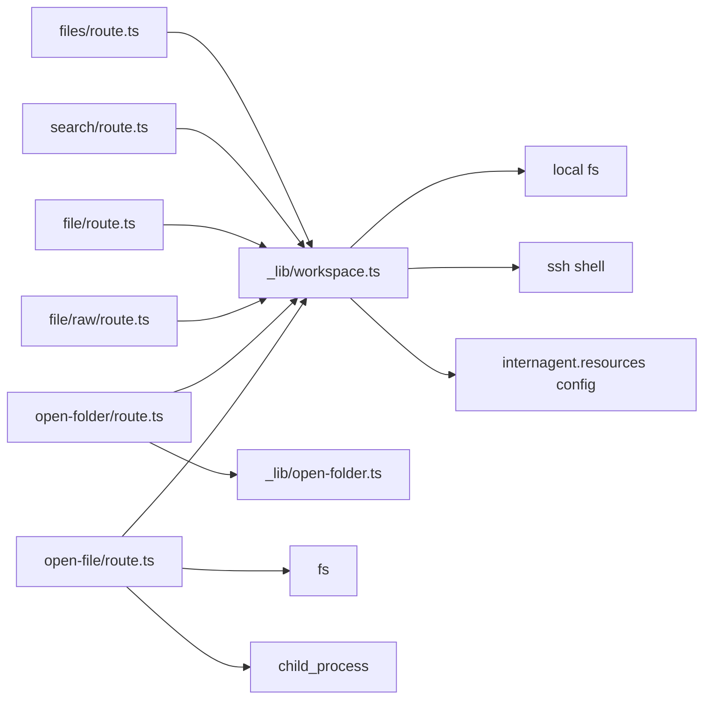

问题：

- route 文件同时负责 HTTP、业务判断、payload 拼装、系统调用
- `open-file/route.ts` 直接调用 `fs` 和 `child_process`
- `file/route.ts` 直接拼装预览 payload
- `raw/route.ts` 直接判断本地/远程 raw 文件读取方式

### 改动后

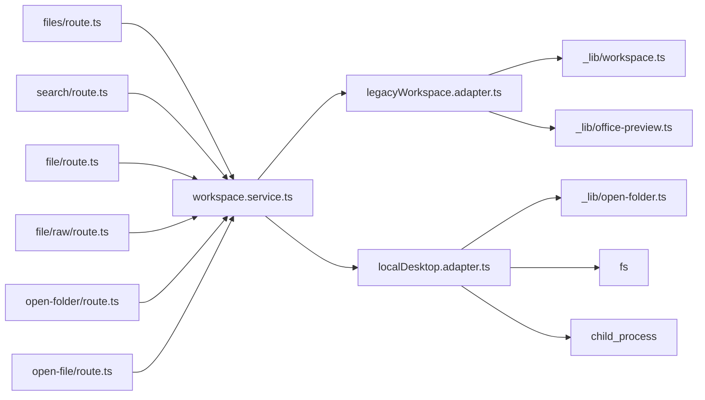

现在 route 的职责变成：

- 读取 query/body/header
- 调用 `workspace.service.ts`
- 返回 `NextResponse`
- 处理 HTTP error

业务流程被收到：

```text
ui/src/server/domains/workspace/workspace.service.ts
```

底层副作用被收到：

```text
ui/src/server/domains/workspace/adapters/
```

### 本次涉及文件

新增：

```text
ui/src/server/domains/workspace/workspace.service.ts
ui/src/server/domains/workspace/workspace.types.ts
ui/src/server/domains/workspace/adapters/legacyWorkspace.adapter.ts
ui/src/server/domains/workspace/adapters/localDesktop.adapter.ts
```

修改：

```text
ui/src/app/api/workspace/files/route.ts
ui/src/app/api/workspace/search/route.ts
ui/src/app/api/workspace/file/route.ts
ui/src/app/api/workspace/file/raw/route.ts
ui/src/app/api/workspace/open-folder/route.ts
ui/src/app/api/workspace/open-file/route.ts
```

暂未修改：

```text
ui/src/app/api/workspace/attachments/route.ts
```

原因：

`attachments/route.ts` 同时涉及上传、PDF 提取、Office 解析、summary 文件写入，业务更重，适合作为 workspace 第二刀单独拆。

### 验证结果

已执行：

```text
npx tsc --noEmit --pretty false
npm run lint
npm run test:open-folder
npm run test:office-preview
git diff --check
```

结果：

- TypeScript 通过
- lint 通过，无新增 error
- 仍有 7 个原项目已有 warning
- `test:open-folder` 通过
- `test:office-preview` 通过
- `git diff --check` 通过

### 当前状态

本次还没有提交，也没有推送。

工作区还有这些本地未跟踪内容：

```text
.vscode/
docs/architecture/
repomix-output-lite.md
ui/src/server/
```

其中 `ui/src/server/` 是本次第二阶段新增代码目录；`docs/architecture/` 是本地架构文档目录。

### 下一步建议

下一刀建议继续拆 workspace，但只拆 `attachments/route.ts`：

```text
attachments/route.ts
  -> workspaceAttachment.service.ts
    -> pdfAttachment.adapter.ts
    -> officeAttachment.adapter.ts
    -> workspaceFile.adapter.ts
```

原因：

- 它仍然是 workspace 域里最厚的 route
- 它混合了上传、PDF、Office、文件写入
- 拆完后 workspace API route 基本都会变薄

## 2026-07-07：workspace attachments route 接入 service 层

### 改动目标

继续拆 workspace 域，把最后一个较厚的 route：

```text
ui/src/app/api/workspace/attachments/route.ts
```

从“HTTP + 业务流程 + PDF/Office 提取 + workspace 文件写入”混合模式，改成：

```text
attachments/route.ts
  -> workspaceAttachment.service.ts
    -> attachmentExtraction.adapter.ts
    -> legacyWorkspace.adapter.ts
```

这次仍然保持 API URL、请求格式、返回字段不变。

### 改动前

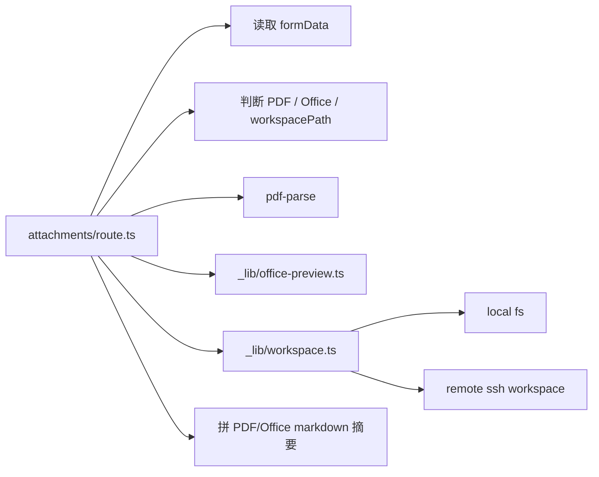

问题：

- route 文件接近 500 行
- route 直接包含 PDF 提取逻辑
- route 直接包含 Office 附件类型判断
- route 直接写 `.internagents/uploads/...`
- route 直接拼装附件返回 payload
- HTTP 层和业务层没有边界

### 改动后

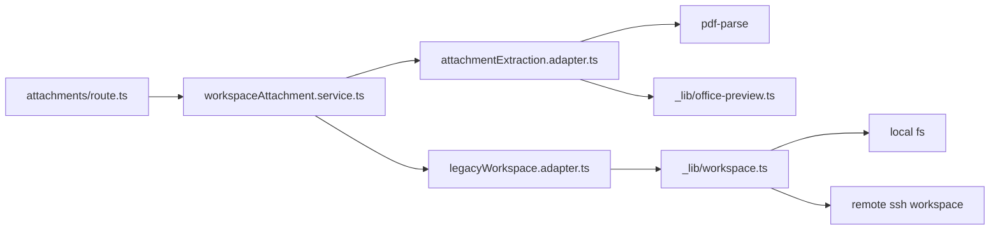

现在职责变成：

```text
attachments/route.ts
  只负责：
  - request.formData()
  - 读取 resourceId/workspaceId/threadId/workspacePath/file
  - 调用 uploadWorkspaceAttachment()
  - 返回 NextResponse

workspaceAttachment.service.ts
  负责：
  - 附件上传业务流程
  - workspacePath 附件流程
  - PDF / Office 类型判断
  - 上传路径生成
  - markdown summary 生成
  - API payload 拼装
  - 业务错误状态码

attachmentExtraction.adapter.ts
  负责：
  - PDF 文本提取
  - Office readable preview 调用

legacyWorkspace.adapter.ts
  负责：
  - 读 workspace raw file
  - 写 workspace raw file
  - 复用旧 workspace 实现
```

### 本次涉及文件

新增：

```text
ui/src/server/domains/workspace/workspaceAttachment.service.ts
ui/src/server/domains/workspace/adapters/attachmentExtraction.adapter.ts
```

修改：

```text
ui/src/app/api/workspace/attachments/route.ts
ui/src/server/domains/workspace/adapters/legacyWorkspace.adapter.ts
```

### 行为保持

保持不变：

- POST `/api/workspace/attachments`
- `FormData` 字段：
  - `resourceId`
  - `workspaceId`
  - `threadId`
  - `workspacePath`
  - `file`
- 返回格式：

```text
{
  attachment: {
    name,
    mimeType,
    size,
    kind,
    workspacePath,
    extractedWorkspacePath,
    extractedTextSize,
    text,
    pageCount,
    extractedPageCount,
    truncated,
    extractionError
  }
}
```

保持不变的错误状态：

- 缺少文件：400
- 不支持的文件类型：400
- 上传文件过大：413
- 其他异常：400

### 验证结果

已执行：

```text
npx tsc --noEmit --pretty false
npm run lint
npm run test:open-folder
npm run test:office-preview
npm run test:think-tags
npm run test:local-folder-picker
git diff --check
```

结果：

- TypeScript 通过
- lint 通过，无新增 error
- 仍有 7 个原项目已有 warning
- `test:open-folder` 通过
- `test:office-preview` 通过
- `test:think-tags` 通过
- `test:local-folder-picker` 通过
- `git diff --check` 通过

### 当前 workspace 域状态

workspace 域目前已经完成第一轮 route 瘦身：

```text
/api/workspace/files
/api/workspace/search
/api/workspace/file
/api/workspace/file/raw
/api/workspace/open-folder
/api/workspace/open-file
/api/workspace/attachments
```

这些 route 已经不再直接承载主要业务流程。

仍需后续继续做的事：

```text
legacyWorkspace.adapter.ts
  -> localWorkspace.adapter.ts
  -> remoteWorkspace.adapter.ts
  -> workspaceConfig.adapter.ts
```

也就是说，workspace 第一轮“route 变薄”完成了；第二轮可以继续把 legacy adapter 里的旧 `_lib/workspace.ts` 逐块拆实。

### 下一步建议

第二阶段下一步建议转向 `config` 域。

原因：

- workspace route 已经完成第一轮边界收口
- config 是 runtime、resources、language、API key 的基础
- config 拆清楚后，后面 runtime/remote 会更好拆

建议下一刀：

```text
ui/src/app/api/config/route.ts
  -> ui/src/server/domains/config/config.service.ts
    -> ui/src/server/domains/config/adapters/configFile.adapter.ts
    -> ui/src/server/domains/config/adapters/envFile.adapter.ts
```

## 2026-07-08：config route 接入 service 层

### 改动目标

拆分 config 域，把：

```text
ui/src/app/api/config/route.ts
```

从“HTTP + deepagent.config.json 读写 + .env 读写 + 模型配置归一化 + workspace 配置更新”混合模式，改成：

```text
config/route.ts
  -> config.service.ts
    -> configFile.adapter.ts
    -> envFile.adapter.ts
    -> workspaceConfig.adapter.ts
```

这次保持 API URL、请求字段、返回字段和状态码不变。

### 改动前

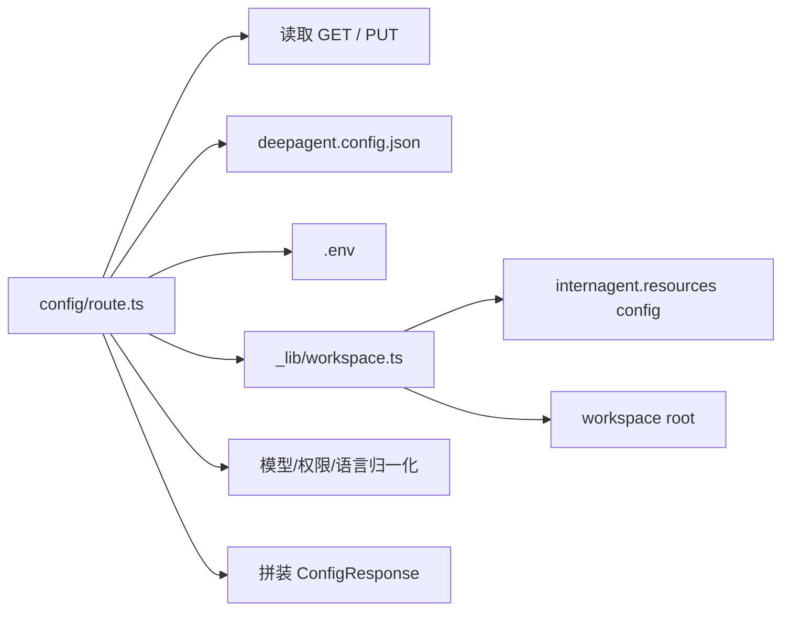

问题：

- `config/route.ts` 超过 500 行
- route 直接读写 `deepagent.config.json`
- route 直接读写 `.env`
- route 直接调用 workspace `_lib`
- route 直接做模型 provider 兼容、API key、onboarding、authorization mode 等业务规则
- HTTP 层和配置业务层混在一起

### 改动后

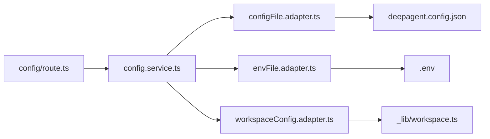

现在职责变成：

```text
config/route.ts
  只负责：
  - GET 调用 getConfig()
  - PUT 读取 request.json()
  - 调用 updateConfig()
  - 返回 NextResponse
  - HTTP error 包装

config.service.ts
  负责：
  - 模型字段归一化
  - OpenAI 兼容 Base URL 校验
  - API key 处理
  - authorization mode / interrupt_on 生成
  - onboarding 状态判断
  - ConfigResponse 拼装
  - workspacePath 变更业务判断

configFile.adapter.ts
  负责：
  - deepagent.config.json 路径
  - 读取 AgentConfig
  - 写入 AgentConfig

envFile.adapter.ts
  负责：
  - .env 路径
  - 解析 env key/value
  - 写入/删除 env key/value

workspaceConfig.adapter.ts
  负责：
  - workspace root
  - resources config path
  - 当前 local workspace path
  - 更新 local workspace path
```

### 本次涉及文件

新增：

```text
ui/src/server/domains/config/config.service.ts
ui/src/server/domains/config/config.types.ts
ui/src/server/domains/config/adapters/configFile.adapter.ts
ui/src/server/domains/config/adapters/envFile.adapter.ts
ui/src/server/domains/config/adapters/workspaceConfig.adapter.ts
```

修改：

```text
ui/src/app/api/config/route.ts
```

### 行为保持

保持不变：

- GET `/api/config`
- PUT `/api/config`
- PUT body 字段：
  - `model`
  - `modelProvider`
  - `modelSelectionMode`
  - `openaiCompatibleApiKey`
  - `openaiCompatibleBaseUrl`
  - `openrouterApiKey`
  - `authorizationMode`
  - `workspacePath`
  - `language`
  - `onboardingSkipped`
- 返回字段：
  - `configPath`
  - `envPath`
  - `resourcesPath`
  - `workspacePath`
  - `workspaceResolvedPath`
  - `workspaceError`
  - `modelProvider`
  - `model`
  - `modelSelectionMode`
  - `effectiveModel`
  - `autoModel`
  - `openaiCompatibleModel`
  - `openaiCompatibleBaseUrl`
  - `openaiCompatibleApiKey`
  - `openaiCompatibleApiKeySet`
  - `openaiCompatibleApiKeyPreview`
  - `openrouterModel`
  - `openrouterApiKey`
  - `openrouterApiKeySet`
  - `openrouterApiKeyPreview`
  - `authorizationMode`
  - `language`
  - `desktopMode`
  - `onboardingSkipped`
  - `needsOnboarding`
  - `missing`
  - `message`

保持不变的错误状态：

- GET 配置失败：500
- PUT 保存失败：500

### 验证结果

已执行：

```text
npx tsc --noEmit --pretty false
npm run lint
npm run test:open-folder
npm run test:office-preview
npm run test:think-tags
npm run test:local-folder-picker
git diff --check
```

结果：

- TypeScript 通过
- lint 通过，无新增 error
- 仍有 7 个原项目已有 warning
- `test:open-folder` 通过
- `test:office-preview` 通过
- `test:think-tags` 通过
- `test:local-folder-picker` 通过
- `git diff --check` 通过

### 当前 config 域状态

config 域第一轮 route 瘦身完成：

```text
/api/config
```

现在 `config/route.ts` 不再直接：

- import `fs`
- import `path`
- import workspace `_lib`
- 读写 `.env`
- 读写 `deepagent.config.json`
- 处理完整配置业务规则

这些逻辑已经进入：

```text
ui/src/server/domains/config/
```

### 下一步建议

第二阶段下一步建议拆 `resources` 和 `workspaces`。

原因：

- 它们和 config/workspace 强相关
- 它们大概率仍然直接依赖 workspace `_lib`
- 拆完后，配置、资源、项目选择这条链路会更清晰

建议下一刀：

```text
ui/src/app/api/resources/route.ts
ui/src/app/api/workspaces/route.ts
  -> ui/src/server/domains/resources/resources.service.ts
  -> ui/src/server/domains/workspaces/workspaces.service.ts
```

## 2026-07-08：resources + workspaces route 接入 service 层

### 改动目标

继续补齐 config/workspace 之间的资源和项目管理链路，拆分：

```text
ui/src/app/api/resources/route.ts
ui/src/app/api/workspaces/route.ts
```

目标结构：

```text
resources/route.ts
  -> resources.service.ts
    -> resources.adapter.ts

workspaces/route.ts
  -> workspaces.service.ts
    -> workspaces.adapter.ts
    -> folderPicker.adapter.ts
```

这次仍然保持 API URL、请求字段、返回字段和状态码不变。

### 改动前

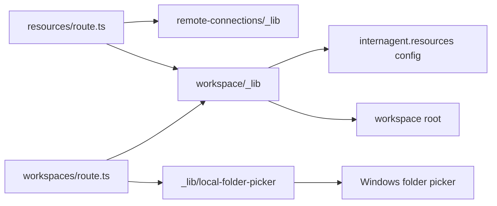

问题：

- `resources/route.ts` 直接依赖 remote 和 workspace 两个旧 `_lib`。
- `workspaces/route.ts` 同时处理 HTTP、项目业务规则、本地文件夹选择器和 workspace 配置更新。
- 项目 ID 为空、用户取消选择、项目切换等规则散落在 route 里。
- config/workspace 已经拆到 service 层，但 resources/workspaces 仍在旧 route 模式。

### 改动后

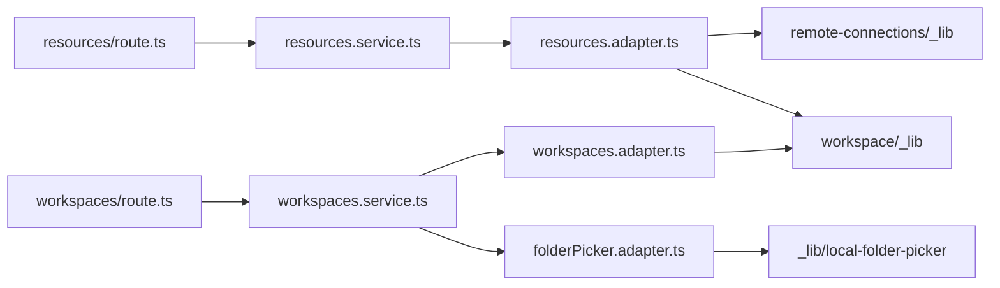

现在职责变成：

```text
resources/route.ts
  只负责：
  - GET 调用 getResources()
  - 返回 NextResponse
  - HTTP error 包装

resources.service.ts
  负责：
  - 拼装 defaultResourceId
  - 拼装 resources response

resources.adapter.ts
  负责：
  - 读取 workspace resources config
  - 调用 remote-connections 的 UI resources 列表

workspaces/route.ts
  只负责：
  - 读取 HTTP query/body
  - 调用 get/set/update/delete/pick workspace service
  - 返回 NextResponse
  - HTTP error/cancelled 包装

workspaces.service.ts
  负责：
  - 项目列表
  - 切换默认项目
  - 更新项目名称/路径
  - 删除项目
  - 选择本地项目文件夹
  - 项目 ID 为空等业务错误

workspaces.adapter.ts
  负责：
  - 复用旧 workspace 配置读写能力

folderPicker.adapter.ts
  负责：
  - 本地文件夹选择器
  - 用户取消选择判断
```

### 本次涉及文件

新增：

```text
ui/src/server/domains/resources/resources.service.ts
ui/src/server/domains/resources/resources.types.ts
ui/src/server/domains/resources/adapters/resources.adapter.ts

ui/src/server/domains/workspaces/workspaces.service.ts
ui/src/server/domains/workspaces/workspaces.types.ts
ui/src/server/domains/workspaces/adapters/workspaces.adapter.ts
ui/src/server/domains/workspaces/adapters/folderPicker.adapter.ts
```

修改：

```text
ui/src/app/api/resources/route.ts
ui/src/app/api/workspaces/route.ts
```

### 行为保持

保持不变：

```text
GET /api/resources
GET /api/workspaces
PUT /api/workspaces
PATCH /api/workspaces
DELETE /api/workspaces?id=...
POST /api/workspaces
```

保持不变的主要返回：

```text
/api/resources
  - defaultResourceId
  - resources

/api/workspaces
  - cancelled
  - defaultWorkspaceId
  - workspaceId
  - workspacePath
  - workspaces
```

保持不变的错误状态：

- resources 读取失败：500
- workspaces 读取失败：500
- PUT 项目路径为空：500
- PATCH 项目 ID 为空：400
- DELETE 项目 ID 为空：400
- 用户取消文件夹选择：`{ cancelled: true }`

### 验证结果

已执行：

```text
npx tsc --noEmit --pretty false
npm run lint
npm run test:local-folder-picker
npm run test:open-folder
npm run test:office-preview
npm run test:think-tags
git diff --check
```

结果：

- TypeScript 通过
- lint 通过，无新增 error
- 仍有 7 个原项目已有 warning
- `test:local-folder-picker` 通过
- `test:open-folder` 通过
- `test:office-preview` 通过
- `test:think-tags` 通过
- `git diff --check` 通过

### 当前状态

目前已经完成第一轮 route 瘦身的域：

```text
workspace
config
resources
workspaces
```

下一步可以开始做两条线：

```text
1. 补 adapter-contracts.md
2. 拆 runtime
```

建议先补 `adapter-contracts.md`，因为后续 runtime、remote、Agent Runtime 都会涉及更明显的底层协议替换问题。

## 2026-07-08：新增 Adapter Contract 基准文档

### 改动目标

补齐第二阶段的新主线：

```text
adapter contract
```

需求同事关心的是以后能不能替换底层能力，比如：

```text
DeepAgents -> OpenCode
LangGraph RemoteGraph -> 其他 runtime
SSH workspace -> cloud workspace
本地 compute -> Slurm / cloud batch
```

所以这次新增：

```text
docs/architecture/adapter-contracts.md
```

### 文档内容

文档说明了三层协议边界：

```text
HTTP API 协议
  面向前端，保持稳定

Adapter Contract
  面向 domain service，定义内部稳定输入输出

底层协议
  面向 concrete adapter，例如 DeepAgents、OpenCode、SSH、LangGraph
```

并定义了这些 adapter contract 方向：

```text
Workspace Adapter
Resources Adapter
Workspaces Adapter
Config Adapter
Runtime Adapter
Remote Adapter
Skills Adapter
Compute Adapter
Agent Runtime Adapter
```

### 关键结论

后续替换底层实现时，目标结构应该是：

```text
route
  -> domain service
    -> adapter contract
      -> concrete adapter
```

而不是：

```text
service
  -> DeepAgents/OpenCode/SSH 细节
```

### 对后续改造的影响

下一步拆 `runtime` 时，应该同时对齐：

```text
RuntimeAdapter
```

后续拆 Agent 主链路时，应该先对齐：

```text
AgentRuntimeAdapter
```

暂时仍不建议直接改：

```text
agent_graph.py
useChat.ts 主链路
DeepAgents 底层实现
```

## 2026-07-08：runtime route 接入 service 层

### 改动目标

继续第二阶段后端 API service 层梳理，拆分 runtime 域：

```text
ui/src/app/api/runtime/backend/ready/route.ts
ui/src/app/api/runtime/backend/status/route.ts
ui/src/app/api/runtime/backend/restart/route.ts
ui/src/app/api/runtime/desktop-config/route.ts
```

目标结构：

```text
runtime route
  -> runtime.service.ts
    -> backendRuntime.adapter.ts
    -> backendHealth.adapter.ts
    -> desktopRuntime.adapter.ts
```

这次仍然保持 API URL、请求字段、返回字段、状态码和 header 不变。

### 改动前

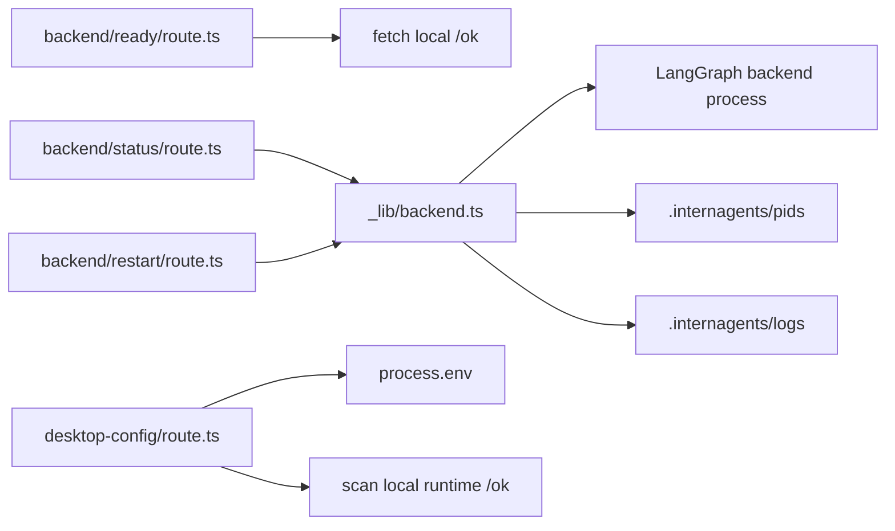

问题：

- runtime route 直接承载健康检查、状态码判断、进程管理入口、桌面配置生成等逻辑。
- `status/restart` route 直接 import `runtime/_lib/backend`。
- `desktop-config/route.ts` 直接读取环境变量并扫描本地 runtime 端口。
- route 层和 runtime 业务层边界不清晰。

### 改动后

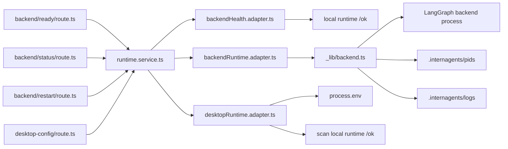

现在职责变成：

```text
runtime route
  只负责：
  - 读取 HTTP query
  - 调用 runtime.service.ts
  - 返回 NextResponse
  - 保留原状态码和 header

runtime.service.ts
  负责：
  - runtime ready/status/restart/desktop-config 用例编排
  - 非本地 backend URL 的业务错误
  - desktop config script 生成

backendHealth.adapter.ts
  负责：
  - 校验 local backend URL
  - 请求 runtime /ok
  - 超时和失败时返回 ready:false

backendRuntime.adapter.ts
  负责：
  - 暂时包住旧的 getBackendStatus()
  - 暂时包住旧的 restartBackend()

desktopRuntime.adapter.ts
  负责：
  - 读取 runtime 相关环境变量
  - 扫描本地 runtime 端口
  - 生成桌面 runtime config 数据
```

### 本次涉及文件

新增：

```text
ui/src/server/domains/runtime/runtime.service.ts
ui/src/server/domains/runtime/runtime.types.ts
ui/src/server/domains/runtime/adapters/backendRuntime.adapter.ts
ui/src/server/domains/runtime/adapters/backendHealth.adapter.ts
ui/src/server/domains/runtime/adapters/desktopRuntime.adapter.ts
```

修改：

```text
ui/src/app/api/runtime/backend/ready/route.ts
ui/src/app/api/runtime/backend/status/route.ts
ui/src/app/api/runtime/backend/restart/route.ts
ui/src/app/api/runtime/desktop-config/route.ts
docs/architecture/后续改造.md
docs/architecture/第二阶段改动过程.md
```

### 行为保持

保持不变：

```text
GET /api/runtime/backend/ready?url=...
GET /api/runtime/backend/status
POST /api/runtime/backend/restart
GET /api/runtime/desktop-config
```

保持不变的关键行为：

- `ready` 非本地 URL 返回 `{ ready: false, error: "Only local backend URLs can be checked." }`，状态码 400。
- `ready` 请求失败返回 `{ ready: false }`。
- `status` 在 `result.status === "unavailable"` 时返回 503，否则返回 200。
- `restart` 在 `result.status === "restarted"` 时返回 200，否则返回 500。
- `desktop-config` 仍返回 JavaScript，header 仍为 `Content-Type: application/javascript; charset=utf-8` 和 `Cache-Control: no-store, max-age=0`。

### 验证结果

已执行：

```text
npx tsc --noEmit --pretty false
npm run lint
npm run test:local-folder-picker
npm run test:open-folder
npm run test:office-preview
npm run test:think-tags
git diff --check
```

结果：

- TypeScript 通过
- lint 通过，无新增 error
- 仍有 7 个原项目已有 warning
- `test:local-folder-picker` 通过
- `test:open-folder` 通过
- `test:office-preview` 通过
- `test:think-tags` 通过
- `git diff --check` 通过，只有 Windows 换行提示

### 当前 runtime 域状态

runtime 域已经完成第一轮 route 瘦身：

```text
/api/runtime/backend/ready
/api/runtime/backend/status
/api/runtime/backend/restart
/api/runtime/desktop-config
```

下一轮可以继续做：

```text
backendRuntime.adapter.ts
  -> backendProcess.adapter.ts
  -> runtimeFiles.adapter.ts
  -> langgraphRuntime.adapter.ts
```

但当前更建议先转向 `remote` 域，因为 remote 是下一块最重的外部副作用边界，涉及 SSH、远端 backend、远端 workspace 和 NDJSON 流。

## 2026-07-08：remote-connections route 接入 service 层

### 改动目标

继续第二阶段后端 API service 层梳理，拆分 remote 域：

```text
ui/src/app/api/remote-connections/ensure/route.ts
ui/src/app/api/remote-connections/setup/route.ts
ui/src/app/api/remote-connections/push-backend-cli/route.ts
ui/src/app/api/remote-connections/test/route.ts
ui/src/app/api/remote-connections/ssh-hosts/route.ts
```

目标结构：

```text
remote-connections route
  -> remote.service.ts
    -> remoteConnections.adapter.ts
      -> old remote-connections/_lib/remote-connections.ts
```

这次只做第一轮 route 瘦身，不拆旧 `_lib` 内部的 SSH、远端安装、端口选择和资源配置写入算法。

### 改动前

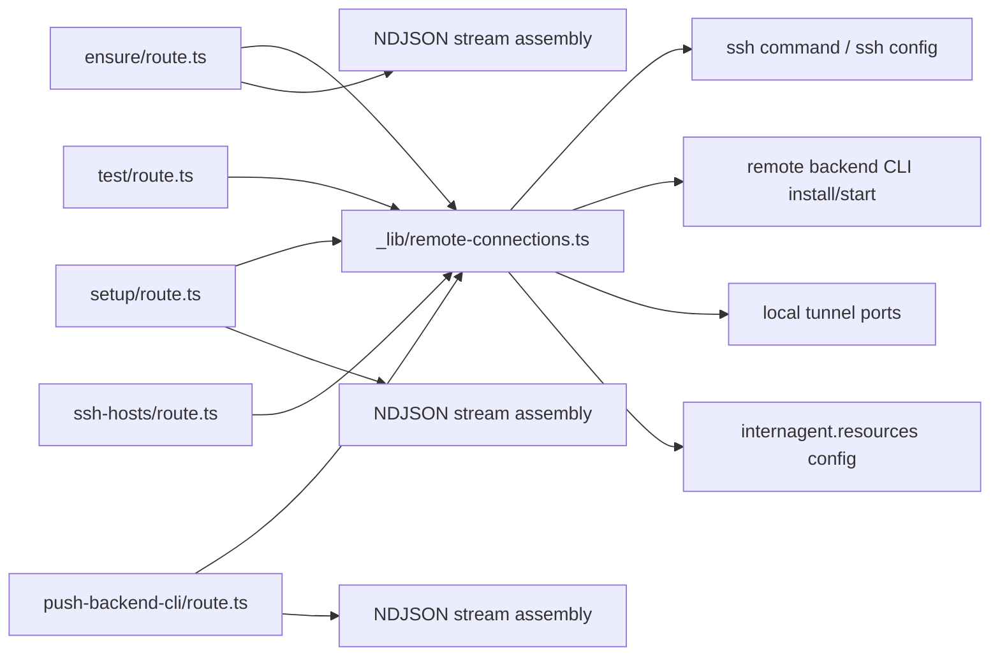

问题：

- route 直接依赖旧 `_lib/remote-connections.ts`。
- 三个流式 route 重复拼装 NDJSON。
- route 层同时知道初始 log 文案、fallback error 文案、底层 remote 函数名。
- remote 底层副作用很重，但没有 service/adapter 边界。

### 改动后

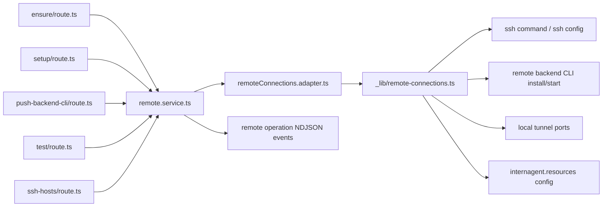

现在职责变成：

```text
remote-connections route
  只负责：
  - request.json()
  - 保留原 JSON 解析错误响应
  - 调用 remote.service.ts
  - 返回 Response / NextResponse
  - 保留原 NDJSON header 和 JSON 状态码

remote.service.ts
  负责：
  - ensure/setup/push-backend-cli 的流式用例编排
  - 初始 log 文案
  - fallback error 文案
  - test/ssh-hosts 用例入口

remoteConnections.adapter.ts
  负责：
  - 暂时包住旧 remote-connections/_lib
  - 暂时承接 SSH、远端 backend、端口、资源配置等底层副作用
```

### 本次涉及文件

新增：

```text
ui/src/server/domains/remote/remote.service.ts
ui/src/server/domains/remote/remote.types.ts
ui/src/server/domains/remote/adapters/remoteConnections.adapter.ts
```

修改：

```text
ui/src/app/api/remote-connections/ensure/route.ts
ui/src/app/api/remote-connections/setup/route.ts
ui/src/app/api/remote-connections/push-backend-cli/route.ts
ui/src/app/api/remote-connections/test/route.ts
ui/src/app/api/remote-connections/ssh-hosts/route.ts
docs/architecture/后续改造.md
docs/architecture/第二阶段改动过程.md
```

### 行为保持

保持不变：

```text
POST /api/remote-connections/ensure
POST /api/remote-connections/setup
POST /api/remote-connections/push-backend-cli
POST /api/remote-connections/test
GET /api/remote-connections/ssh-hosts
```

保持不变的关键行为：

- `ensure/setup/push-backend-cli` 仍返回 `application/x-ndjson; charset=utf-8`。
- 三个 NDJSON route 仍按原顺序输出 `log`、`done` 或 `error`。
- `ensure/setup` 的 JSON 解析失败仍返回中文错误，状态码 400。
- `push-backend-cli` 的 JSON 解析失败仍返回 `Invalid request body.`，状态码 400。
- `test` 根据 `result.ok` 返回 200 或 400。
- `ssh-hosts` 返回 `{ hosts }`，读取失败返回状态码 500。

### 验证结果

已执行：

```text
npx tsc --noEmit --pretty false
npm run lint
npm run test:local-folder-picker
npm run test:open-folder
npm run test:office-preview
npm run test:think-tags
git diff --check
```

结果：

- TypeScript 通过
- lint 通过，无新增 error
- 仍有 7 个原项目已有 warning
- `test:local-folder-picker` 通过
- `test:open-folder` 通过
- `test:office-preview` 通过
- `test:think-tags` 通过
- `git diff --check` 通过，只有 Windows 换行提示

### 当前 remote 域状态

remote 域已经完成第一轮 route 瘦身：

```text
/api/remote-connections/ensure
/api/remote-connections/setup
/api/remote-connections/push-backend-cli
/api/remote-connections/test
/api/remote-connections/ssh-hosts
```

下一轮可以继续做：

```text
remoteConnections.adapter.ts
  -> ssh.adapter.ts
  -> remoteBackend.adapter.ts
  -> remoteProject.adapter.ts
  -> remoteResources.adapter.ts
```

但按当前路线，下一步更建议先拆 `skills` 域，让主功能管理入口也进入 route/service/adapter 结构。

## 2026-07-08：skills route 接入 service 层

### 改动目标

继续第二阶段后端 API service 层梳理，拆分 skills 域：

```text
ui/src/app/api/skills/route.ts
ui/src/app/api/skills/import/route.ts
ui/src/app/api/skills/local-picker/route.ts
ui/src/app/api/skills/connections/route.ts
```

目标结构：

```text
skills route
  -> skills.service.ts
    -> skillsConfig.adapter.ts
    -> skillFolderPicker.adapter.ts
    -> skillConnections.adapter.ts
```

这次只做第一轮 route 瘦身，不拆旧 `_lib/skills.ts` 内部的技能发现、导入、同步 active skills 算法。

### 改动前

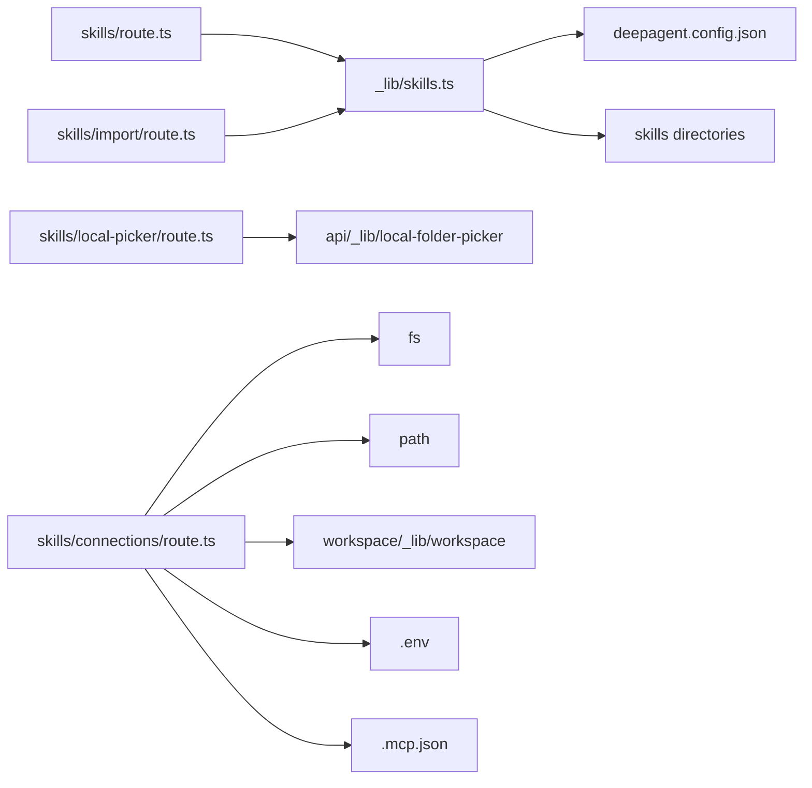

问题：

- `skills/connections/route.ts` 直接读写 `.env` 和 `.mcp.json`。
- MCP JSON 校验、SCP API key 预览、连接配置 response 组装都在 route 里。
- `skills/local-picker/route.ts` 直接依赖本地文件夹选择器。
- `skills/route.ts` 和 `skills/import/route.ts` 直接依赖旧 `_lib/skills.ts`。
- route 层和技能业务层、文件副作用边界不清晰。

### 改动后

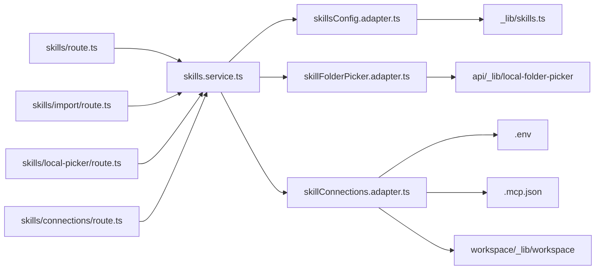

现在职责变成：

```text
skills route
  只负责：
  - request.json()
  - 调用 skills.service.ts
  - 返回 NextResponse
  - 保留原错误状态码和文案

skills.service.ts
  负责：
  - 技能配置读取/保存用例
  - 技能导入请求校验
  - 本地技能文件夹选择用例
  - 连接配置读取/保存用例

skillsConfig.adapter.ts
  负责：
  - 暂时包住旧 _lib/skills.ts

skillFolderPicker.adapter.ts
  负责：
  - 暂时包住本地文件夹选择器

skillConnections.adapter.ts
  负责：
  - .env 读写
  - SCP_HUB_API_KEY 保存/清除/预览
  - .mcp.json 读写
  - MCP JSON 格式校验
```

### 本次涉及文件

新增：

```text
ui/src/server/domains/skills/skills.service.ts
ui/src/server/domains/skills/skills.types.ts
ui/src/server/domains/skills/adapters/skillsConfig.adapter.ts
ui/src/server/domains/skills/adapters/skillFolderPicker.adapter.ts
ui/src/server/domains/skills/adapters/skillConnections.adapter.ts
```

修改：

```text
ui/src/app/api/skills/route.ts
ui/src/app/api/skills/import/route.ts
ui/src/app/api/skills/local-picker/route.ts
ui/src/app/api/skills/connections/route.ts
docs/architecture/后续改造.md
docs/architecture/第二阶段改动过程.md
```

### 行为保持

保持不变：

```text
GET /api/skills
PUT /api/skills
POST /api/skills/import
POST /api/skills/local-picker
GET /api/skills/connections
PUT /api/skills/connections
```

保持不变的关键行为：

- `PUT /api/skills` 仍返回 `requiresRestart: true` 和 `技能配置已保存，应用后生效。`
- `POST /api/skills/import` 的 type 非 `local/cloud` 时仍返回 400。
- `POST /api/skills/import` 的 source 为空时仍返回 400。
- `POST /api/skills/local-picker` 取消选择时仍返回 `{ cancelled: true }`。
- `GET /api/skills/connections` 仍返回 `scp` 和 `mcp` 两块配置。
- `PUT /api/skills/connections` 仍保存 `SCP_HUB_API_KEY` 和 `.mcp.json`，保存后返回是否需要重启。

### 验证结果

已执行：

```text
npx tsc --noEmit --pretty false
npm run lint
npm run test:local-folder-picker
npm run test:open-folder
npm run test:office-preview
npm run test:think-tags
git diff --check
```

结果：

- TypeScript 通过
- lint 通过，无新增 error
- 仍有 7 个原项目已有 warning
- `test:local-folder-picker` 通过
- `test:open-folder` 通过
- `test:office-preview` 通过
- `test:think-tags` 通过
- `git diff --check` 通过，只有 Windows 换行提示

### 当前 skills 域状态

skills 域已经完成第一轮 route 瘦身：

```text
/api/skills
/api/skills/import
/api/skills/local-picker
/api/skills/connections
```

下一轮可以继续做：

```text
skillsConfig.adapter.ts
  -> skillsDirectory.adapter.ts
  -> skillsImport.adapter.ts
  -> skillsConfigFile.adapter.ts
```

但按当前路线，下一步更建议先拆 `compute` 域。compute 和 remote 都涉及 SSH，后续可以沉淀共享 SSH adapter contract。

## 2026-07-08：compute route 接入 service 层

### 改动目标

继续第二阶段后端 API service 层梳理，拆分 compute 域：

```text
ui/src/app/api/compute/ssh-hosts/route.ts
ui/src/app/api/compute/remote-jobs/route.ts
ui/src/app/api/compute/remote-jobs/[jobId]/route.ts
```

目标结构：

```text
compute route
  -> compute.service.ts
    -> computeAuth.adapter.ts
    -> sshRemoteJobs.adapter.ts
      -> old compute/_lib
```

这次只做第一轮 route 瘦身，不拆旧 `_lib/ssh-remote-jobs.ts` 内部的 SSH 执行、远端任务提交、任务状态采集和本地 store 写入算法。

### 改动前

```mermaid
flowchart LR
  HostsRoute[compute/ssh-hosts/route.ts] --> ComputeAuth[_lib/compute-auth.ts]
  HostsRoute --> SshJobsLib[_lib/ssh-remote-jobs.ts]
  JobsRoute[compute/remote-jobs/route.ts] --> ComputeAuth
  JobsRoute --> SshJobsLib
  JobRoute[compute/remote-jobs/[jobId]/route.ts] --> SshJobsLib

  ComputeAuth --> TokenFile[.internagents/compute/api-token]
  SshJobsLib --> HostsStore[.internagents/compute/ssh-hosts.json]
  SshJobsLib --> JobsStore[.internagents/compute/remote-jobs.json]
  SshJobsLib --> SSH[ssh command / remote python]
```

问题：

- route 直接 import `compute/_lib/ssh-remote-jobs.ts`。
- route 直接 import `compute/_lib/compute-auth.ts`。
- POST 授权、远端任务业务、SSH 副作用都从 route 直接进入旧 `_lib`。
- compute 和 remote 都涉及 SSH，但还没有共享 adapter contract。

### 改动后

```mermaid
flowchart LR
  HostsRoute[compute/ssh-hosts/route.ts] --> ComputeService[compute.service.ts]
  JobsRoute[compute/remote-jobs/route.ts] --> ComputeService
  JobRoute[compute/remote-jobs/[jobId]/route.ts] --> ComputeService

  ComputeService --> AuthAdapter[computeAuth.adapter.ts]
  ComputeService --> JobsAdapter[sshRemoteJobs.adapter.ts]

  AuthAdapter --> ComputeAuth[_lib/compute-auth.ts]
  JobsAdapter --> SshJobsLib[_lib/ssh-remote-jobs.ts]

  ComputeAuth --> TokenFile[.internagents/compute/api-token]
  SshJobsLib --> HostsStore[.internagents/compute/ssh-hosts.json]
  SshJobsLib --> JobsStore[.internagents/compute/remote-jobs.json]
  SshJobsLib --> SSH[ssh command / remote python]
```

现在职责变成：

```text
compute route
  只负责：
  - request.json()
  - 调用 compute.service.ts
  - 返回 NextResponse
  - 保留原错误状态码和文案

compute.service.ts
  负责：
  - SSH compute hosts 查询/保存用例
  - remote jobs 查询/提交用例
  - remote job snapshot 查询用例
  - POST 授权检查编排

computeAuth.adapter.ts
  负责：
  - 暂时包住旧 compute-auth

sshRemoteJobs.adapter.ts
  负责：
  - 暂时包住旧 ssh-remote-jobs
```

### 本次涉及文件

新增：

```text
ui/src/server/domains/compute/compute.service.ts
ui/src/server/domains/compute/compute.types.ts
ui/src/server/domains/compute/adapters/computeAuth.adapter.ts
ui/src/server/domains/compute/adapters/sshRemoteJobs.adapter.ts
```

修改：

```text
ui/src/app/api/compute/ssh-hosts/route.ts
ui/src/app/api/compute/remote-jobs/route.ts
ui/src/app/api/compute/remote-jobs/[jobId]/route.ts
docs/architecture/后续改造.md
docs/architecture/第二阶段改动过程.md
```

### 行为保持

保持不变：

```text
GET /api/compute/ssh-hosts
POST /api/compute/ssh-hosts
GET /api/compute/remote-jobs
POST /api/compute/remote-jobs
GET /api/compute/remote-jobs/[jobId]
```

保持不变的关键行为：

- `GET /api/compute/ssh-hosts` 仍返回 `{ hosts }`。
- `POST /api/compute/ssh-hosts` 仍先做 compute POST 授权检查，再返回 `{ host }`。
- `GET /api/compute/remote-jobs` 仍返回 `{ jobs }`。
- `POST /api/compute/remote-jobs` 仍先做 compute POST 授权检查，再返回 `{ job }`。
- `GET /api/compute/remote-jobs/[jobId]` 成功仍返回 `{ job }`，失败仍返回 404。
- POST 失败仍返回 400。

### 验证结果

已执行：

```text
npx tsc --noEmit --pretty false
npm run lint
npm run test:local-folder-picker
npm run test:open-folder
npm run test:office-preview
npm run test:think-tags
git diff --check
```

结果：

- TypeScript 通过
- lint 通过，无新增 error
- 仍有 7 个原项目已有 warning
- `test:local-folder-picker` 通过
- `test:open-folder` 通过
- `test:office-preview` 通过
- `test:think-tags` 通过
- `git diff --check` 通过，只有 Windows 换行提示

### 当前 compute 域状态

compute 域已经完成第一轮 route 瘦身：

```text
/api/compute/ssh-hosts
/api/compute/remote-jobs
/api/compute/remote-jobs/[jobId]
```

下一轮可以继续做：

```text
sshRemoteJobs.adapter.ts
  -> computeSsh.adapter.ts
  -> computeJob.adapter.ts
  -> computeStore.adapter.ts
```

但按当前路线，下一步更建议先拆 `update` 域。compute 和 remote 的共享 SSH adapter contract 可以在第二阶段尾部统一回看。

## 2026-07-08：update route 接入 service 层

### 改动目标

继续第二阶段后端 API service 层梳理，拆分 update 域：

```text
ui/src/app/api/update/status/route.ts
ui/src/app/api/update/check/route.ts
ui/src/app/api/update/apply/route.ts
ui/src/app/api/update/rollback/route.ts
```

目标结构：

```text
update route
  -> update.service.ts
    -> updatePackage.adapter.ts
      -> old update/_lib/update.ts
```

这次只做第一轮 route 瘦身，不拆旧 `_lib/update.ts` 内部的版本检查、GitHub release 查询、下载、安装、回滚和日志状态管理。

### 改动前

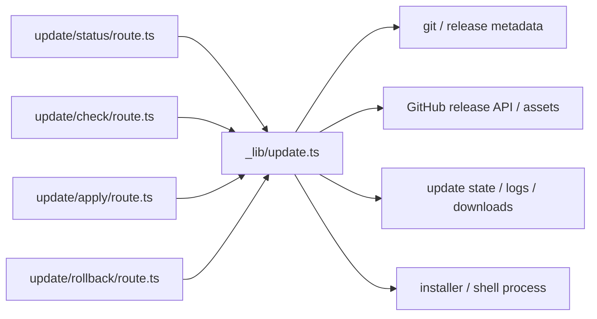

问题：

- route 直接 import `update/_lib/update.ts`。
- update 的底层副作用很重，涉及网络、文件、进程、安装、回滚。
- 虽然 route 本身不厚，但边界仍然是 route 直接接入旧实现。

### 改动后

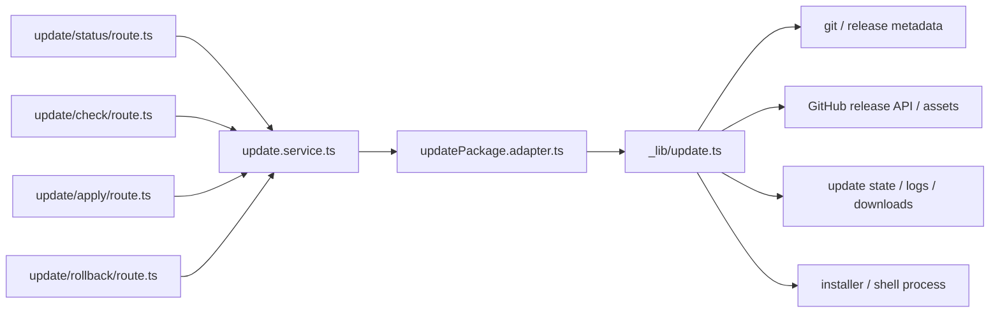

现在职责变成：

```text
update route
  只负责：
  - 调用 update.service.ts
  - 返回 NextResponse
  - 保留原失败状态码映射

update.service.ts
  负责：
  - 当前更新状态查询
  - 检查可用更新
  - 应用更新
  - 回滚更新

updatePackage.adapter.ts
  负责：
  - 暂时包住旧 update/_lib/update.ts
```

### 本次涉及文件

新增：

```text
ui/src/server/domains/update/update.service.ts
ui/src/server/domains/update/update.types.ts
ui/src/server/domains/update/adapters/updatePackage.adapter.ts
```

修改：

```text
ui/src/app/api/update/status/route.ts
ui/src/app/api/update/check/route.ts
ui/src/app/api/update/apply/route.ts
ui/src/app/api/update/rollback/route.ts
docs/architecture/后续改造.md
docs/architecture/第二阶段改动过程.md
```

### 行为保持

保持不变：

```text
GET /api/update/status
POST /api/update/check
POST /api/update/apply
POST /api/update/rollback
```

保持不变的关键行为：

- `GET /api/update/status` 仍直接返回 update status。
- `POST /api/update/check` 在 `status.state === "failed"` 时仍返回 502，否则 200。
- `POST /api/update/apply` 在 `status.state === "failed"` 时仍返回 500，否则 200。
- `POST /api/update/rollback` 在 `status.state === "failed"` 时仍返回 500，否则 200。

### 验证结果

已执行：

```text
npx tsc --noEmit --pretty false
npm run lint
npm run test:local-folder-picker
npm run test:open-folder
npm run test:office-preview
npm run test:think-tags
git diff --check
```

结果：

- TypeScript 通过
- lint 通过，无新增 error
- 仍有 7 个原项目已有 warning
- `test:local-folder-picker` 通过
- `test:open-folder` 通过
- `test:office-preview` 通过
- `test:think-tags` 通过
- `git diff --check` 通过，只有 Windows 换行提示

### 当前 update 域状态

update 域已经完成第一轮 route 瘦身：

```text
/api/update/status
/api/update/check
/api/update/apply
/api/update/rollback
```

下一轮可以继续做：

```text
updatePackage.adapter.ts
  -> updateRelease.adapter.ts
  -> updateInstall.adapter.ts
  -> updateState.adapter.ts
```

到这里，第二阶段主要 API group 的第一轮 route 瘦身已经基本覆盖：

```text
workspace
config
resources
workspaces
runtime
remote
skills
compute
update
```

下一步建议从继续拆 route 转向补齐两个横向 contract：

```text
Agent Runtime Adapter Contract
Shared SSH Adapter Contract
```

## 2026-07-08：补齐第二阶段第一轮验收和横向 contract 文档

### 改动目标

第二阶段主要 API group 的第一轮 route 瘦身已经覆盖：

```text
workspace
config
resources
workspaces
runtime
remote
skills
compute
update
```

本次不继续改代码，而是补齐三份文档：

```text
docs/architecture/第二阶段第一轮验收.md
docs/architecture/agent-runtime-adapter-contract.md
docs/architecture/shared-ssh-adapter-contract.md
```

目标是让第二阶段从“代码已经拆了一轮”变成“代码、验收、后续 contract 都能解释清楚”。

### 新增文档一：第二阶段第一轮验收

文件：

```text
docs/architecture/第二阶段第一轮验收.md
```

内容包括：

- 第二阶段第一轮总体结论。
- 已完成的 domain 清单。
- 每个 domain 已瘦身 API、service、adapter。
- route/service/adapter 当前职责边界。
- 哪些 adapter 仍是过渡 adapter。
- 已执行的验证命令。
- 仍需人工回归的功能。
- 第二阶段剩余工作。
- 验收结论。

这份文档主要面向领导和团队评审。

### 新增文档二：Agent Runtime Adapter Contract

文件：

```text
docs/architecture/agent-runtime-adapter-contract.md
```

内容包括：

- 为什么不能直接替换 DeepAgents。
- Agent Runtime Adapter 的目标边界。
- Thread、Run、Message、Workspace、Skills 的统一模型。
- `AgentRuntimeAdapter` 目标接口。
- 标准事件流 `AgentRunEvent`。
- DeepAgents / LangGraph / OpenCode 的映射思路。
- 安全和权限规则。
- 后续落地顺序。

这份文档回答的是：

```text
以后如果底层从 DeepAgents 换成 OpenCode，应该换哪里？
上层如何尽量不跟着重写？
```

### 新增文档三：Shared SSH Adapter Contract

文件：

```text
docs/architecture/shared-ssh-adapter-contract.md
```

内容包括：

- remote 和 compute 当前 SSH 能力重复的问题。
- 共享 SSH adapter 的目标结构。
- SSH Host、SSH Connection、Remote Command 模型。
- `SharedSshAdapter` 目标接口。
- SSH 安全规则。
- remote 域如何使用。
- compute 域如何使用。
- 可替换实现。
- 第二轮落地顺序。

这份文档回答的是：

```text
remote 和 compute 都用 SSH，后续如何避免两边各写一套？
```

### 更新文档

修改：

```text
docs/architecture/后续改造.md
```

更新内容：

- 第二阶段状态从“进行中”改为“第一轮已完成”。
- 补充第一轮验收文档路径。
- 补充两个横向 contract 文档路径。
- 最近三步改为第二轮 adapter 细拆：

```text
1. 第二轮拆 shared SSH adapter types
2. remoteConnections.adapter.ts 拆 SSH/remote backend
3. sshRemoteJobs.adapter.ts 复用 shared SSH adapter
```

### 验证结果

本次只新增/修改文档，未改运行代码。

已执行：

```text
git diff --check
```

结果：

- 通过
- 只有 Windows CRLF 提示

### 当前状态

第二阶段第一轮可以视为完成。

后续建议进入第二轮：

```text
shared SSH adapter types
remoteConnections.adapter.ts 细拆
sshRemoteJobs.adapter.ts 复用 shared SSH adapter
```

暂时仍不建议直接改：

```text
useChat.ts
agent_graph.py
DeepAgents 底层实现
OpenCodeRuntimeAdapter
```

## 2026-07-08：补齐横向 contract types

### 改动目标

前一步已经补齐横向 contract 文档：

```text
docs/architecture/agent-runtime-adapter-contract.md
docs/architecture/shared-ssh-adapter-contract.md
```

本次把文档 contract 落成代码级 TypeScript contract types，给第二轮 adapter 细拆提供稳定引用点。

新增目录：

```text
ui/src/server/shared/contracts/
```

### 新增 contract types

新增：

```text
ui/src/server/shared/contracts/adapterError.contract.ts
ui/src/server/shared/contracts/agentRuntime.contract.ts
ui/src/server/shared/contracts/sharedSsh.contract.ts
ui/src/server/shared/contracts/index.ts
```

职责：

```text
adapterError.contract.ts
  通用 adapter 错误结构、错误码、超时/取消选项。

agentRuntime.contract.ts
  Agent Runtime Adapter 的 Thread、Run、Message、Event、Adapter interface。

sharedSsh.contract.ts
  remote 和 compute 共享的 SSH Host、Connection、Command、Probe、Adapter interface。

index.ts
  横向 contract 统一导出入口。
```

### 当前策略

这次只新增类型，不接入业务 adapter。

原因：

- 先让 contract 稳定下来。
- 避免同时改 remote/compute 行为。
- 后续第二轮再让 `remoteConnections.adapter.ts` 和 `sshRemoteJobs.adapter.ts` 逐步依赖 shared SSH contract。

目标结构：

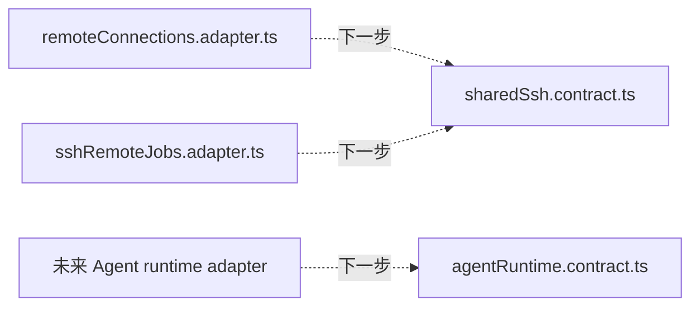

### 文档同步

已更新：

```text
docs/architecture/agent-runtime-adapter-contract.md
docs/architecture/shared-ssh-adapter-contract.md
docs/architecture/第二阶段第一轮验收.md
docs/architecture/后续改造.md
docs/architecture/第二阶段改动过程.md
```

更新内容：

- 补充代码级 contract types 路径。
- `后续改造.md` 最近三步从“补 types”推进到“remote/compute 接入 shared SSH contract”。

### 验证结果

已执行：

```text
npx tsc --noEmit --pretty false
npm run lint
git diff --check
```

结果：

- TypeScript 通过。
- lint 通过，无新增 error。
- 仍有 7 个原项目已有 warning。
- `git diff --check` 通过，只有 Windows CRLF 提示。

### 当前状态

横向 contract 已补齐到两层：

```text
文档层：
  docs/architecture/agent-runtime-adapter-contract.md
  docs/architecture/shared-ssh-adapter-contract.md

代码类型层：
  ui/src/server/shared/contracts/agentRuntime.contract.ts
  ui/src/server/shared/contracts/sharedSsh.contract.ts
  ui/src/server/shared/contracts/adapterError.contract.ts
```

下一步建议：

```text
remoteConnections.adapter.ts 接入 shared SSH contract
sshRemoteJobs.adapter.ts 接入 shared SSH contract
remote/compute 共享 SSH adapter 实现
```

## 2026-07-08：第二轮第一刀，新增 shared SSH concrete adapter

### 改动目标

进入第二阶段第二轮 adapter 细拆。

本次先做最小闭环：

```text
shared SSH contract types
  -> shared SSH concrete adapter
  -> remoteConnections.adapter.ts 的 ssh-hosts/test 接入
```

暂时不迁移：

```text
remote ensure/setup/push-backend-cli
compute remote jobs
```

原因：

- ensure/setup/push 涉及远端 backend 安装、上传、端口、tunnel、resources config，风险更高。
- compute job 涉及远端 Python 协议、job store、输出采集，也不适合和第一刀混在一起。

### 改动前

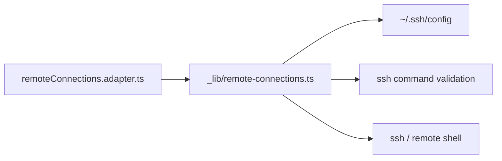

`remoteConnections.adapter.ts` 的 `listRemoteSshHosts()` 和 `testRemoteSshConnection()` 仍然直接包旧 `_lib/remote-connections.ts`。

### 改动后

```mermaid
flowchart LR
  RemoteAdapter[remoteConnections.adapter.ts] --> SharedSsh[SshCliAdapter]
  SharedSsh --> Contract[SharedSshAdapter Contract]
  SharedSsh --> SshConfig[~/.ssh/config]
  SharedSsh --> SshCommand[ssh command validation]
  SharedSsh --> SshExec[ssh / remote shell]

  RemoteAdapter --> RemoteLib[_lib/remote-connections.ts]
  RemoteLib --> RemoteBackend[ensure/setup/push backend]
```

现在：

```text
listRemoteSshHosts()
  -> sshCliAdapter.listHosts()

testRemoteSshConnection()
  -> sshCliAdapter.resolveConnection()
  -> sshCliAdapter.testConnection()
```

而这些仍保留旧实现：

```text
ensureRemoteRuntime()
setupRemoteRuntime()
pushRemoteRuntimeBackendCli()
```

### 本次新增文件

```text
ui/src/server/shared/adapters/sshCli.adapter.ts
ui/src/server/shared/adapters/index.ts
```

`sshCli.adapter.ts` 实现：

```text
listHosts()
resolveConnection()
testConnection()
runCommand()
runJsonCommand()
```

它实现的 contract 来自：

```text
ui/src/server/shared/contracts/sharedSsh.contract.ts
```

### 本次修改文件

```text
ui/src/server/domains/remote/adapters/remoteConnections.adapter.ts
docs/architecture/shared-ssh-adapter-contract.md
docs/architecture/后续改造.md
docs/architecture/第二阶段改动过程.md
```

### 行为保持

保持不变：

```text
GET /api/remote-connections/ssh-hosts
POST /api/remote-connections/test
```

保持不变的返回结构：

```text
ssh-hosts:
  { hosts: [{ host, source }] }

test:
  { ok, stdout, stderr }
```

说明：

- shared adapter 内部使用 `alias`，remote API 仍映射回原来的 `host` 字段。
- shared adapter 内部返回结构化 probe，remote API 仍映射回原来的 `stdout/stderr`。

### 验证结果

已执行：

```text
npx tsc --noEmit --pretty false
npm run lint
npm run test:local-folder-picker
npm run test:open-folder
npm run test:office-preview
npm run test:think-tags
git diff --check
```

结果：

- TypeScript 通过。
- lint 通过，无新增 error。
- 仍有 7 个原项目已有 warning。
- `test:local-folder-picker` 通过。
- `test:open-folder` 通过。
- `test:office-preview` 通过。
- `test:think-tags` 通过。
- `git diff --check` 通过，只有 Windows CRLF 提示。

### 下一步建议

下一步建议优先做：

```text
sshRemoteJobs.adapter.ts 接入 shared SSH contract
```

也就是先让 compute 的 SSH host 校验、环境 probe 复用 shared SSH adapter。

再下一步才考虑：

```text
remoteConnections.adapter.ts 第二刀迁移 ensure/setup/push 内部 SSH helper
```

## 2026-07-08：第二轮第二刀，compute SSH host/probe 接入 shared SSH adapter

### 改动目标

继续第二阶段第二轮 adapter 细拆。

本次只迁移 compute 领域里最通用、风险最低的 SSH 能力：

```text
compute SSH host alias 校验
compute Linux 环境 probe
```

暂时不迁移：

```text
submitLinuxSshJob()
getRemoteJobSnapshot()
runRemotePythonWithInput()
compute job store
```

原因是远程 job 提交和状态采集涉及远端 Python JSON 协议、输入输出文件限制、本地 job store 写入和超时控制，风险比 host/probe 更高，应该单独拆。

### 改动前

```mermaid
flowchart LR
  ComputeAdapter[sshRemoteJobs.adapter.ts] --> SshJobsLib[_lib/ssh-remote-jobs.ts]
  SshJobsLib --> RemoteConnLib[remote-connections/_lib]
  SshJobsLib --> LocalSshRunner[local runSshCommand]
  SshJobsLib --> JobProtocol[remote python job protocol]

  RemoteConnLib --> SshConfig[~/.ssh/config]
  LocalSshRunner --> SshExec[ssh / remote shell]
```

问题：

- compute 保存 host 时复用 remote-connections 旧 `_lib` 里的 `assertKnownSshHost()`，存在跨领域依赖。
- compute probe 自己维护一套 SSH 执行脚本，与 remote 的 SSH probe 逻辑重复。
- SSH config 解析、SSH 命令校验、远端探测没有统一收口到 shared SSH contract。

### 改动后

```mermaid
flowchart LR
  ComputeAdapter[sshRemoteJobs.adapter.ts] --> SshJobsLib[_lib/ssh-remote-jobs.ts]
  SshJobsLib --> SharedSsh[SshCliAdapter]
  SharedSsh --> Contract[SharedSshAdapter Contract]
  SharedSsh --> SshConfig[~/.ssh/config]
  SharedSsh --> SshCommand[ssh command validation]
  SharedSsh --> SshExec[ssh / remote shell]

  SshJobsLib --> JobProtocol[remote python job protocol]
```

现在：

```text
upsertSshComputeHost()
  -> sshCliAdapter.resolveConnection({ connectionMode: "sshConfig" })
  -> probeSshComputeHost()

probeSshComputeHost()
  -> sshCliAdapter.resolveConnection({ connectionMode: "sshCommand" })
  -> sshCliAdapter.testConnection()
  -> compute 自己判断 Linux / python3 / bash / timeout
```

仍保留旧实现：

```text
submitLinuxSshJob()
getRemoteJobSnapshot()
runRemotePythonWithInput()
compute hosts/jobs store
```

### 本次修改文件

```text
ui/src/app/api/compute/_lib/ssh-remote-jobs.ts
docs/architecture/shared-ssh-adapter-contract.md
docs/architecture/后续改造.md
docs/architecture/第二阶段改动过程.md
```

### 行为保持

保持不变：

```text
GET /api/compute/ssh-hosts
POST /api/compute/ssh-hosts
GET /api/compute/remote-jobs
POST /api/compute/remote-jobs
GET /api/compute/remote-jobs/[jobId]
```

保持不变的返回结构：

```text
ssh-hosts:
  { hosts }

POST ssh-hosts:
  { host }

remote-jobs:
  { jobs }

remote-jobs/[jobId]:
  { job }
```

说明：

- compute API 仍只允许使用 `~/.ssh/config` 里的 Host alias。
- `probe` 返回字段仍保留 `ok/checkedAt/os/kernel/arch/user/host/python/bash/timeout/workdir/error`。
- shared SSH adapter 只负责 SSH 连接解析和远端探测；Linux、python3、bash、timeout 是否满足 compute job 要求，仍由 compute 领域判断。

### 验证结果

已执行：

```text
npx tsc --noEmit --pretty false
npm run lint
npm run test:local-folder-picker
npm run test:open-folder
npm run test:office-preview
npm run test:think-tags
git diff --check
```

结果：

- TypeScript 通过。
- lint 通过，无新增 error。
- 仍有 7 个原项目已有 warning。
- `test:local-folder-picker` 通过。
- `test:open-folder` 通过。
- `test:office-preview` 通过。
- `test:think-tags` 通过。
- `git diff --check` 通过，只有 Windows CRLF 提示。

### 下一步建议

下一步建议优先做：

```text
remoteConnections.adapter.ts 第二刀迁移 ensure/setup/push 内部 SSH helper
```

再下一步建议补：

```text
shared SSH adapter 的 Host config / sshCommand 校验测试
```

## 2026-07-08：第二轮第三刀，remote ensure/setup/push 内部 SSH helper 接入 shared SSH adapter

### 改动目标

继续第二阶段第二轮 adapter 细拆。

本次不改 API route，也不改 `ensure/setup/push` 的业务流程，只把旧 `_lib/remote-connections.ts` 内部的通用 SSH helper 委托给 shared SSH adapter：

```text
resolveSshConnection()
runSshCommand()
listSshHosts()
assertKnownSshHost()
testSshConnection()
```

这样 `setupRemoteConnection()`、`ensureRemoteResourceRuntime()`、`pushRemoteBackendCli()` 里大量普通远端命令会开始复用统一的 SSH 连接解析、Host config 读取、SSH command 校验和远端命令执行。

暂时不迁移：

```text
streamFileOverSsh()
streamTextOverSsh()
ensureRuntimeTunnel()
```

原因是这三块涉及 stdin 流式上传和 SSH 端口转发，而当前 `SharedSshAdapter` contract 还只覆盖 host list、connection resolve、probe、runCommand、runJsonCommand。先不临时扩 contract，避免把上传和 tunnel 协议混进这一刀。

### 改动前

```mermaid
flowchart LR
  RemoteAdapter[remoteConnections.adapter.ts] --> RemoteLib[_lib/remote-connections.ts]

  RemoteLib --> LocalResolve[local resolveSshConnection]
  RemoteLib --> LocalList[local listSshHosts/readSshConfigFile]
  RemoteLib --> LocalTest[local testSshConnection]
  RemoteLib --> LocalRun[local runSshCommand]

  LocalList --> SshConfig[~/.ssh/config]
  LocalRun --> SshExec[ssh / remote shell]
```

问题：

- remote `_lib` 和 shared SSH adapter 各维护一套 SSH config 解析与命令校验。
- remote setup/ensure/push 内部普通远端命令没有走 shared SSH contract。
- 后续如果替换 SSH 实现，remote 的旧 helper 仍会卡在旧实现里。

### 改动后

```mermaid
flowchart LR
  RemoteAdapter[remoteConnections.adapter.ts] --> RemoteLib[_lib/remote-connections.ts]

  RemoteLib --> SharedSsh[SshCliAdapter]
  SharedSsh --> Contract[SharedSshAdapter Contract]
  SharedSsh --> SshConfig[~/.ssh/config]
  SharedSsh --> SshCommand[ssh command validation]
  SharedSsh --> SshExec[ssh / remote shell]

  RemoteLib --> LegacyStream[stream upload / tunnel 保留旧实现]
```

现在：

```text
resolveSshConnection()
  -> sshCliAdapter.resolveConnection()

runSshCommand()
  -> sshCliAdapter.resolveConnection({ connectionMode: "sshCommand" })
  -> sshCliAdapter.runCommand()
  -> 失败时包装成旧逻辑兼容的 throw + stdout/stderr

listSshHosts()
  -> sshCliAdapter.listHosts()
  -> 映射回 remote API 旧字段 { host, source }

testSshConnection()
  -> sshCliAdapter.testConnection()
  -> 映射回旧返回结构 { ok, stdout, stderr }
```

仍保留旧实现：

```text
streamFileOverSsh()
streamTextOverSsh()
ensureRuntimeTunnel()
sshArgsFromCommand()
```

### 本次修改文件

```text
ui/src/app/api/remote-connections/_lib/remote-connections.ts
docs/architecture/shared-ssh-adapter-contract.md
docs/architecture/后续改造.md
docs/architecture/第二阶段改动过程.md
```

### 行为保持

保持不变：

```text
POST /api/remote-connections/setup
POST /api/remote-connections/ensure
POST /api/remote-connections/push-backend-cli
GET /api/remote-connections/ssh-hosts
POST /api/remote-connections/test
```

保持不变的关键行为：

- `sshCommand` 模式仍支持直接传 `ssh ...` 连接命令。
- 未显式传 `connectionMode` 但传了 `sshCommand` 时，仍按旧逻辑走 `sshCommand` 模式。
- `runSshCommand()` 对调用方仍表现为：成功返回 `{ stdout, stderr }`，失败 throw，并带上 `stdout/stderr` 字段。
- `listSshHosts()` 仍返回 `{ host, source }`，不把 shared adapter 内部的 `alias` 字段泄漏给旧 remote API。

### 验证结果

已执行：

```text
npx tsc --noEmit --pretty false
npm run lint
npm run test:local-folder-picker
npm run test:open-folder
npm run test:office-preview
npm run test:think-tags
git diff --check
```

结果：

- TypeScript 通过。
- lint 通过，无新增 error。
- 仍有 7 个原项目已有 warning。
- `test:local-folder-picker` 通过。
- `test:open-folder` 通过。
- `test:office-preview` 通过。
- `test:think-tags` 通过。
- `git diff --check` 通过，只有 Windows CRLF 提示。

### 下一步建议

下一步建议优先做：

```text
给 shared SSH adapter 补 Host config / sshCommand 校验测试
```

再下一步再考虑：

```text
继续拆 compute job：computeJob.adapter.ts / computeStore.adapter.ts
```

## 2026-07-08：第二轮第四刀，补 shared SSH adapter 校验测试

### 改动目标

这次补测试，不改 remote/compute API 行为。

目标是让 shared SSH adapter 的基础规则有自动化保护：

```text
sshCommand 校验
Host alias 校验
~/.ssh/config Host 解析
Include 解析
Host pattern 过滤
路径解析
```

### 改动内容

新增纯 helper 文件：

```text
ui/src/server/shared/adapters/sshCli.helpers.ts
```

它承接原来 `sshCli.adapter.ts` 内部的纯逻辑：

```text
assertSshCommand()
assertSshConfigHost()
sshArgsFromCommand()
readSshConfigFile()
resolveSshConfigPath()
shellQuote()
remoteBashCommand()
```

`sshCli.adapter.ts` 继续负责真正的副作用：

```text
读取默认 ~/.ssh/config
执行 ssh 命令
远端 probe
远端 JSON command
```

新增测试：

```text
ui/tests/ssh-cli-adapter.test.mts
```

新增 npm script：

```text
npm run test:ssh-adapter
```

### 覆盖用例

已覆盖：

- 合法 SSH 连接命令，包括 `-i`、`-p` 等选项。
- 拒绝 `scp ...` 这类非 ssh 命令。
- 拒绝多行 SSH 命令。
- 拒绝把远端命令附加到连接命令后面，例如 `ssh host uptime`。
- 拒绝管道、重定向、串联命令，例如 `ssh host && echo nope`。
- 拒绝未闭合引号。
- Host alias 自动 trim。
- Host alias 不允许空值和空白字符。
- 解析 ssh config 中的普通 `Host alpha beta`。
- 默认过滤 `Host *.example.com`、`Host !blocked` 这类 pattern。
- 按需允许 includePatterns。
- 支持相对 `Include child.conf`。
- 忽略通配符 Include，例如 `Include *.ignored`。
- 解析 `~/`、绝对路径和相对路径。

测试不做的事：

```text
不读取用户真实 ~/.ssh/config
不执行真实 ssh
不连接远端机器
不测试 tunnel / streaming upload
```

### 改动前后

改动前：

```mermaid
flowchart LR
  SshCliAdapter[sshCli.adapter.ts] --> PureLogic[private pure helpers]
  SshCliAdapter --> SideEffects[ssh command / fs read]
  Tests[tests] -.无法直接覆盖.-> PureLogic
```

改动后：

```mermaid
flowchart LR
  SshCliAdapter[sshCli.adapter.ts] --> Helpers[sshCli.helpers.ts]
  SshCliAdapter --> SideEffects[ssh command / fs read]
  Tests[ssh-cli-adapter.test.mts] --> Helpers
```

这样测试覆盖的是规则本身，不依赖真实 SSH 环境。

### 本次修改文件

```text
ui/src/server/shared/adapters/sshCli.helpers.ts
ui/src/server/shared/adapters/sshCli.adapter.ts
ui/tests/ssh-cli-adapter.test.mts
ui/package.json
docs/architecture/shared-ssh-adapter-contract.md
docs/architecture/后续改造.md
docs/architecture/第二阶段改动过程.md
```

### 验证结果

已执行：

```text
npm run test:ssh-adapter
npx tsc --noEmit --pretty false
npm run lint
npm run test:local-folder-picker
npm run test:open-folder
npm run test:office-preview
npm run test:think-tags
git diff --check
```

结果：

- `test:ssh-adapter` 通过，6 个用例通过。
- TypeScript 通过。
- lint 通过，无新增 error。
- 仍有 7 个原项目已有 warning。
- `test:local-folder-picker` 通过。
- `test:open-folder` 通过。
- `test:office-preview` 通过。
- `test:think-tags` 通过。
- `git diff --check` 通过，只有 Windows CRLF 提示。

### 下一步建议

下一步建议进入：

```text
继续拆 compute job：computeJob.adapter.ts / computeStore.adapter.ts
```

但在拆之前要保持一个边界：

```text
先拆本地 store / job 业务编排，不急着改远端 Python job 协议。
```

## 2026-07-08：第二轮第五刀，拆 compute host/job/store adapter

### 改动目标

继续拆 compute 领域 adapter。

上一轮 compute 第一阶段只有一个大 adapter：

```text
sshRemoteJobs.adapter.ts
```

它同时承接：

```text
compute host 保存/读取
compute job 提交/查询
compute 本地 store 读写
旧远端 Python job 协议
```

这次把它拆成更清楚的三个入口：

```text
computeHost.adapter.ts
computeJob.adapter.ts
computeStore.adapter.ts
```

并把 store 的纯规则拆出：

```text
computeStore.helpers.ts
```

### 改动前

```mermaid
flowchart LR
  ComputeService[compute.service.ts] --> SshRemoteJobs[sshRemoteJobs.adapter.ts]
  SshRemoteJobs --> LegacyLib[_lib/ssh-remote-jobs.ts]
  LegacyLib --> Store[.internagents/compute/*.json]
  LegacyLib --> RemotePython[remote python job protocol]
```

问题：

- service 看不出 host、job、store 三类职责边界。
- `.internagents/compute/*.json` 本地副作用仍藏在旧 `_lib/ssh-remote-jobs.ts` 内部。
- 以后拆 job 协议或替换 store 时，没有单独入口。

### 改动后

```mermaid
flowchart LR
  ComputeService[compute.service.ts] --> HostAdapter[computeHost.adapter.ts]
  ComputeService --> JobAdapter[computeJob.adapter.ts]
  ComputeService --> StoreAdapter[computeStore.adapter.ts]

  HostAdapter --> LegacyLib[_lib/ssh-remote-jobs.ts]
  JobAdapter --> LegacyLib
  LegacyLib --> StoreAdapter

  StoreAdapter --> StoreFiles[.internagents/compute/ssh-hosts.json + remote-jobs.json]
  JobAdapter --> RemotePython[remote python job protocol 保留旧实现]
```

现在：

```text
compute.service.ts
  getComputeHosts()
    -> computeStore.adapter.ts

  upsertComputeHost()
    -> computeHost.adapter.ts

  getComputeJobs()
    -> computeStore.adapter.ts

  submitRemoteComputeJob()
    -> computeJob.adapter.ts

  getComputeJobSnapshot()
    -> computeJob.adapter.ts
```

store 文件读写已下沉到：

```text
computeStore.adapter.ts
  -> .internagents/compute/ssh-hosts.json
  -> .internagents/compute/remote-jobs.json
```

store 纯规则已下沉到：

```text
computeStore.helpers.ts
```

### 行为保持

保持不变：

```text
GET /api/compute/ssh-hosts
POST /api/compute/ssh-hosts
GET /api/compute/remote-jobs
POST /api/compute/remote-jobs
GET /api/compute/remote-jobs/[jobId]
```

保持不变的关键行为：

- compute host 新增或更新后仍放到 host 列表最前面。
- compute job 新提交时仍放到 job 列表最前面。
- compute job snapshot 更新已有 job 时仍保持原列表顺序。
- `.internagents/compute/ssh-hosts.json` 路径不变。
- `.internagents/compute/remote-jobs.json` 路径不变。
- 远端 Python submit/status 协议不变。

### 新增测试

新增：

```text
ui/tests/compute-store.test.mts
```

新增 npm script：

```text
npm run test:compute-store
```

覆盖：

- `upsertComputeHostRecord()` 新增和更新 host 时前插。
- `upsertComputeJobRecord()` 新 job 前插。
- `upsertComputeJobRecord()` 更新已有 job 时保持原顺序。

测试不做的事：

```text
不读写真正 .internagents/compute/*.json
不提交真实远程 job
不执行 SSH
```

### 本次修改文件

```text
ui/src/server/domains/compute/compute.service.ts
ui/src/server/domains/compute/adapters/computeHost.adapter.ts
ui/src/server/domains/compute/adapters/computeJob.adapter.ts
ui/src/server/domains/compute/adapters/computeStore.adapter.ts
ui/src/server/domains/compute/adapters/computeStore.helpers.ts
ui/src/app/api/compute/_lib/ssh-remote-jobs.ts
ui/tests/compute-store.test.mts
ui/package.json
docs/architecture/后续改造.md
docs/architecture/第二阶段改动过程.md
```

删除：

```text
ui/src/server/domains/compute/adapters/sshRemoteJobs.adapter.ts
```

### 验证结果

已执行：

```text
npx tsc --noEmit --pretty false
npm run lint
npm run test:ssh-adapter
npm run test:compute-store
npm run test:local-folder-picker
npm run test:open-folder
npm run test:office-preview
npm run test:think-tags
git diff --check
```

结果：

- TypeScript 通过。
- lint 通过，无新增 error。
- 仍有 7 个原项目已有 warning。
- `test:ssh-adapter` 通过。
- `test:compute-store` 通过，2 个用例通过。
- `test:local-folder-picker` 通过。
- `test:open-folder` 通过。
- `test:office-preview` 通过。
- `test:think-tags` 通过。
- `git diff --check` 通过，只有 Windows CRLF 提示。

### 下一步建议

下一步建议先不要直接改远端 Python job 协议。

更稳的顺序是：

```text
1. 评估 shared SSH contract 是否需要补 streaming upload / tunnel 能力
2. 再拆 compute 远端 job protocol adapter
3. 最后进入 Agent Runtime Adapter 文档到代码 contract 的下一轮落地
```

## 2026-07-08：第二轮第六刀，扩展 shared SSH contract：stdin streaming 与 tunnel

### 改动目标

这次先补 shared SSH adapter 的代码级 contract 和 concrete adapter 能力，不迁移 remote 旧调用。

评估结果：

```text
shared SSH contract 需要补 streaming upload / tunnel 能力。
```

原因：

- remote backend CLI 上传需要把本地 tar.gz 通过 stdin 流给远端 bash 脚本。
- runtime config 上传需要把本地文本通过 stdin 传到远端。
- remote runtime 访问需要启动 `ssh -N -L local:127.0.0.1:remote` tunnel。
- 这些都是 SSH 底层能力，不应该长期藏在 `remote-connections/_lib/remote-connections.ts` 里。

### 新增 contract

在代码 contract 中新增：

```text
RemoteCommandStdin
RemoteStdinCommandInput
OpenSshTunnelInput
SshTunnelHandle
```

`SharedSshAdapter` 新增方法：

```text
runCommandWithInput(input)
openTunnel(input)
```

### 新增 concrete adapter 能力

`sshCliAdapter` 新增实现：

```text
runCommandWithInput()
  -> spawn ssh
  -> stdin pipe
  -> stdout/stderr 受 maxBufferBytes 限制
  -> timeout 后 kill
  -> 返回 { stdout, stderr, exitCode, timedOut }

openTunnel()
  -> spawn ssh -N -L localPort:remoteHost:remotePort
  -> 可写 logFile
  -> 可写 pidFile
  -> 可按 pidFile 停掉旧 tunnel
  -> 返回 { localUrl, localPort, remoteHost, remotePort, pid, logFile, pidFile }
```

### 改动前

```mermaid
flowchart LR
  RemoteLib[_lib/remote-connections.ts] --> StreamFile[streamFileOverSsh]
  RemoteLib --> StreamText[streamTextOverSsh]
  RemoteLib --> Tunnel[ensureRuntimeTunnel]

  StreamFile --> LocalSsh[local ssh spawn]
  StreamText --> LocalSsh
  Tunnel --> LocalSsh

  SharedSsh[SshCliAdapter] --> BasicRun[runCommand/test/list/resolve]
```

### 改动后

```mermaid
flowchart LR
  SharedSsh[SshCliAdapter] --> RunInput[runCommandWithInput]
  SharedSsh --> OpenTunnel[openTunnel]

  RemoteLib[_lib/remote-connections.ts] -.下一刀迁移.-> RunInput
  RemoteLib -.下一刀迁移.-> OpenTunnel
```

这一步只是把底座补齐，remote 旧调用还没有迁移。

### 本次修改文件

```text
ui/src/server/shared/contracts/sharedSsh.contract.ts
ui/src/server/shared/contracts/index.ts
ui/src/server/shared/adapters/sshCli.adapter.ts
docs/architecture/shared-ssh-adapter-contract.md
docs/architecture/后续改造.md
docs/architecture/第二阶段改动过程.md
```

### 行为保持

保持不变：

```text
POST /api/remote-connections/setup
POST /api/remote-connections/ensure
POST /api/remote-connections/push-backend-cli
```

说明：

- `streamFileOverSsh()` 仍保留旧实现。
- `streamTextOverSsh()` 仍保留旧实现。
- `ensureRuntimeTunnel()` 仍保留旧实现。
- 远端 backend 安装、runtime 启动、tunnel 健康检查流程不变。

### 验证结果

已执行：

```text
npx tsc --noEmit --pretty false
npm run lint
npm run test:ssh-adapter
npm run test:compute-store
npm run test:local-folder-picker
npm run test:open-folder
npm run test:office-preview
npm run test:think-tags
git diff --check
```

结果：

- TypeScript 通过。
- lint 通过，无新增 error。
- 仍有 7 个原项目已有 warning。
- `test:ssh-adapter` 通过。
- `test:compute-store` 通过。
- `test:local-folder-picker` 通过。
- `test:open-folder` 通过。
- `test:office-preview` 通过。
- `test:think-tags` 通过。
- `git diff --check` 通过，只有 Windows CRLF 提示。

### 下一步建议

下一步可以迁移 remote 旧调用：

```text
streamFileOverSsh()
  -> sshCliAdapter.runCommandWithInput()

streamTextOverSsh()
  -> sshCliAdapter.runCommandWithInput()

ensureRuntimeTunnel()
  -> sshCliAdapter.openTunnel()
  -> 保留 waitForUrl 健康检查和日志文案
```

## 2026-07-08：第二轮第七刀，remote streaming upload / tunnel 接入 shared SSH adapter

### 改动目标

把 remote 旧 `_lib/remote-connections.ts` 里的三块 SSH 底层能力迁移到 shared SSH adapter：

```text
streamFileOverSsh()
streamTextOverSsh()
ensureRuntimeTunnel()
```

保持不变：

```text
remote backend CLI 打包逻辑
remote backend CLI 安装脚本
runtime config 内容生成
远端 runtime 启动脚本
tunnel 健康检查
API URL / request / response
```

### 改动前

```mermaid
flowchart LR
  RemoteLib[_lib/remote-connections.ts] --> StreamFile[streamFileOverSsh]
  RemoteLib --> StreamText[streamTextOverSsh]
  RemoteLib --> Tunnel[ensureRuntimeTunnel]

  StreamFile --> LocalSpawn[spawn ssh + stdin pipe]
  StreamText --> LocalSpawn
  Tunnel --> LocalTunnelSpawn[spawn ssh -N -L]
```

问题：

- remote `_lib` 仍直接持有 stdin pipe 和 tunnel 的底层 SSH 细节。
- shared SSH adapter 已经有 `runCommandWithInput()` / `openTunnel()`，但 remote 还没使用。
- 后续替换 SSH 实现时，这三块会成为漏网的旧实现。

### 改动后

```mermaid
flowchart LR
  RemoteLib[_lib/remote-connections.ts] --> SharedSsh[SshCliAdapter]

  StreamFile[streamFileOverSsh] --> RunInput[runCommandWithInput]
  StreamText[streamTextOverSsh] --> RunInput
  Tunnel[ensureRuntimeTunnel] --> OpenTunnel[openTunnel]

  SharedSsh --> RunInput
  SharedSsh --> OpenTunnel
```

现在：

```text
streamFileOverSsh()
  -> sshCliAdapter.resolveConnection({ connectionMode: "sshCommand" })
  -> sshCliAdapter.runCommandWithInput({ stdin: createReadStream(localPath), timeoutMs: 0 })

streamTextOverSsh()
  -> sshCliAdapter.resolveConnection({ connectionMode: "sshCommand" })
  -> sshCliAdapter.runCommandWithInput({ stdin: content, timeoutMs: 0 })

ensureRuntimeTunnel()
  -> sshCliAdapter.resolveConnection({ connectionMode: "sshCommand" })
  -> sshCliAdapter.openTunnel({ localPort, remotePort, logFile, pidFile })
  -> waitForUrl(`${url}/ok`)
```

说明：

- `timeoutMs: 0` 用于保持旧上传行为：不因为默认 15 秒超时杀掉大文件上传。
- `openTunnel()` 负责启动 tunnel、写 pidFile、写 logFile、替换旧 pid。
- `ensureRuntimeTunnel()` 仍负责复用已有 tunnel、健康检查和业务日志。

### 本次修改文件

```text
ui/src/app/api/remote-connections/_lib/remote-connections.ts
ui/src/server/shared/adapters/sshCli.adapter.ts
docs/architecture/shared-ssh-adapter-contract.md
docs/architecture/后续改造.md
docs/architecture/第二阶段改动过程.md
```

### 行为保持

保持不变：

```text
POST /api/remote-connections/setup
POST /api/remote-connections/ensure
POST /api/remote-connections/push-backend-cli
```

保持不变的关键行为：

- backend CLI 包仍通过 tar.gz 上传到远端。
- runtime config 仍通过文本写入远端 state 目录。
- tunnel 成功后仍等待 `/ok` 健康检查。
- tunnel 日志仍写入 `.internagents/logs/remote-tunnel-<resourceId>.log`。
- tunnel pid 仍写入 `.internagents/pids/remote-tunnel-<resourceId>.pid`。

### 验证结果

已执行：

```text
npx tsc --noEmit --pretty false
npm run lint
npm run test:ssh-adapter
npm run test:compute-store
npm run test:local-folder-picker
npm run test:open-folder
npm run test:office-preview
npm run test:think-tags
git diff --check
```

结果：

- TypeScript 通过。
- lint 通过，无新增 error。
- 仍有 7 个原项目已有 warning。
- `test:ssh-adapter` 通过。
- `test:compute-store` 通过。
- `test:local-folder-picker` 通过。
- `test:open-folder` 通过。
- `test:office-preview` 通过。
- `test:think-tags` 通过。
- `git diff --check` 通过，只有 Windows CRLF 提示。

### 下一步建议

下一步建议进入：

```text
拆 compute 远端 job protocol adapter
```

但仍保持边界：

```text
不改远端 Python submit/status 脚本内容
只先把 submit/status 协议调用从旧 _lib 中分离出来
```

## 2026-07-08：第二轮第八刀，拆 compute 远端 job protocol adapter

### 改动目标

把 compute 旧 `_lib/ssh-remote-jobs.ts` 里的远端 job submit/status 协议调用拆到独立 adapter。

这次只移动边界，不改行为：

```text
不改远端 Python submit/status 脚本内容
不改 POST /api/compute/remote-jobs
不改 GET /api/compute/remote-jobs/[jobId]
不改 job store 文件路径
不改 stdout/stderr/outputs/status 映射规则
```

### 改动前

```mermaid
flowchart LR
  ComputeJobAdapter[computeJob.adapter.ts] --> LegacyLib[_lib/ssh-remote-jobs.ts]

  LegacyLib --> Validation[请求校验 / job 记录]
  LegacyLib --> Store[computeStore.adapter.ts]
  LegacyLib --> Spawn[spawn ssh]
  LegacyLib --> PythonSubmit[REMOTE_SUBMIT_SCRIPT]
  LegacyLib --> PythonStatus[REMOTE_STATUS_SCRIPT]
```

问题：

- `_lib/ssh-remote-jobs.ts` 同时负责业务校验、store 更新、SSH 执行、远端 Python 协议。
- submit/status 协议脚本和业务流程绑在同一个文件里，后面替换 job 协议时影响面太大。
- shared SSH adapter 已经具备 `runCommandWithInput()`，但 compute 远端 job 还没有复用。

### 改动后

```mermaid
flowchart LR
  ComputeJobAdapter[computeJob.adapter.ts] --> LegacyLib[_lib/ssh-remote-jobs.ts]

  LegacyLib --> Validation[请求校验 / job 记录 / 状态映射]
  LegacyLib --> Store[computeStore.adapter.ts]
  LegacyLib --> ProtocolAdapter[computeRemoteJobProtocol.adapter.ts]

  ProtocolAdapter --> SharedSsh[sshCliAdapter.runCommandWithInput]
  ProtocolAdapter --> PythonSubmit[REMOTE_SUBMIT_SCRIPT]
  ProtocolAdapter --> PythonStatus[REMOTE_STATUS_SCRIPT]
```

现在职责变成：

```text
_lib/ssh-remote-jobs.ts
  负责：
  - hostId / command / input files / output globs 校验
  - 生成 jobId
  - 创建和更新 RemoteJobRecord
  - 把 exitCode 映射为 succeeded / failed / timeout
  - 调用 protocol adapter

computeRemoteJobProtocol.adapter.ts
  负责：
  - submitComputeRemoteJobProtocol()
  - readComputeRemoteJobStatus()
  - 用 shared SSH adapter 执行 python3 -c
  - 解析远端 JSON envelope
  - 保存远端 Python submit/status 脚本
```

### 本次修改文件

新增：

```text
ui/src/server/domains/compute/adapters/computeRemoteJobProtocol.adapter.ts
```

修改：

```text
ui/src/app/api/compute/_lib/ssh-remote-jobs.ts
docs/architecture/后续改造.md
docs/architecture/第二阶段改动过程.md
```

### 行为保持

保持不变：

```text
GET /api/compute/remote-jobs
POST /api/compute/remote-jobs
GET /api/compute/remote-jobs/[jobId]
```

保持不变的关键行为：

- 远端 scratch root 仍来自 compute host 的 `scratchRoot`。
- job id 仍使用 `job_<timestamp>_<uuid>` 格式。
- 远端 job 目录仍返回 `remoteJobDir`。
- 远端 job 仍通过 `nohup bash run.sh` 后台启动。
- stdout/stderr/exit_code/finished_at 的读取规则不变。
- outputs 的 glob、单文件大小限制、总大小限制不变。
- exit code `124` 仍映射为 `timeout`。

### 验证结果

已执行：

```text
npx tsc --noEmit --pretty false
npm run lint
npm run test:ssh-adapter
npm run test:compute-store
npm run test:local-folder-picker
npm run test:open-folder
npm run test:office-preview
npm run test:think-tags
git diff --check
```

结果：

- TypeScript 通过。
- lint 通过，无新增 error。
- 仍有 7 个原项目已有 warning。
- `test:ssh-adapter` 通过。
- `test:compute-store` 通过。
- `test:local-folder-picker` 通过。
- `test:open-folder` 通过。
- `test:office-preview` 通过。
- `test:think-tags` 通过。
- `git diff --check` 通过，只有 Windows CRLF 提示。

### 下一步建议

下一步建议做：

```text
shared SSH adapter 错误码结构化
```

原因：

- 现在 remote 和 compute 都开始复用 shared SSH adapter。
- 但 SSH 失败目前主要还是普通 Error 字符串。
- 需求同事后续看 adapter 输入/输出和替换底层实现时，需要稳定的错误分类，比如 validation、timeout、connection_failed、remote_exit_nonzero。

## 2026-07-08：第二轮第九刀，第二阶段 adapter 细拆收尾

### 改动目标

把第二阶段剩余的聚合 adapter 细拆完成，让 domain service 面对更明确的小 adapter。

这次仍然保持边界：

```text
不改 API URL
不改请求字段
不改返回字段
不改 HTTP 状态码
不碰 useChat.ts
不碰 agent_graph.py
不替换 DeepAgents / LangGraph
```

### 本次细拆范围

#### compute

改动前：

```mermaid
flowchart LR
  ComputeService[compute.service.ts] --> HostAdapter[computeHost.adapter.ts]
  ComputeService --> JobAdapter[computeJob.adapter.ts]
  ComputeService --> AuthAdapter[computeAuth.adapter.ts]

  HostAdapter --> OldComputeLib[app/api/compute/_lib/ssh-remote-jobs.ts]
  JobAdapter --> OldComputeLib
  AuthAdapter --> OldAuthLib[app/api/compute/_lib/compute-auth.ts]
  ComputeTypes[compute.types.ts] --> OldComputeLib
```

改动后：

```mermaid
flowchart LR
  ComputeService[compute.service.ts] --> AuthAdapter[computeAuth.adapter.ts]
  ComputeService --> HostAdapter[computeHost.adapter.ts]
  ComputeService --> JobAdapter[computeJob.adapter.ts]
  ComputeService --> StoreAdapter[computeStore.adapter.ts]

  HostAdapter --> SharedSsh[shared ssh adapter]
  HostAdapter --> StoreAdapter
  JobAdapter --> StoreAdapter
  JobAdapter --> ProtocolAdapter[computeRemoteJobProtocol.adapter.ts]
  ProtocolAdapter --> SharedSsh
```

完成点：

- `compute.types.ts` 不再从 `app/api/compute/_lib/ssh-remote-jobs.ts` import 类型。
- `computeHost.adapter.ts` 独立承接 host 保存、Host alias 解析、Linux probe。
- `computeJob.adapter.ts` 独立承接 job 输入校验、提交、snapshot 状态映射。
- `computeAuth.adapter.ts` 独立承接 compute POST 授权。
- server compute 新调用链不再依赖 `app/api/compute/_lib`。

#### workspace

改动前：

```mermaid
flowchart LR
  WorkspaceService[workspace.service.ts] --> LegacyWorkspace[legacyWorkspace.adapter.ts]
  AttachmentService[workspaceAttachment.service.ts] --> LegacyWorkspace
  LegacyWorkspace --> OldWorkspaceLib[app/api/workspace/_lib/workspace.ts]
```

改动后：

```mermaid
flowchart LR
  WorkspaceService[workspace.service.ts] --> Metadata[workspaceMetadata.adapter.ts]
  WorkspaceService --> Path[workspacePath.adapter.ts]
  WorkspaceService --> Directory[workspaceDirectory.adapter.ts]
  WorkspaceService --> File[workspaceFile.adapter.ts]
  AttachmentService[workspaceAttachment.service.ts] --> Metadata
  AttachmentService --> File
```

完成点：

- 删除 `legacyWorkspace.adapter.ts`。
- 元信息、路径解析、目录搜索、文件读写分到独立 adapter。
- 文件预览、raw 文件、附件上传流程保持不变。

#### runtime

改动前：

```mermaid
flowchart LR
  RuntimeService[runtime.service.ts] --> BackendRuntime[backendRuntime.adapter.ts]
```

改动后：

```mermaid
flowchart LR
  RuntimeService[runtime.service.ts] --> BackendStatus[backendStatus.adapter.ts]
  RuntimeService --> BackendRestart[backendRestart.adapter.ts]
  RuntimeService --> BackendHealth[backendHealth.adapter.ts]
  RuntimeService --> DesktopRuntime[desktopRuntime.adapter.ts]
```

完成点：

- 删除 `backendRuntime.adapter.ts` 聚合入口。
- `runtime.types.ts` 不再从旧 `_lib/backend` import 类型。
- status/restart 拆成独立 adapter。

#### remote

改动前：

```mermaid
flowchart LR
  RemoteService[remote.service.ts] --> RemoteConnections[remoteConnections.adapter.ts]
```

改动后：

```mermaid
flowchart LR
  RemoteService[remote.service.ts] --> RemoteSsh[remoteSsh.adapter.ts]
  RemoteService --> RemoteRuntime[remoteRuntime.adapter.ts]
  RemoteService --> BackendCli[remoteBackendCli.adapter.ts]
```

完成点：

- 删除 `remoteConnections.adapter.ts` 聚合入口。
- SSH host/test、ensure/setup runtime、backend CLI push 拆成独立 adapter。
- `remote.types.ts` 不再从旧 remote `_lib` import 类型。

#### skills

改动前：

```mermaid
flowchart LR
  SkillsService[skills.service.ts] --> SkillsConfig[skillsConfig.adapter.ts]
```

改动后：

```mermaid
flowchart LR
  SkillsService[skills.service.ts] --> SkillsConfigFile[skillsConfigFile.adapter.ts]
  SkillsService --> SkillsImport[skillsImport.adapter.ts]
  SkillsService --> SkillConnections[skillConnections.adapter.ts]
  SkillsService --> SkillFolderPicker[skillFolderPicker.adapter.ts]
```

完成点：

- 删除 `skillsConfig.adapter.ts` 聚合入口。
- skill 配置读写和 skill 导入拆成独立 adapter。

#### update

改动前：

```mermaid
flowchart LR
  UpdateService[update.service.ts] --> UpdatePackage[updatePackage.adapter.ts]
```

改动后：

```mermaid
flowchart LR
  UpdateService[update.service.ts] --> UpdateState[updateState.adapter.ts]
  UpdateService --> UpdateRelease[updateRelease.adapter.ts]
  UpdateService --> UpdateInstall[updateInstall.adapter.ts]
  UpdateService --> UpdateRollback[updateRollback.adapter.ts]
```

完成点：

- 删除 `updatePackage.adapter.ts` 聚合入口。
- 状态读取、Release 检查、安装、回滚拆成独立 adapter。
- `update.types.ts` 不再从旧 update `_lib` import 类型。

#### shared SSH error

新增：

```text
AdapterError
isAdapterError()
```

并让 shared SSH adapter 在本来会 throw 的路径上抛结构化错误：

```text
resolveConnection()
  -> SSH_CONFIG_NOT_FOUND
  -> INVALID_SSH_COMMAND

runJsonCommand()
  -> COMMAND_TIMEOUT
  -> REMOTE_COMMAND_FAILED
  -> PARSE_ERROR
```

说明：

- `runCommand()` 和 `runCommandWithInput()` 原本返回 `{ stdout, stderr, exitCode }`，本次保持不变。
- 结构化错误只增强原本就会 throw 的调用点。

### 本次修改文件

新增/替换：

```text
ui/src/server/domains/workspace/adapters/workspaceMetadata.adapter.ts
ui/src/server/domains/workspace/adapters/workspacePath.adapter.ts
ui/src/server/domains/workspace/adapters/workspaceDirectory.adapter.ts
ui/src/server/domains/workspace/adapters/workspaceFile.adapter.ts

ui/src/server/domains/runtime/adapters/backendStatus.adapter.ts
ui/src/server/domains/runtime/adapters/backendRestart.adapter.ts

ui/src/server/domains/remote/adapters/remoteSsh.adapter.ts
ui/src/server/domains/remote/adapters/remoteRuntime.adapter.ts
ui/src/server/domains/remote/adapters/remoteBackendCli.adapter.ts

ui/src/server/domains/skills/adapters/skillsConfigFile.adapter.ts
ui/src/server/domains/skills/adapters/skillsImport.adapter.ts

ui/src/server/domains/update/adapters/updateState.adapter.ts
ui/src/server/domains/update/adapters/updateRelease.adapter.ts
ui/src/server/domains/update/adapters/updateInstall.adapter.ts
ui/src/server/domains/update/adapters/updateRollback.adapter.ts
```

删除：

```text
ui/src/server/domains/workspace/adapters/legacyWorkspace.adapter.ts
ui/src/server/domains/runtime/adapters/backendRuntime.adapter.ts
ui/src/server/domains/remote/adapters/remoteConnections.adapter.ts
ui/src/server/domains/skills/adapters/skillsConfig.adapter.ts
ui/src/server/domains/update/adapters/updatePackage.adapter.ts
```

修改：

```text
ui/src/server/domains/compute/compute.types.ts
ui/src/server/domains/compute/adapters/computeAuth.adapter.ts
ui/src/server/domains/compute/adapters/computeHost.adapter.ts
ui/src/server/domains/compute/adapters/computeJob.adapter.ts
ui/src/server/domains/remote/remote.types.ts
ui/src/server/domains/runtime/runtime.types.ts
ui/src/server/domains/update/update.types.ts
ui/src/server/shared/contracts/adapterError.contract.ts
ui/src/server/shared/contracts/index.ts
ui/src/server/shared/adapters/sshCli.adapter.ts
docs/architecture/后续改造.md
docs/architecture/第二阶段改动过程.md
```

### 行为保持

保持不变：

```text
/api/workspace/*
/api/runtime/*
/api/remote-connections/*
/api/skills/*
/api/compute/*
/api/update/*
```

保持不变的关键点：

- route 仍只做 HTTP 入参/出参。
- service 仍承接业务流程。
- adapter 仍承接底层副作用或旧实现兼容。
- 前端 client 和 API 协议不变。
- 远端 runtime NDJSON 流式协议不变。
- compute job 远端 Python submit/status 协议不变。

### 验证结果

已执行：

```text
npx tsc --noEmit --pretty false
npm run test:ssh-adapter
npm run lint
npm run test:compute-store
npm run test:local-folder-picker
npm run test:open-folder
npm run test:office-preview
npm run test:think-tags
git diff --check
```

结果：

- TypeScript 通过。
- lint 通过，无新增 error。
- 仍有 7 个原项目已有 warning。
- `test:ssh-adapter` 通过。
- `test:compute-store` 通过。
- `test:local-folder-picker` 通过。
- `test:open-folder` 通过。
- `test:office-preview` 通过。
- `test:think-tags` 通过。
- `git diff --check` 通过，只有 Windows CRLF 提示。

### Review 补丁

复查时发现一个行为差异：

```text
/api/resources 原来通过 listUiResources() 返回 remoteRuntimePort。
resources.adapter.ts 改成自行映射后漏掉了 remoteRuntimePort。
```

修复：

```text
ui/src/server/domains/resources/adapters/resources.adapter.ts
  补回 remoteRuntimePort: resource.remote_runtime_port

ui/src/lib/config.ts
  ResourceConfig 补充 remoteRuntimePort?: number
  parseResourceEnv() 支持读取 remoteRuntimePort
```

这属于 API 返回字段保持问题，已修复。

## Bugfix：本地聊天一直正在思考

现象：
- 输入消息后一直显示“正在思考”。
- 点击停止后控制台出现 `UserInterrupt`，并被前端显示成 internal error。

原因：
- `/api/resources` 的 resources adapter 在第二阶段拆分后把本地资源固定映射成 `agent_local`。
- 但本机 local runtime `langgraph.runtime.json` 实际只注册 `agent`。
- 前端同时存在 `config.deploymentUrl` 和 `activeResource.runtimeUrl` 两条 runtime URL，assistant 解析和 stream 运行可能落到不同 runtime。
- 用户主动停止时，LangGraph SDK 抛出的 `UserInterrupt` 没有被当作正常停止处理。

修复：
```text
ui/src/server/domains/resources/adapters/resources.adapter.ts
  优先使用 resource.remote_assistant_id，避免把 local 强制改成 agent_local。

ui/src/app/api/remote-connections/_lib/remote-connections.ts
  uiResourceFromRecord() 同样优先使用 remote_assistant_id。

ui/src/app/page.tsx
  RemoteAgentProvider 使用 activeResource.runtimeUrl || config.deploymentUrl。
  backend ready 检查使用实际 active runtime URL。

ui/src/app/hooks/useChat.ts
  UserInterrupt 按 stopped 处理，不再进入 visibleError。
```

验证：
```text
npx tsc --noEmit --pretty false
npm run lint
curl /api/resources
curl /api/runtime/backend/status
LangGraph SDK 直连 22024 创建 thread 并运行一次消息
删除测试 thread
```

结果：
- `/api/resources` 返回 local `assistantId: "agent"`，`runtimeUrl: "http://127.0.0.1:22024"`。
- local runtime 22024 存在 graph `agent`。
- backend status 为 idle，busyThreads/interruptedThreads 均为 0。
- lint 无新增 error，仍保留原项目已有 7 个 warning。

## Bugfix：远程 backend CLI marker 检查脚本失败

现象：
- 接入远程项目时，SSH 已经能连通 `jd-101`，但界面报：
  `Command failed: ssh ... bash -c ... if [ ! -f "$marker" ]; then exit 0 fi ...`

原因：
- `readRemoteBackendCliMarker()` 生成的 shell 脚本依赖换行分隔。
- 错误展示和部分远端执行场景会把脚本压成一行，导致 `then exit 0 fi` 缺少 `;` 分隔，shell 语法错误。

修复：
```text
ui/src/app/api/remote-connections/_lib/remote-connections.ts
  readRemoteBackendCliMarker() 改成显式分号分隔的脚本。
  每个 if 都写成 if ...; then ...; fi，避免换行丢失导致语法错误。
```

验证：
```text
ssh -o BatchMode=yes jd-101 true
项目 /api/remote-connections/test 返回 ok
远端 marker 检查脚本可直接执行
npx tsc --noEmit --pretty false
npm run test:ssh-adapter
npm run lint
```

结果：
- `jd-101` 免密 SSH 可用。
- `/api/remote-connections/test` 返回 `user=ubuntu`、`python=/usr/bin/python3`。
- lint 无新增 error，仍保留原项目已有 7 个 warning。

## Bugfix：SSH 远端脚本执行改为 stdin

现象：
- 远程接入时仍可能报 `Command failed: ssh ... bash -c '...'`。
- 即使脚本内部已经补充分号，复杂引号和多行脚本仍然容易被远端 shell 解析影响。

原因：
- `sshCli.adapter.runCommand()` 通过 `ssh host "bash -c 'script'"` 执行远端脚本。
- OpenSSH 的远端命令本质是字符串，不是稳定 argv 传递；脚本越复杂，越容易受引号、换行、平台展示影响。

修复：
```text
ui/src/server/shared/adapters/sshCli.adapter.ts
  runCommand() 改为 ssh host bash -s。
  脚本内容通过 stdin 写入远端 bash。
```

说明：
- `runCommandWithInput()` 暂时保留原逻辑，因为它的 stdin 已经用于传文件/文本内容。
- 当前修复覆盖 remote setup、remote preflight、marker 检查等普通远端命令。

验证：
```text
npx tsc --noEmit --pretty false
npm run test:ssh-adapter
npm run lint
/api/remote-connections/test jd-101 返回 ok
```

## 远端环境处理：jd-101 安装 python3.12-venv

现象：
- 远端预检显示 `python3 venv: 可用`。
- 真正安装 backend CLI 时失败：远端缺少可用 Python 环境。

原因：
- Ubuntu 24.04 上 `python3 -m venv --help` 可用，但实际创建 venv 时缺 `ensurepip`。
- 系统提示需要安装 `python3.12-venv`。

处理：
```text
ssh jd-101
sudo apt-get update
sudo apt-get install -y python3.12-venv
```

验证：
```text
python3 -m venv /tmp/internagents-venv-test
/tmp/internagents-venv-test/bin/python -m pip --version
```

结果：
- 远端 backend CLI 安装成功。
- 远端 runtime 已启动在 `127.0.0.1:22024`。
- 本地 SSH tunnel 已启动为 `http://127.0.0.1:22025`。
- `/api/resources` 已出现 `remote1 / JD-101`。

## Bugfix：远程项目重复注册为 remote1/remote2

现象：
- 用户在界面新增同一个远程项目后，资源列表里出现两个远程项目。
- 实际上它们指向同一个 SSH 目标 `jd-101` 和同一个远端 workspace。

原因：
- `setupRemoteConnection()` 每次接入远程项目时都会优先申请新的 `remoteN`。
- 旧逻辑没有按 `ssh_command + workspace` 判断“这是不是同一个远程项目”。
- 所以手动接入一次、界面再接入一次，就可能得到 `remote1` 和 `remote2` 两条记录。

修复：
```text
ui/src/app/api/remote-connections/_lib/remote-connections.ts
  uiResourceFromRecord() 优先使用 resource.remote_assistant_id。
  新增 findExistingRemoteResource()。
  新增 isSameRemoteWorkspace()。
  setupRemoteConnection() 先解析真实远端 workspace，再判断是否复用已有 resource。
  写回资源配置时过滤同 SSH + 同 workspace 的重复记录。
```

结果：
- 再次接入 `jd-101 + ~/internagents-projects/jd-101` 时复用 `remote1`。
- 返回资源里不再出现 `remote2`。
- 远端 assistantId 保持为 `agent`，避免本地 UI 误用 `agent_remote1`。

验证：
```text
npx tsc --noEmit --pretty false
npm run lint
npm run test:ssh-adapter
POST /api/remote-connections/setup 同一 jd-101 配置
GET /api/resources
```

验证结果：
- `POST /api/remote-connections/setup` 日志出现 `复用已有远程资源: JD-101`。
- `/api/resources` 只返回 `local` 和 `remote1 / JD-101`。
- lint 无新增 error，仍保留原项目已有 7 个 warning。

## Bugfix：设置页添加本地技能按钮不可靠

现象：
- 设置页打开“添加本地技能”弹窗后，点击“选择目录并添加”没有明显反应。
- 依赖系统原生文件夹选择器时，在浏览器/Next 开发环境下可能出现窗口被遮挡、无法弹出或调用失败的问题。

原因：
- 本地技能导入能力本身支持路径导入，但弹窗里只暴露了系统目录选择器。
- “选择目录并添加”按钮使用全局 `actionBusy` 禁用，后台状态检查、重启等状态也可能让这个按钮看起来点不动。

修复：
```text
ui/src/app/skills/components/SkillsMarketplace.tsx
  新增 localSkillImportBusy，只让本地导入相关状态控制本地目录按钮。
  本地目录模式新增路径输入框。
  新增“按路径导入”按钮，直接复用已有 local skill import 流程。

ui/src/lib/i18n.ts
  新增中英文文案：本地技能路径、路径占位符、按路径导入。
```

结果：
- 如果系统目录选择器能打开，仍可点击“选择目录并添加”。
- 如果目录选择器不弹，可以直接粘贴本地 skill 路径并点击“按路径导入”。
- 本地技能目录只需要包含 `SKILL.md`。

验证：
```text
npx tsc --noEmit --pretty false
npm run lint
```

验证结果：
- TypeScript 通过。
- lint 无新增 error，仍保留原项目已有 7 个 warning。

## UX：设置页返回工作台启动慢、会话列表逐个显示

现象：
- 从设置页返回工作台时，工作台会显示一段时间“InternAgentS 正在启动中...”。
- 进入工作台后，项目会话列表不是很快整体出现，而是感觉一条一条慢慢显示。

原因：
- 工作台首页会等待本地 LangGraph backend ready 后再渲染主界面。
- 会话列表 `useThreads()` 原先为了推断标题/摘要，会对每个 thread 额外读取 state、pending runs、runtime state/history。
- 列表页本质只需要“足够可读的标题和摘要”，不应该为了列表展示触发每个会话的深度状态解析。

修复：
```text
ui/src/app/page.tsx
  backend ready cache TTL 从 5 分钟延长到 30 分钟。
  返回工作台时，如果本浏览器会话近期确认过 backend 可用，先渲染工作台。
  后台仍继续 ready 检查；如果 backend 真的不可用，再回到启动态。

ui/src/app/hooks/useThreads.ts
  新增 lightweight 模式。
  lightweight=true 时，会话列表只用 thread.values / metadata 推断标题摘要。
  不再为列表项逐个读取 state、pending runs、runtime state/history。

ui/src/app/page.tsx
ui/src/app/components/ThreadList.tsx
ui/src/app/components/ChatInterface.tsx
  顶部会话 tab、左侧项目会话、输入框会话建议全部使用 lightweight 模式。
```

结果：
- 从设置页返回工作台时，近期已经 ready 的本机 backend 不再阻塞整页渲染。
- 项目会话列表加载请求明显变轻，不再为列表展示做每个会话的深度解析。
- 打开具体会话后的主聊天加载逻辑不变，避免影响会话内容完整性。

验证：
```text
npx tsc --noEmit --pretty false
npm run lint
```

验证结果：
- TypeScript 通过。
- lint 无新增 error，仍保留原项目已有 7 个 warning。

## Bugfix：设置页立即应用可能长时间转圈

现象：
- 用户把授权模式切换为“写入需审批”后点击“立即应用”，配置实际已经写入，但按钮可能一直处于重启 loading 状态。
- 重新检查后端状态时，backend 已经是 `idle`，说明问题主要出在前端等待重启请求收尾不稳定。

原因：
- `runtimeClient.restartBackend()` 直接等待 `/api/runtime/backend/restart` 请求返回，没有前端超时。
- 如果浏览器到 Next API 的重启请求被长时间挂住，`config/page.tsx` 的 `finally` 迟迟不执行，设置页就会一直显示 loading。
- 后端有可能已经重启完成，但前端没有主动二次确认状态。

修复：
```text
ui/src/app/services/runtimeClient.ts
  给 restartBackend() 增加 90 秒前端超时，超时后抛出明确错误。

ui/src/app/config/page.tsx
  restartBackendNow() 捕获重启错误后，自动再查一次 backend status。
  如果 status 已经是 idle，则认为本次配置应用成功，清除 requiresRestart 和 loading 状态。
  如果 status 仍不可用或 busy，再展示原始错误。
```

结果：
- 正常重启路径不变。
- 重启请求偶发卡住时，设置页可以通过 backend status 自恢复。
- 用户不需要手动刷新页面来解除“立即应用”的 loading 状态。

验证：
```text
curl.exe -s http://127.0.0.1:3001/api/runtime/backend/status
npx tsc --noEmit --pretty false
npm run lint
```

验证结果：
- backend status 返回 `idle`。
- TypeScript 通过。
- lint 无新增 error，仍保留原项目已有 7 个 warning。

## Bugfix：授权模式切换后自动应用仍长时间转圈

现象：
- 用户把授权模式切换为“自动授权”后，配置文件已经写入成功。
- 返回工作台再进入设置页，可以看到授权模式已经变成自动授权。
- 但留在当前设置页时，右上角“立即应用”仍可能长时间显示 loading。

原因：
- 保存配置和应用配置是两个阶段：
  - `PUT /api/config` 写入 `deepagent.config.json`。
  - `/api/runtime/backend/restart` 负责重启 LangGraph runtime/backend，让新配置进入运行态。
- 当前问题发生在第二阶段：restart route 在 Windows 本地环境中可能长时间等待。
- pid 文件记录的是启动包装进程，真正监听端口的是其子进程；连续触发重启时，旧逻辑容易出现重启请求等待过久。
- 前端此前等待 restart 请求返回的时间太长，导致用户看到“配置其实生效了，但页面还在转”。

修复：
```text
ui/src/app/services/runtimeClient.ts
  restartBackend() 前端请求超时从 90 秒缩短到 20 秒。

ui/src/app/config/page.tsx
  restartBackendNow() 在重启请求失败/超时后，不立即结束。
  新增 waitForBackendIdleAfterRestartError()，最多 30 秒轮询 backend status。
  如果 backend 已恢复 idle，就按“配置已应用”收尾，清除 requiresRestart、autoRestart 和 loading。

ui/src/server/domains/runtime/adapters/backendRestart.adapter.ts
  新增 restart route 总超时，避免 API 请求无限等待。
  新增 activeRestart 锁，避免多个重启请求并发执行、互相打架。
  如果已有重启正在执行，立即返回“后台配置仍在应用中”。
```

结果：
- 配置保存成功后，即使 restart route 等待异常，设置页也能通过 status 自恢复。
- 自动授权/写入需审批/全部需审批之间切换，不应再出现“返回再进才发现已生效”的卡住体验。
- 后端 restart route 不再无限挂起。

验证：
```text
npx tsc --noEmit --pretty false
npm run lint
POST /api/runtime/backend/restart
GET /api/runtime/backend/status
```

验证结果：
- TypeScript 通过。
- lint 无新增 error，仍保留原项目已有 7 个 warning。
- restart route 返回超时提示后，backend status 可恢复为 `idle`。

## Bugfix：右侧文件预览 tab 切换时重复读取文件

现象：
- 用户在右侧文件面板打开多个文件 tab 后，A 文件切到 B 文件，再切回 A 文件，会感觉卡顿。
- 文件树 tab 本身没有卸载，但文件预览组件会因为 `selectedPath` 改变重新请求 `/api/workspace/file`。

原因：
- `WorkspaceViewer` 之前只保存当前一个 `file` 状态。
- 每次 `selectedPath` 改变都会进入 loading，并重新调用 `getWorkspaceFile()`。
- 已打开过的文件 tab 没有前端缓存，所以切回历史 tab 时也会重新读文件内容/Office 预览/科学预览元数据。

修复：
```text
ui/src/app/components/WorkspaceViewer.tsx
  新增模块级 filePreviewCache。
  缓存 key 使用 resourceId + workspaceId + path。
  最多缓存 30 个文件预览，避免无限占用内存。
  命中缓存时立即显示旧预览，不展示整页 loading。
  同时保留后台刷新请求，刷新成功后更新缓存。
  如果后台刷新失败且已有缓存，不清空当前预览。
```

结果：
- 文件 tab 来回切换时，已打开过的文件可以秒开。
- 后台仍会刷新文件内容，避免一直使用过期数据。
- 文件树读取逻辑未改动，不影响目录展开状态。

验证：
```text
npx tsc --noEmit --pretty false
npm run lint
```

验证结果：
- TypeScript 通过。
- lint 无新增 error，仍保留原项目已有 7 个 warning。

## Bugfix：添加技能弹窗 GitHub 地址输入框被误禁用

现象：
- 切换到“GitHub 地址”tab 后，云端地址输入框和导入按钮是灰色的，无法输入。

原因：
- 云端地址输入框和导入按钮也使用了全局 `actionBusy`。
- `actionBusy` 包含页面 loading、后台状态检查、重启、连接保存等无关状态。
- 这些状态不应该阻止用户在弹窗里填写 GitHub 技能地址。

修复：
```text
ui/src/app/skills/components/SkillsMarketplace.tsx
  新增 cloudSkillImportBusy。
  GitHub 地址输入框只在技能导入进行中禁用。
  GitHub 导入按钮只在技能导入进行中或输入为空时禁用。
  点击导入时增加重复提交保护。
```

结果：
- “GitHub 地址”tab 可以正常输入。
- 后台状态检查/重启不再把云端地址输入框锁成灰色。

验证：
```text
npx tsc --noEmit --pretty false
npm run lint
```

验证结果：
- TypeScript 通过。
- lint 无新增 error，仍保留原项目已有 7 个 warning。
