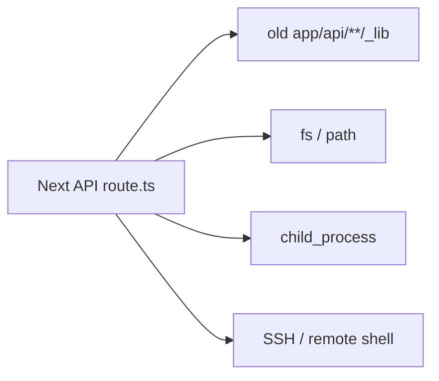
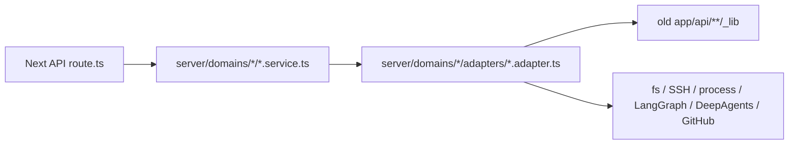

# 第二阶段第一轮验收

本文档用于验收“后端 API Service 层梳理”的第一轮结果。

第一轮目标不是把所有旧代码完全拆干净，而是先完成一个清晰、低风险的架构中间态：

```text
Next API route
  -> domain service
    -> adapter
      -> old _lib / 底层副作用
```

这样做的意义是：

- route 不再直接承载复杂业务逻辑。
- 后续每个业务域有明确入口。
- 底层文件系统、SSH、进程、LangGraph、DeepAgents、更新安装等副作用被先收进 adapter。
- API URL、请求字段、返回字段、状态码保持不变。

## 1. 总体结论

第二阶段第一轮已经覆盖主要 API group：

```text
workspace
config
resources
workspaces
runtime
remote
skills
compute
update
```

当前主调用结构已经从：



改为：



这是合理的中间态。旧 `_lib` 还没有完全拆掉，但它已经不再由 route 直接接入，而是被 adapter 包住。

## 2. 已完成范围

| 领域 | 已瘦身 API | 新 domain service | 当前 adapter 状态 |
| --- | --- | --- | --- |
| workspace | `/api/workspace/files`、`search`、`file`、`file/raw`、`open-folder`、`open-file`、`attachments` | `workspace.service.ts`、`workspaceAttachment.service.ts` | `legacyWorkspace.adapter.ts`、`localDesktop.adapter.ts`、`attachmentExtraction.adapter.ts` |
| config | `/api/config` | `config.service.ts` | `configFile.adapter.ts`、`envFile.adapter.ts`、`workspaceConfig.adapter.ts` |
| resources | `/api/resources` | `resources.service.ts` | `resources.adapter.ts` |
| workspaces | `/api/workspaces` | `workspaces.service.ts` | `workspaces.adapter.ts`、`folderPicker.adapter.ts` |
| runtime | `/api/runtime/backend/ready`、`status`、`restart`、`desktop-config` | `runtime.service.ts` | `backendHealth.adapter.ts`、`backendRuntime.adapter.ts`、`desktopRuntime.adapter.ts` |
| remote | `/api/remote-connections/ensure`、`setup`、`push-backend-cli`、`test`、`ssh-hosts` | `remote.service.ts` | `remoteConnections.adapter.ts` |
| skills | `/api/skills`、`import`、`local-picker`、`connections` | `skills.service.ts` | `skillsConfig.adapter.ts`、`skillFolderPicker.adapter.ts`、`skillConnections.adapter.ts` |
| compute | `/api/compute/ssh-hosts`、`remote-jobs`、`remote-jobs/[jobId]` | `compute.service.ts` | `computeAuth.adapter.ts`、`sshRemoteJobs.adapter.ts` |
| update | `/api/update/status`、`check`、`apply`、`rollback` | `update.service.ts` | `updatePackage.adapter.ts` |

## 3. 行为保持

第一轮改造遵守这些约束：

- 不改 API URL。
- 不改请求字段。
- 不改返回字段。
- 不改已有状态码策略。
- 不改前端交互。
- 不改 `useChat.ts` 主聊天流式链路。
- 不替换 DeepAgents。
- 不改 `agent_graph.py` 主 Agent 实现。

也就是说，前端和用户视角不应该感知到行为变化。

## 4. 当前代码边界

### 4.1 route 层

route 现在只应该做：

```text
读取 request query/body/header
调用 domain service
把 service 结果包装成 NextResponse / Response
保留 HTTP 状态码和 header
```

route 不应该做：

```text
直接读写 fs
直接 spawn/exec 进程
直接 SSH
直接读写 .env / deepagent.config.json / .mcp.json
直接解析复杂业务规则
直接调用 LangGraph / DeepAgents / GitHub API
```

### 4.2 domain service 层

service 负责业务用例编排，例如：

```text
读取配置
保存配置
列文件
上传附件
重启 runtime
配置远程机器
保存技能连接
提交 compute job
检查更新
```

service 不应该直接知道底层协议细节。

### 4.3 adapter 层

adapter 负责底层副作用，例如：

```text
本地文件系统
SSH
远端 shell
进程启动
pid/log 文件
GitHub release API
旧 _lib 兼容层
```

当前很多 adapter 仍是过渡 adapter。它们的作用是先把旧实现封起来，而不是立刻把所有旧代码拆碎。

## 5. 仍然存在的过渡 adapter

这些 adapter 目前还是“包旧实现”的中间形态：

```text
legacyWorkspace.adapter.ts
remoteConnections.adapter.ts
sshRemoteJobs.adapter.ts
updatePackage.adapter.ts
backendRuntime.adapter.ts
skillsConfig.adapter.ts
```

这不是问题，反而是第一轮刻意选择的低风险方式。

后续第二轮可以逐步拆成更明确的 adapter：

```text
localWorkspace.adapter.ts
remoteWorkspace.adapter.ts
ssh.adapter.ts
remoteBackend.adapter.ts
computeJob.adapter.ts
computeStore.adapter.ts
updateRelease.adapter.ts
updateInstall.adapter.ts
agentRuntime.adapter.ts
```

## 6. 验证结果

第一轮改造过程中已多次执行：

```text
npx tsc --noEmit --pretty false
npm run lint
npm run test:local-folder-picker
npm run test:open-folder
npm run test:office-preview
npm run test:think-tags
git diff --check
```

最近一轮结果：

- TypeScript 通过。
- lint 通过，无新增 error。
- 仍有 7 个原项目已有 warning。
- `test:local-folder-picker` 通过。
- `test:open-folder` 通过。
- `test:office-preview` 通过。
- `test:think-tags` 通过。
- `git diff --check` 通过，只有 Windows CRLF 提示。

## 7. 需要人工回归的功能

代码验证不能覆盖所有运行时行为，建议人工点测：

```text
配置页读取/保存
语言切换
项目切换
文件树展开状态
文件预览
附件上传
Skill 启用/导入/连接配置
runtime ready/status/restart
remote SSH 测试和远端配置
compute SSH host 保存和 remote job 提交
update status/check
聊天主链路流式输出
```

其中 remote、compute、update 涉及外部环境，自动测试较难完全覆盖。

## 8. 第二阶段剩余工作

第二阶段第一轮 route 瘦身已经基本完成，但第二阶段整体还剩三类工作：

### 8.1 补横向 contract

已经建议新增：

```text
docs/architecture/agent-runtime-adapter-contract.md
docs/architecture/shared-ssh-adapter-contract.md
```

对应代码级 contract types：

```text
ui/src/server/shared/contracts/agentRuntime.contract.ts
ui/src/server/shared/contracts/sharedSsh.contract.ts
ui/src/server/shared/contracts/adapterError.contract.ts
ui/src/server/shared/contracts/index.ts
```

这两份文档分别回答：

- DeepAgents / OpenCode / LangGraph 以后如何替换。
- remote / compute 里的 SSH 能力如何共用，不重复发散。

### 8.2 第二轮 adapter 细拆

第二轮不是继续改 route，而是拆过渡 adapter：

```text
legacyWorkspace.adapter.ts
remoteConnections.adapter.ts
sshRemoteJobs.adapter.ts
updatePackage.adapter.ts
backendRuntime.adapter.ts
skillsConfig.adapter.ts
```

建议按风险顺序做：

```text
1. shared SSH adapter contract
2. remoteConnections.adapter.ts 拆 SSH/remote backend
3. sshRemoteJobs.adapter.ts 拆 SSH/compute job/store
4. backendRuntime.adapter.ts 拆 process/pid/log/runtime
5. updatePackage.adapter.ts 拆 release/install/state
```

### 8.3 Agent Runtime Adapter

暂时不建议直接改：

```text
useChat.ts
agent_graph.py
DeepAgents 底层实现
```

应先把 Agent Runtime Adapter contract 写清楚，再决定是否接入：

```text
DeepAgentsRuntimeAdapter
LangGraphRemoteRuntimeAdapter
OpenCodeRuntimeAdapter
```

## 9. 验收结论

第二阶段第一轮可以视为完成：

```text
API route 变薄：完成
domain service 入口：完成
adapter 过渡封装：完成
API 行为保持：完成
验证命令：通过
文档记录：已补充
```

第二阶段下一步不建议继续盲目拆代码，而是先补齐横向 contract，然后再进入第二轮 adapter 细拆。
